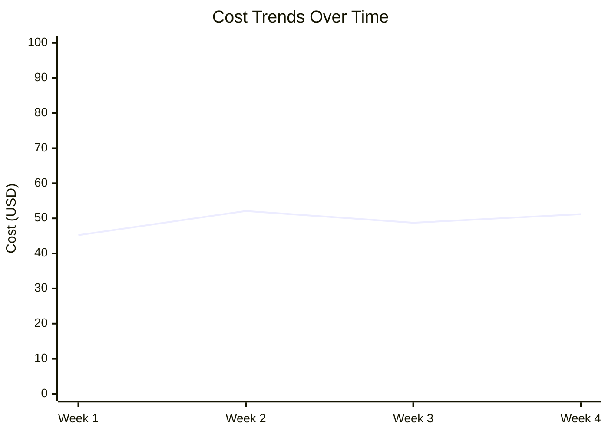
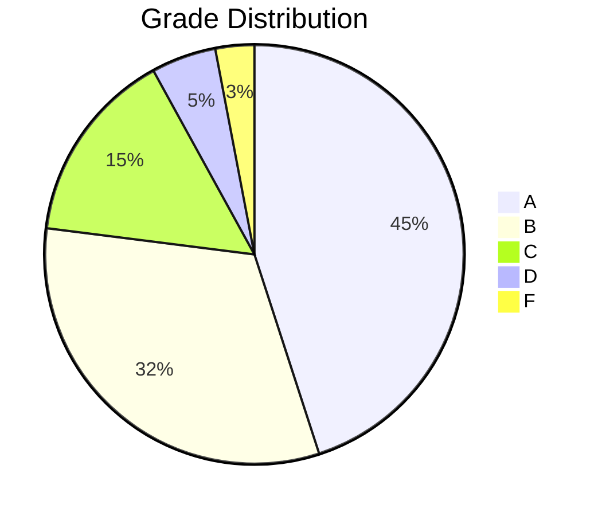

# Auto-Fix Performance Reporting System

**Document ID:** 130-DR-PERF
**Category:** Design Reference - Performance Reporting
**Status:** Active
**Last Updated:** 2025-12-24

## Overview

The Auto-Fix Performance Reporting system automatically generates comprehensive weekly reports analyzing the performance, cost, and quality metrics of the auto-fix system. Reports are posted to GitHub Discussions for transparency and team collaboration.

## Architecture

### Components

```
┌─────────────────────────────────────────────────────────────────┐
│                    Auto-Fix Performance Reporter                 │
└─────────────────────────────────────────────────────────────────┘
                              │
                              ▼
        ┌──────────────────────────────────────────┐
        │     Analytics Database (SQLite)          │
        │  - autofix_runs                          │
        │  - ai_calls                              │
        │  - grades                                │
        │  - quality_metrics                       │
        └──────────────────────────────────────────┘
                              │
                              ▼
        ┌──────────────────────────────────────────┐
        │  Report Generator (TypeScript)           │
        │  - Query analytics                       │
        │  - Calculate week-over-week trends       │
        │  - Generate markdown report              │
        │  - Create mermaid charts                 │
        └──────────────────────────────────────────┘
                              │
                              ▼
        ┌──────────────────────────────────────────┐
        │  GitHub Discussions                      │
        │  - Category: Auto-Fix Reports            │
        │  - Weekly posts with full metrics        │
        │  - Actionable recommendations            │
        └──────────────────────────────────────────┘
```

### Data Flow

1. **Auto-Fix Runs** → Write metrics to SQLite database
2. **Database Backup** → Periodic upload to GCS bucket
3. **Scheduled Workflow** → Downloads database from GCS
4. **Report Generator** → Queries analytics and generates markdown
5. **GitHub API** → Creates discussion post with report
6. **Notifications** → Team receives weekly performance insights

## Report Contents

### Executive Summary

High-level metrics for quick overview:

- Total runs
- Success rate
- Average grade
- Total cost
- Active repositories
- Average duration

### Week-over-Week Comparison

Trend analysis comparing current week to previous week:

- Change in total runs
- Success rate delta
- Cost delta
- Average grade delta

### Success Rates by Repository

Per-repository breakdown:

- Total runs
- Success percentage
- Average duration
- Average files changed

### Cost Analysis

Detailed cost breakdown:

- Total cost by period
- Average cost per run
- Cost by AI provider (Anthropic, Google, OpenAI)
- Cost trend charts

### Grade Distribution

Quality metrics:

- Distribution of A/B/C/D/F grades
- Average score per grade
- Average cost per grade
- Average duration per grade
- Pie chart visualization

### Performance Metrics

Latency and speed analysis:

- Run duration percentiles (P50, P95, P99)
- AI call latency percentiles
- Cost percentiles

### Quality Trends

Code quality over time:

- Lint pass rate
- Typecheck pass rate
- Test pass rate
- Coverage delta
- Complexity delta

### Top Errors

Error analysis:

- Most common error types
- Error frequency
- First and last occurrence
- Average latency impact
- Total cost impact

### Repository Leaderboard

Top performing repositories:

- Ranked by average grade
- Success rate
- Total runs
- Total cost
- Merge rate

### Recommendations

AI-generated actionable recommendations based on:

- Success rate thresholds
- Cost optimization opportunities
- Grade distribution patterns
- Performance bottlenecks
- Error frequency
- Quality trends

## Workflow Configuration

### Schedule

- **Frequency:** Weekly
- **Day:** Monday
- **Time:** 9:00 AM UTC
- **Manual Trigger:** Available via workflow_dispatch

### Inputs

- `week_offset`: Report for specific week (0=current, 1=last week, etc.)

### Required Variables

| Variable | Description | Example |
|----------|-------------|---------|
| `ANALYTICS_BUCKET` | GCS bucket for database | `gwi-analytics` |
| `WIF_PROVIDER` | Workload Identity Federation provider | Projects/123/.../providers/github |
| `WIF_SERVICE_ACCOUNT` | Service account email | analytics@project.iam.gserviceaccount.com |

### Permissions

The workflow requires:

- `contents: read` - Clone repository
- `discussions: write` - Create discussion posts
- `id-token: write` - Authenticate via WIF

## Usage

### Automated Weekly Reports

Reports are automatically generated every Monday at 9:00 AM UTC and posted to GitHub Discussions.

### Manual Report Generation

Trigger manual report via GitHub Actions UI:

1. Go to Actions → Auto-Fix Performance Report
2. Click "Run workflow"
3. Optionally set week offset (0=current, 1=last week, etc.)
4. Click "Run workflow"

### Local Testing

Test report generation locally:

```bash
# Build the report generator
npm run build --workspace=packages/core

# Download production database
gcloud storage cp gs://gwi-analytics/autofix.db ./autofix-test.db

# Generate report
./scripts/test-performance-report.sh ./autofix-test.db

# View generated reports
cat report-current.md
cat report-last-week.md
```

### Custom Date Ranges

Modify the script for custom date ranges:

```bash
DB_PATH=./autofix.db \
WEEK_OFFSET=2 \
INCLUDE_CHARTS=true \
OUTPUT_FILE=./custom-report.md \
node scripts/dist/generate-performance-report.js
```

## Report Format

### Markdown Structure

```markdown
# Auto-Fix Performance Report - Dec 16 - Dec 22, 2025

## Executive Summary
**Total Runs:** 1,234
**Success Rate:** 92.5%
...

## Week-over-Week Comparison
| Metric | Change |
|--------|--------|
| Total Runs | 📈 +45 |
...

## Success Rates by Repository
| Repository | Total Runs | Success Rate | ... |
|------------|------------|--------------|-----|
| owner/repo | 123 | 95.0% | ... |
...

## Cost Analysis
[Cost table and trend chart]

## Grade Distribution
[Grade table and pie chart]

## Performance Metrics
[Percentile tables]

## Quality Trends
[Quality metrics over time]

## Top Errors
[Error analysis]

## Repository Leaderboard
| Rank | Repository | Runs | Success Rate | Avg Grade | ... |
|------|------------|------|--------------|-----------|-----|
| 🥇 | owner/repo1 | 500 | 98.0% | 95.2 | ... |
| 🥈 | owner/repo2 | 450 | 96.5% | 93.1 | ... |
...

## Recommendations
- ✅ Excellent success rate at 95.2% - Consider expanding auto-fix...
- 💰 Average cost per run is $0.0523 - Review model selection...
...

---
*Generated automatically by Auto-Fix Performance Reporter*
*Report Date: 2025-12-23T09:00:00.000Z*
```

### Chart Visualizations

Reports include Mermaid charts for visual analysis:

**Cost Trend Chart:**


**Grade Distribution Chart:**


## Database Schema

### Required Tables

The report generator queries these tables:

- `autofix_runs` - Run metadata and status
- `ai_calls` - AI provider calls with cost/latency
- `grades` - Quality grades for each run
- `quality_metrics` - Code quality metrics

See `packages/core/src/database/schema.sql` for full schema.

## Analytics Queries

### Success Rate by Repository

```sql
SELECT
  repo_owner,
  repo_name,
  COUNT(*) as total_runs,
  SUM(CASE WHEN status = 'success' THEN 1 ELSE 0 END) as successful_runs,
  ROUND(
    CAST(SUM(CASE WHEN status = 'success' THEN 1 ELSE 0 END) AS REAL) / COUNT(*) * 100,
    2
  ) as success_rate,
  ROUND(AVG(duration_ms), 0) as avg_duration_ms,
  ROUND(AVG(files_changed), 1) as avg_files_changed
FROM autofix_runs
WHERE created_at >= ? AND created_at <= ?
GROUP BY repo_owner, repo_name
ORDER BY total_runs DESC
```

### Cost Metrics by Week

```sql
SELECT
  strftime('%Y-W%W', r.created_at) as period,
  COUNT(DISTINCT r.id) as total_runs,
  ROUND(SUM(c.cost_usd), 2) as total_cost_usd,
  ROUND(AVG(run_cost.cost), 2) as avg_cost_per_run,
  SUM(c.total_tokens) as total_tokens,
  ROUND(SUM(CASE WHEN c.provider = 'anthropic' THEN c.cost_usd ELSE 0 END), 2) as anthropic_cost,
  ROUND(SUM(CASE WHEN c.provider = 'google' THEN c.cost_usd ELSE 0 END), 2) as google_cost
FROM autofix_runs r
LEFT JOIN ai_calls c ON c.run_id = r.id
WHERE r.created_at >= ? AND r.created_at <= ?
GROUP BY period
ORDER BY period DESC
```

See `packages/core/src/database/analytics.ts` for all query implementations.

## Alerting and Notifications

### Automatic Alerts

The workflow will create issues for critical conditions:

- Success rate drops below 80%
- Average cost per run exceeds $0.10
- Grade F percentage exceeds 10%
- P99 duration exceeds 60 seconds

### Discussion Category

Reports are posted to the "Auto-Fix Reports" discussion category:

- **Category Name:** Auto-Fix Reports
- **Emoji:** 📈 (chart_with_upwards_trend)
- **Description:** Weekly performance reports for auto-fix system
- **Auto-created:** If category doesn't exist, workflow creates it

## Operational Procedures

### Weekly Review Process

1. **Monday 9:00 AM UTC** - Automated report posted to Discussions
2. **Monday AM** - Team reviews report
3. **Monday PM** - Action items created for critical issues
4. **Tuesday-Friday** - Implement improvements
5. **Next Monday** - Review impact in new report

### Threshold Response

| Metric | Threshold | Response |
|--------|-----------|----------|
| Success Rate | < 80% | Investigate failures, improve reliability |
| Avg Cost/Run | > $0.10 | Optimize prompts, review model selection |
| Grade F % | > 10% | Enhance validation, improve fix quality |
| P99 Duration | > 60s | Profile slow fixes, add caching |
| Error Rate | > 5% | Fix top errors, improve error handling |

### Data Retention

- **Analytics Database:** Retained indefinitely
- **Discussion Posts:** Permanent record
- **Backup Schedule:** Daily to GCS
- **Archival:** Monthly snapshots to cold storage

## Troubleshooting

### Report Generation Fails

**Problem:** Workflow fails with database error

**Solutions:**
1. Check ANALYTICS_BUCKET is configured
2. Verify WIF authentication is working
3. Ensure database schema is up to date
4. Check database file permissions

### Missing Data

**Problem:** Report shows no data or incomplete data

**Solutions:**
1. Verify auto-fix runs are writing to database
2. Check database backup schedule
3. Confirm correct date range for query
4. Review database migration status

### Discussion Post Fails

**Problem:** Report generates but doesn't post to Discussions

**Solutions:**
1. Verify `discussions: write` permission
2. Check repository has Discussions enabled
3. Confirm category exists or can be created
4. Review GitHub token permissions

### Chart Rendering Issues

**Problem:** Mermaid charts don't render in Discussions

**Solutions:**
1. Verify Mermaid syntax is correct
2. Check data values are valid numbers
3. Ensure chart has sufficient data points
4. Test chart in local markdown viewer

## Performance Considerations

### Query Optimization

- Queries use indexes on `created_at`, `repo_owner`, `repo_name`
- Week-over-week comparisons use cached aggregates
- Percentile calculations done in-memory for accuracy

### Report Size

- Typical report size: 15-25 KB
- Maximum GitHub Discussion size: 65,536 characters
- Large repositories limited to top 10 in leaderboard

### Generation Time

- Database download: ~2-5 seconds
- Query execution: ~1-3 seconds
- Report formatting: <1 second
- Discussion posting: ~2-3 seconds
- **Total:** 5-12 seconds end-to-end

## Future Enhancements

### Planned Features

- [ ] Email digest of weekly reports
- [ ] Slack integration for critical alerts
- [ ] Interactive dashboards (Grafana/Tableau)
- [ ] Machine learning trend prediction
- [ ] Anomaly detection for unusual patterns
- [ ] Repository-specific report subscriptions
- [ ] Custom report templates
- [ ] Historical trend analysis (6-12 months)

### Integration Opportunities

- Merge with drift detection workflow
- Link to CI/CD pipeline metrics
- Cross-reference with incident reports
- Integrate with cost management tools
- Connect to team OKRs and KPIs

## References

- **Analytics Schema:** `packages/core/src/database/analytics.ts`
- **GitHub Alerts:** `scripts/github-alerts.ts`
- **Workflow:** `.github/workflows/auto-fix-report.yml`
- **Test Script:** `scripts/test-performance-report.sh`
- **Related Docs:**
  - `126-AA-AUDT-appaudit-devops-playbook.md` - DevOps audit
  - `111-DR-TARG-slo-sla-targets.md` - SLO/SLA targets
  - `112-DR-RUNB-disaster-recovery-runbook.md` - DR procedures

## Change Log

| Date | Version | Changes |
|------|---------|---------|
| 2025-12-24 | 1.0 | Initial release |

---

**Maintained by:** DevOps Team
**Review Cycle:** Quarterly
**Next Review:** 2026-03-24
