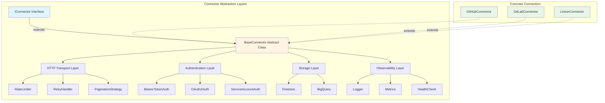

# Design: Connector Abstraction Layer

**Document ID:** 014-DR-DSGN
**Date:** 2025-12-28
**Status:** ✅ Approved
**Epic:** B (Data Ingestion & Connector Framework)
**Story:** B2 (Design Core Connector Framework)
**Task:** B2.1 (Design connector abstraction layer)
**Author:** @backend-architect
**Reviewers:** @connectors-lead, @security

---

## Overview

This document defines the connector abstraction layer for Git With Intent's connector framework. The abstraction layer separates concerns between:

1. **Core connector logic** (authentication, sync, pagination)
2. **HTTP transport** (request/response handling, rate limiting, retries)
3. **Storage integration** (Firestore, BigQuery)
4. **Observability** (logging, metrics, health checks)

**Goal:** Enable rapid connector development (<2 days per connector) by eliminating boilerplate and enforcing consistent patterns.

---

## Architecture Diagram



---

## Design Principles

### 1. Separation of Concerns

Each layer has a single, well-defined responsibility:

| Layer | Responsibility | Example |
|-------|----------------|---------|
| **Interface** | Contract definition | `IConnector.sync()` signature |
| **Base Class** | Shared utilities, lifecycle | `BaseConnector.retryRequest()` |
| **Transport** | HTTP client, rate limiting | `HttpClient.get()` with backoff |
| **Authentication** | Credential management | `OAuth2Auth.refreshToken()` |
| **Storage** | Data persistence | `FirestoreAdapter.saveRun()` |
| **Observability** | Logging, metrics, health | `Logger.info()`, `Metrics.increment()` |

### 2. Dependency Inversion

Connectors depend on interfaces, not concrete implementations:

```typescript
// ✅ GOOD: Depend on interface
class GitHubConnector extends BaseConnector {
  constructor(
    private auth: IAuthStrategy,
    private storage: IStorage,
    private logger: ILogger
  ) {
    super();
  }
}

// ❌ BAD: Depend on concrete class
class GitHubConnector extends BaseConnector {
  constructor() {
    super();
    this.auth = new OAuth2Auth(); // Tightly coupled
  }
}
```

### 3. Open/Closed Principle

BaseConnector is open for extension, closed for modification:

- ✅ Extend BaseConnector for new connectors
- ✅ Override lifecycle hooks (`onBeforeSync`, `onAfterSync`)
- ❌ Don't modify BaseConnector for connector-specific logic

### 4. Composition Over Inheritance

Prefer composition for cross-cutting concerns:

```typescript
// ✅ GOOD: Compose behaviors
class BaseConnector {
  constructor(
    protected httpClient: IHttpClient,
    protected rateLimiter: IRateLimiter,
    protected retryHandler: IRetryHandler
  ) {}
}

// ❌ BAD: Inherit behaviors
class RateLimitedConnector extends BaseConnector {}
class RetryableConnector extends RateLimitedConnector {}
```

---

## Layer Definitions

### Layer 1: Interface (IConnector)

**Purpose:** Define the contract all connectors must implement.

**Location:** `packages/connectors/src/interfaces/IConnector.ts`

**Key Methods:**
- `authenticate()` - Validate credentials
- `healthCheck()` - Test connection
- `sync()` - Fetch data (returns AsyncIterator)
- `processWebhook()` - Handle webhook events

**See:** 014-DR-DSGN-iconnector-interface.md for full interface definition.

---

### Layer 2: Base Class (BaseConnector)

**Purpose:** Provide shared utilities and enforce lifecycle.

**Location:** `packages/connectors/src/base/BaseConnector.ts`

**Responsibilities:**
1. **Lifecycle Management:** `onBeforeSync()`, `onAfterSync()`, `onError()`
2. **Error Handling:** Standardized error wrapping
3. **Retry Logic:** Exponential backoff with jitter
4. **Rate Limiting:** Respect `Retry-After` headers
5. **Logging:** Structured logs with context
6. **Metrics:** Counter, gauge, histogram instrumentation

**Class Structure:**

```typescript
export abstract class BaseConnector implements IConnector {
  // Dependencies (injected)
  protected httpClient: IHttpClient;
  protected auth: IAuthStrategy;
  protected storage: IStorage;
  protected logger: ILogger;
  protected metrics: IMetrics;
  protected rateLimiter: IRateLimiter;
  protected retryHandler: IRetryHandler;

  // Abstract methods (must implement)
  abstract authenticate(config: ConnectorConfig): Promise<void>;
  abstract healthCheck(): Promise<HealthStatus>;
  abstract sync(options: SyncOptions): AsyncIterator<Record>;
  abstract processWebhook(event: WebhookEvent): Promise<void>;

  // Shared utilities (optional to use)
  protected async retryRequest<T>(
    fn: () => Promise<T>,
    options?: RetryOptions
  ): Promise<T>;

  protected async checkRateLimit(response: any): Promise<void>;

  protected handleError(error: any, context?: any): never;

  protected log(level: LogLevel, message: string, meta?: any): void;

  protected recordMetric(
    name: string,
    value: number,
    labels?: Record<string, string>
  ): void;

  // Lifecycle hooks (optional to override)
  protected async onBeforeSync(options: SyncOptions): Promise<void> {}
  protected async onAfterSync(result: SyncResult): Promise<void> {}
  protected async onError(error: Error, context: any): Promise<void> {}
}
```

---

### Layer 3: HTTP Transport

**Purpose:** Handle all HTTP communication with external APIs.

**Location:** `packages/connectors/src/transport/HttpClient.ts`

**Features:**
- Automatic retry with exponential backoff
- Rate limit detection and handling
- Request/response logging
- Timeout management
- Connection pooling

**Interface:**

```typescript
export interface IHttpClient {
  get<T>(url: string, options?: RequestOptions): Promise<T>;
  post<T>(url: string, body: any, options?: RequestOptions): Promise<T>;
  put<T>(url: string, body: any, options?: RequestOptions): Promise<T>;
  delete<T>(url: string, options?: RequestOptions): Promise<T>;
  patch<T>(url: string, body: any, options?: RequestOptions): Promise<T>;
}

export interface RequestOptions {
  headers?: Record<string, string>;
  timeout?: number;
  retries?: number;
  retryDelay?: number;
  signal?: AbortSignal;
}
```

**Rate Limiter:**

```typescript
export interface IRateLimiter {
  // Check if request can proceed
  checkLimit(key: string): Promise<void>;

  // Record successful request
  recordRequest(key: string): void;

  // Handle rate limit error
  handleRateLimit(error: RateLimitError): Promise<void>;
}

export class TokenBucketRateLimiter implements IRateLimiter {
  constructor(
    private maxTokens: number,
    private refillRate: number
  ) {}

  async checkLimit(key: string): Promise<void> {
    const bucket = this.getBucket(key);
    if (bucket.tokens < 1) {
      const waitMs = this.calculateWaitTime(bucket);
      throw new RateLimitError(`Rate limit exceeded, retry after ${waitMs}ms`);
    }
    bucket.tokens -= 1;
  }
}
```

**Retry Handler:**

```typescript
export interface IRetryHandler {
  retry<T>(
    fn: () => Promise<T>,
    options: RetryOptions
  ): Promise<T>;
}

export interface RetryOptions {
  maxAttempts: number;
  initialDelayMs: number;
  maxDelayMs: number;
  backoffMultiplier: number;
  retryableErrors: (error: any) => boolean;
}

export class ExponentialBackoffRetry implements IRetryHandler {
  async retry<T>(
    fn: () => Promise<T>,
    options: RetryOptions
  ): Promise<T> {
    let attempt = 0;
    while (attempt < options.maxAttempts) {
      try {
        return await fn();
      } catch (error) {
        if (!options.retryableErrors(error)) {
          throw error;
        }
        attempt++;
        const delayMs = Math.min(
          options.initialDelayMs * Math.pow(options.backoffMultiplier, attempt),
          options.maxDelayMs
        );
        await this.sleep(delayMs + this.jitter());
      }
    }
    throw new Error(`Max retries exceeded (${options.maxAttempts})`);
  }

  private jitter(): number {
    return Math.random() * 1000; // 0-1000ms jitter
  }
}
```

---

### Layer 4: Authentication

**Purpose:** Manage credentials and token refresh.

**Location:** `packages/connectors/src/auth/`

**See:** 015-DR-DSGN-authentication-strategy.md for full design.

**Quick Summary:**

```typescript
export interface IAuthStrategy {
  authenticate(config: ConnectorConfig): Promise<AuthResult>;
  refreshIfNeeded(): Promise<void>;
  getHeaders(): Record<string, string>;
  isExpired(): boolean;
}

// Implementations:
// - BearerTokenAuth (73% of connectors)
// - OAuth2Auth (13% of connectors)
// - ServiceAccountAuth (Vertex AI)
```

---

### Layer 5: Storage

**Purpose:** Persist connector state and data.

**Location:** `packages/connectors/src/storage/`

**Interfaces:**

```typescript
export interface IStorage {
  // Connector state (cursor position, last sync time)
  saveState(connector: string, state: ConnectorState): Promise<void>;
  loadState(connector: string): Promise<ConnectorState | null>;

  // Sync runs (tracking)
  saveRun(run: SyncRun): Promise<void>;
  updateRun(runId: string, updates: Partial<SyncRun>): Promise<void>;
  getRun(runId: string): Promise<SyncRun | null>;

  // Records (actual data)
  saveRecords(records: Record[]): Promise<void>;
  queryRecords(query: RecordQuery): AsyncIterator<Record>;
}

export interface ConnectorState {
  lastSyncCursor: string | null;
  lastSyncTime: string;
  totalRecordsSynced: number;
  errors: ErrorLog[];
}

export interface SyncRun {
  id: string;
  connector: string;
  tenantId: string;
  status: 'running' | 'completed' | 'failed';
  startTime: string;
  endTime?: string;
  recordsProcessed: number;
  errors: ErrorLog[];
}
```

**Implementations:**
- `FirestoreStorage` (production)
- `SQLiteStorage` (local dev)
- `InMemoryStorage` (testing)

---

### Layer 6: Observability

**Purpose:** Logging, metrics, and health checks.

**Location:** `packages/connectors/src/observability/`

**Logger Interface:**

```typescript
export interface ILogger {
  debug(message: string, meta?: any): void;
  info(message: string, meta?: any): void;
  warn(message: string, meta?: any): void;
  error(message: string, meta?: any): void;

  // Structured logging
  child(context: Record<string, any>): ILogger;
}

// Implementation
export class StructuredLogger implements ILogger {
  constructor(
    private context: Record<string, any> = {}
  ) {}

  info(message: string, meta?: any): void {
    console.log(JSON.stringify({
      level: 'info',
      message,
      ...this.context,
      ...meta,
      timestamp: new Date().toISOString()
    }));
  }

  child(context: Record<string, any>): ILogger {
    return new StructuredLogger({ ...this.context, ...context });
  }
}
```

**Metrics Interface:**

```typescript
export interface IMetrics {
  increment(name: string, value?: number, labels?: Record<string, string>): void;
  gauge(name: string, value: number, labels?: Record<string, string>): void;
  histogram(name: string, value: number, labels?: Record<string, string>): void;
}

// Example metrics
// connector.sync.records_processed (counter)
// connector.sync.duration_ms (histogram)
// connector.auth.token_expiry_seconds (gauge)
// connector.http.requests_total (counter)
// connector.http.errors_total (counter)
```

**Health Check:**

```typescript
export interface HealthStatus {
  healthy: boolean;
  timestamp: string;
  connector: string;
  checks: HealthCheck[];
  error?: string;
}

export interface HealthCheck {
  name: string;
  status: 'pass' | 'fail';
  duration_ms: number;
  error?: string;
}

// Example health checks:
// - auth_valid: Can authenticate successfully
// - api_reachable: Can reach API endpoint
// - credentials_valid: Credentials not expired
// - rate_limit_ok: Not rate limited
```

---

## Pagination Strategies

**Purpose:** Abstract pagination logic for different API styles.

**Location:** `packages/connectors/src/pagination/`

**Interface:**

```typescript
export interface IPaginationStrategy<T> {
  hasMore(response: T): boolean;
  getNextCursor(response: T): string | null;
  buildRequest(cursor: string | null): RequestOptions;
}

// Example: Cursor-based pagination (Slack, Linear)
export class CursorPagination implements IPaginationStrategy<any> {
  constructor(
    private cursorField: string = 'next_cursor'
  ) {}

  hasMore(response: any): boolean {
    return response[this.cursorField] !== null;
  }

  getNextCursor(response: any): string | null {
    return response[this.cursorField];
  }

  buildRequest(cursor: string | null): RequestOptions {
    return cursor ? { params: { cursor } } : {};
  }
}

// Example: Offset-based pagination (Jira, Confluence)
export class OffsetPagination implements IPaginationStrategy<any> {
  constructor(
    private pageSize: number = 100
  ) {}

  private offset = 0;

  hasMore(response: any): boolean {
    return response.items.length === this.pageSize;
  }

  getNextCursor(response: any): string | null {
    this.offset += this.pageSize;
    return this.offset.toString();
  }

  buildRequest(cursor: string | null): RequestOptions {
    const offset = cursor ? parseInt(cursor) : 0;
    return { params: { offset, limit: this.pageSize } };
  }
}

// Example: Link header pagination (GitHub)
export class LinkHeaderPagination implements IPaginationStrategy<any> {
  hasMore(response: any): boolean {
    const linkHeader = response.headers?.['link'];
    return linkHeader && linkHeader.includes('rel="next"');
  }

  getNextCursor(response: any): string | null {
    const linkHeader = response.headers?.['link'];
    if (!linkHeader) return null;

    const match = linkHeader.match(/<([^>]+)>;\s*rel="next"/);
    return match ? match[1] : null;
  }

  buildRequest(cursor: string | null): RequestOptions {
    return cursor ? { url: cursor } : {};
  }
}
```

**Helper Function:**

```typescript
export async function* paginate<T>(
  requestFn: (cursor: string | null) => Promise<T>,
  strategy: IPaginationStrategy<T>
): AsyncIterator<T> {
  let cursor: string | null = null;

  do {
    const response = await requestFn(cursor);
    yield response;

    cursor = strategy.getNextCursor(response);
  } while (strategy.hasMore(response));
}

// Usage in connector
async *sync(options: SyncOptions): AsyncIterator<Record> {
  const strategy = new CursorPagination('next_cursor');

  for await (const page of paginate(
    (cursor) => this.fetchPage(cursor),
    strategy
  )) {
    for (const item of page.items) {
      yield this.transform(item);
    }
  }
}
```

---

## Lifecycle Hooks

**Purpose:** Allow connectors to customize behavior at key points.

**Hooks:**

```typescript
export abstract class BaseConnector {
  // Called before sync starts
  protected async onBeforeSync(options: SyncOptions): Promise<void> {
    // Default: validate options, check auth
    await this.auth.refreshIfNeeded();
  }

  // Called after sync completes
  protected async onAfterSync(result: SyncResult): Promise<void> {
    // Default: save state, log metrics
    await this.storage.saveState(this.name, {
      lastSyncCursor: result.cursor,
      lastSyncTime: new Date().toISOString(),
      totalRecordsSynced: result.recordsProcessed
    });
  }

  // Called on error
  protected async onError(error: Error, context: any): Promise<void> {
    // Default: log error, record metric
    this.logger.error('Connector error', { error, context });
    this.metrics.increment('connector.errors_total', 1, {
      connector: this.name,
      error_type: error.constructor.name
    });
  }

  // Called on rate limit
  protected async onRateLimit(error: RateLimitError): Promise<void> {
    // Default: wait for retry-after duration
    const waitMs = error.retryAfter || 60000;
    this.logger.warn('Rate limited, waiting', { waitMs });
    await this.sleep(waitMs);
  }
}

// Example: Custom hook in GitHubConnector
export class GitHubConnector extends BaseConnector {
  protected async onBeforeSync(options: SyncOptions): Promise<void> {
    await super.onBeforeSync(options);

    // Custom: Prefetch repository metadata
    const repo = await this.getRepository(options.repository);
    this.logger.info('Starting sync', { repo: repo.full_name });
  }

  protected async onAfterSync(result: SyncResult): Promise<void> {
    await super.onAfterSync(result);

    // Custom: Update BigQuery stats table
    await this.updateSyncStats(result);
  }
}
```

---

## Error Handling

**Error Hierarchy:**

```typescript
// Base error
export class ConnectorError extends Error {
  constructor(
    message: string,
    public connector: string,
    public context?: any
  ) {
    super(message);
    this.name = 'ConnectorError';
  }
}

// Authentication errors
export class AuthenticationError extends ConnectorError {
  constructor(message: string, connector: string, context?: any) {
    super(message, connector, context);
    this.name = 'AuthenticationError';
  }
}

// Rate limit errors
export class RateLimitError extends ConnectorError {
  constructor(
    message: string,
    connector: string,
    public retryAfter: number,
    context?: any
  ) {
    super(message, connector, context);
    this.name = 'RateLimitError';
  }
}

// Network errors
export class NetworkError extends ConnectorError {
  constructor(
    message: string,
    connector: string,
    public statusCode?: number,
    context?: any
  ) {
    super(message, connector, context);
    this.name = 'NetworkError';
  }
}

// Validation errors
export class ValidationError extends ConnectorError {
  constructor(
    message: string,
    connector: string,
    public validationErrors: any[],
    context?: any
  ) {
    super(message, connector, context);
    this.name = 'ValidationError';
  }
}
```

**Error Handling in BaseConnector:**

```typescript
export abstract class BaseConnector {
  protected handleError(error: any, context?: any): never {
    // Wrap unknown errors
    if (!(error instanceof ConnectorError)) {
      error = new ConnectorError(
        error.message || 'Unknown error',
        this.name,
        { originalError: error, ...context }
      );
    }

    // Log error
    this.logger.error('Connector error', {
      error: error.message,
      stack: error.stack,
      context
    });

    // Record metric
    this.metrics.increment('connector.errors_total', 1, {
      connector: this.name,
      error_type: error.constructor.name
    });

    // Call lifecycle hook
    void this.onError(error, context);

    // Re-throw
    throw error;
  }
}
```

---

## Dependency Injection

**Container Setup:**

```typescript
// packages/connectors/src/di/Container.ts
export class ConnectorContainer {
  private instances = new Map<string, any>();

  register<T>(key: string, factory: () => T): void {
    this.instances.set(key, factory);
  }

  resolve<T>(key: string): T {
    const factory = this.instances.get(key);
    if (!factory) {
      throw new Error(`No factory registered for ${key}`);
    }
    return factory();
  }
}

// Bootstrap
const container = new ConnectorContainer();

// Register dependencies
container.register('logger', () => new StructuredLogger());
container.register('metrics', () => new PrometheusMetrics());
container.register('httpClient', () => new AxiosHttpClient());
container.register('rateLimiter', () => new TokenBucketRateLimiter(1000, 100));
container.register('retryHandler', () => new ExponentialBackoffRetry());
container.register('storage', () => new FirestoreStorage());

// Register auth strategies
container.register('auth:bearer', () => new BearerTokenAuth());
container.register('auth:oauth', () => new OAuth2Auth());
container.register('auth:service', () => new ServiceAccountAuth());

// Register connectors
container.register('connector:github', () => new GitHubConnector(
  container.resolve('auth:oauth'),
  container.resolve('storage'),
  container.resolve('logger'),
  container.resolve('metrics'),
  container.resolve('httpClient'),
  container.resolve('rateLimiter'),
  container.resolve('retryHandler')
));

// Usage
const github = container.resolve<GitHubConnector>('connector:github');
await github.authenticate({ token: '...' });
for await (const record of github.sync({ repository: 'owner/repo' })) {
  console.log(record);
}
```

---

## Testing Strategy

### Unit Tests (Mock Dependencies)

```typescript
// GitHubConnector.test.ts
describe('GitHubConnector', () => {
  let connector: GitHubConnector;
  let mockAuth: jest.Mocked<IAuthStrategy>;
  let mockStorage: jest.Mocked<IStorage>;
  let mockLogger: jest.Mocked<ILogger>;
  let mockHttpClient: jest.Mocked<IHttpClient>;

  beforeEach(() => {
    mockAuth = createMockAuth();
    mockStorage = createMockStorage();
    mockLogger = createMockLogger();
    mockHttpClient = createMockHttpClient();

    connector = new GitHubConnector(
      mockAuth,
      mockStorage,
      mockLogger,
      mock Metrics(),
      mockHttpClient,
      createMockRateLimiter(),
      createMockRetryHandler()
    );
  });

  it('should authenticate successfully', async () => {
    mockAuth.authenticate.mockResolvedValue({ token: 'abc123' });

    await connector.authenticate({ token: 'test' });

    expect(mockAuth.authenticate).toHaveBeenCalledWith({ token: 'test' });
  });

  it('should sync pull requests', async () => {
    mockHttpClient.get.mockResolvedValue({
      data: [{ id: 1, title: 'PR 1' }]
    });

    const records = [];
    for await (const record of connector.sync({ repository: 'owner/repo' })) {
      records.push(record);
    }

    expect(records).toHaveLength(1);
    expect(records[0].title).toBe('PR 1');
  });
});
```

### Integration Tests (Real Dependencies)

```typescript
// GitHubConnector.integration.test.ts
describe('GitHubConnector Integration', () => {
  it('should fetch real pull requests', async () => {
    const token = process.env.GITHUB_TEST_TOKEN;
    if (!token) {
      console.warn('Skipping integration test (no token)');
      return;
    }

    const connector = new GitHubConnector(
      new OAuth2Auth(),
      new InMemoryStorage(),
      new StructuredLogger(),
      new PrometheusMetrics(),
      new AxiosHttpClient(),
      new TokenBucketRateLimiter(1000, 100),
      new ExponentialBackoffRetry()
    );

    await connector.authenticate({ token });

    const records = [];
    for await (const record of connector.sync({
      repository: 'anthropics/anthropic-sdk-typescript'
    })) {
      records.push(record);
      if (records.length >= 10) break; // Limit for testing
    }

    expect(records.length).toBeGreaterThan(0);
    expect(records[0]).toHaveProperty('id');
    expect(records[0]).toHaveProperty('title');
  });
});
```

### Contract Tests (Schema Validation)

```typescript
// GitHubConnector.contract.test.ts
import { PullRequestSchema } from '../schemas/PullRequest';

describe('GitHubConnector Contract', () => {
  it('should return valid pull request schema', async () => {
    const connector = createTestConnector();

    for await (const record of connector.sync({ repository: 'owner/repo' })) {
      // Should not throw
      expect(() => PullRequestSchema.parse(record)).not.toThrow();
      break; // Test first record only
    }
  });
});
```

---

## Performance Considerations

### 1. Memory Management

**Problem:** Syncing large datasets (100K+ records) can exhaust memory.

**Solution:** Use async iterators (streams) instead of loading all data:

```typescript
// ✅ GOOD: Stream records
async *sync(options: SyncOptions): AsyncIterator<Record> {
  for await (const page of this.fetchPages()) {
    for (const item of page.items) {
      yield item; // Process one at a time
    }
  }
}

// ❌ BAD: Load all into memory
async sync(options: SyncOptions): Promise<Record[]> {
  const allRecords = [];
  for await (const page of this.fetchPages()) {
    allRecords.push(...page.items); // OOM risk
  }
  return allRecords;
}
```

### 2. Connection Pooling

**Problem:** Creating new HTTP connections for each request is slow.

**Solution:** Use connection pooling (built into axios):

```typescript
export class AxiosHttpClient implements IHttpClient {
  private client: AxiosInstance;

  constructor() {
    this.client = axios.create({
      timeout: 30000,
      httpAgent: new http.Agent({ keepAlive: true, maxSockets: 10 }),
      httpsAgent: new https.Agent({ keepAlive: true, maxSockets: 10 })
    });
  }
}
```

### 3. Batch Processing

**Problem:** Processing records one-by-one is slow for large syncs.

**Solution:** Batch writes to storage:

```typescript
async *sync(options: SyncOptions): AsyncIterator<Record> {
  const batch: Record[] = [];

  for await (const page of this.fetchPages()) {
    for (const item of page.items) {
      batch.push(item);
      yield item;

      if (batch.length >= 100) {
        await this.storage.saveRecords(batch);
        batch.length = 0; // Clear batch
      }
    }
  }

  // Flush remaining
  if (batch.length > 0) {
    await this.storage.saveRecords(batch);
  }
}
```

---

## Migration Path

### Phase 1: Build Core (Week 2-3)
- [ ] Create `IConnector` interface
- [ ] Implement `BaseConnector` abstract class
- [ ] Build HTTP transport layer (client, rate limiter, retry handler)
- [ ] Implement auth strategies (bearer, OAuth2)
- [ ] Add pagination helpers
- [ ] Create storage adapters (Firestore, in-memory)
- [ ] Add logging and metrics

### Phase 2: Reference Implementation (Week 3-4)
- [ ] Build GitHub connector extending BaseConnector
- [ ] Validate abstraction layer works
- [ ] Identify missing utilities
- [ ] Refine interfaces based on real usage

### Phase 3: Additional Connectors (Week 5-8)
- [ ] GitLab connector
- [ ] Linear connector (GraphQL example)
- [ ] Jira connector
- [ ] Slack connector

---

## Success Metrics

| Metric | Target | Measurement |
|--------|--------|-------------|
| Lines of boilerplate eliminated | >200 per connector | Code diff analysis |
| Connector development time | <2 days | Calendar time |
| Test coverage | >80% | Coverage report |
| Code reuse | >60% | Shared code % |
| Type safety | 100% | TypeScript strict mode |

---

## References

- 012-DR-ADRC-connector-framework-architecture-decision.md (Parent ADR)
- 010-DR-ADOC-airbyte-cdk-architecture-analysis.md (Airbyte research)
- 011-DR-PATT-production-connector-patterns.md (SurfSense analysis)
- TypeScript Handbook: https://www.typescriptlang.org/docs/handbook/
- SOLID Principles: https://en.wikipedia.org/wiki/SOLID

---

**Next Steps:**
1. Implement IConnector interface → 014-DR-DSGN-iconnector-interface.md
2. Build authentication layer → 015-DR-DSGN-authentication-strategy.md
3. Create webhook receiver → 016-DR-DSGN-webhook-receiver.md
4. Implement connector registry → 017-DR-DSGN-connector-registry.md

**Status:** ✅ Approved for implementation
**Approved By:** @connectors-lead, @backend-architect, @security
