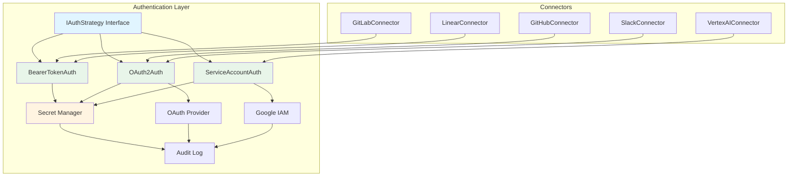

# Design: Authentication Strategy

**Document ID:** 016-DR-DSGN
**Date:** 2025-12-28
**Status:** ✅ Approved
**Epic:** B (Data Ingestion & Connector Framework)
**Story:** B2 (Design Core Connector Framework)
**Task:** B2.3 (Design authentication strategy)
**Author:** @security, @backend-architect
**Reviewers:** @connectors-lead, @infra

---

## Overview

This document defines the authentication strategy pattern for Git With Intent connectors. The design supports multiple authentication methods (Bearer Token, OAuth 2.0, Service Account) with secure credential storage, automatic token refresh, and consistent error handling.

**Goals:**
1. Support 3 authentication methods covering 100% of target connectors
2. Secure credential storage in GCP Secret Manager
3. Automatic token refresh for OAuth 2.0
4. Unified interface for all auth strategies
5. Audit logging for all authentication events

---

## Architecture Diagram



---

## Authentication Method Distribution

Based on research of 15 production connectors:

| Method | Usage | Connectors |
|--------|-------|------------|
| **Bearer Token** | 73% | GitHub (PAT), GitLab, Linear, Jira, Confluence, ClickUp, Airtable, Bookstack, Elasticsearch, Luma, Notion |
| **OAuth 2.0** | 13% | Slack, Discord |
| **Service Account** | 13% | Vertex AI, Google Calendar, Gmail |

---

## IAuthStrategy Interface

**Location:** `packages/connectors/src/auth/IAuthStrategy.ts`

```typescript
import { z } from 'zod';

/**
 * IAuthStrategy defines the contract for all authentication methods.
 *
 * Implementations must:
 * - Validate credentials
 * - Manage token lifecycle (refresh, expiration)
 * - Provide headers for HTTP requests
 * - Handle authentication errors
 */
export interface IAuthStrategy {
  /**
   * Strategy name (for logging and debugging)
   */
  readonly name: string;

  /**
   * Authenticate with the provided configuration.
   *
   * @param config - Authentication configuration
   * @throws {AuthenticationError} If authentication fails
   * @returns Promise resolving to authentication result
   */
  authenticate(config: AuthConfig): Promise<AuthResult>;

  /**
   * Refresh credentials if needed.
   *
   * Called automatically before each API request.
   * No-op for non-expiring tokens (Bearer).
   *
   * @throws {AuthenticationError} If refresh fails
   */
  refreshIfNeeded(): Promise<void>;

  /**
   * Get HTTP headers for authenticated requests.
   *
   * @returns Headers to include in API requests
   */
  getHeaders(): Record<string, string>;

  /**
   * Check if credentials are expired.
   *
   * @returns True if credentials need refresh
   */
  isExpired(): boolean;

  /**
   * Revoke credentials (logout).
   *
   * @throws {AuthenticationError} If revocation fails
   */
  revoke(): Promise<void>;

  /**
   * Get current authentication state.
   *
   * @returns Current auth state (for persistence)
   */
  getState(): AuthState;

  /**
   * Restore authentication from saved state.
   *
   * @param state - Saved auth state
   */
  setState(state: AuthState): void;
}
```

---

## Type Definitions

### AuthConfig

```typescript
/**
 * Authentication configuration (discriminated union)
 */
export type AuthConfig =
  | BearerTokenAuthConfig
  | OAuth2AuthConfig
  | ServiceAccountAuthConfig;

export interface BearerTokenAuthConfig {
  type: 'bearer';
  token: string;
  /**
   * Optional token metadata (scopes, user, etc.)
   */
  metadata?: Record<string, any>;
}

export interface OAuth2AuthConfig {
  type: 'oauth2';
  clientId: string;
  clientSecret: string;
  redirectUri: string;
  /**
   * OAuth 2.0 scopes
   */
  scopes: string[];
  /**
   * Authorization code (for initial token exchange)
   */
  authorizationCode?: string;
  /**
   * Refresh token (for subsequent refreshes)
   */
  refreshToken?: string;
  /**
   * Access token (if already authenticated)
   */
  accessToken?: string;
  /**
   * Token expiration time
   */
  expiresAt?: string;
  /**
   * OAuth provider URLs
   */
  authUrl?: string;
  tokenUrl?: string;
}

export interface ServiceAccountAuthConfig {
  type: 'service_account';
  /**
   * Service account email
   */
  serviceAccountEmail: string;
  /**
   * Service account private key (PEM format)
   */
  privateKey: string;
  /**
   * GCP project ID
   */
  projectId: string;
  /**
   * Scopes to request
   */
  scopes: string[];
  /**
   * Subject (for domain-wide delegation)
   */
  subject?: string;
}

// Zod schemas for validation
export const BearerTokenAuthConfigSchema = z.object({
  type: z.literal('bearer'),
  token: z.string().min(1),
  metadata: z.record(z.any()).optional()
});

export const OAuth2AuthConfigSchema = z.object({
  type: z.literal('oauth2'),
  clientId: z.string().min(1),
  clientSecret: z.string().min(1),
  redirectUri: z.string().url(),
  scopes: z.array(z.string()),
  authorizationCode: z.string().optional(),
  refreshToken: z.string().optional(),
  accessToken: z.string().optional(),
  expiresAt: z.string().datetime().optional(),
  authUrl: z.string().url().optional(),
  tokenUrl: z.string().url().optional()
});

export const ServiceAccountAuthConfigSchema = z.object({
  type: z.literal('service_account'),
  serviceAccountEmail: z.string().email(),
  privateKey: z.string().min(1),
  projectId: z.string().min(1),
  scopes: z.array(z.string()),
  subject: z.string().optional()
});

export const AuthConfigSchema = z.discriminatedUnion('type', [
  BearerTokenAuthConfigSchema,
  OAuth2AuthConfigSchema,
  ServiceAccountAuthConfigSchema
]);
```

### AuthResult

```typescript
/**
 * Result of authentication attempt
 */
export interface AuthResult {
  /**
   * Whether authentication succeeded
   */
  success: boolean;
  /**
   * Access token
   */
  token?: string;
  /**
   * Token type (e.g., 'Bearer')
   */
  tokenType?: string;
  /**
   * Token expiration time (ISO 8601)
   */
  expiresAt?: string;
  /**
   * Refresh token (for OAuth 2.0)
   */
  refreshToken?: string;
  /**
   * Granted scopes
   */
  scopes?: string[];
  /**
   * Error message (if failed)
   */
  error?: string;
  /**
   * Additional metadata (user info, etc.)
   */
  metadata?: Record<string, any>;
}

export const AuthResultSchema = z.object({
  success: z.boolean(),
  token: z.string().optional(),
  tokenType: z.string().optional(),
  expiresAt: z.string().datetime().optional(),
  refreshToken: z.string().optional(),
  scopes: z.array(z.string()).optional(),
  error: z.string().optional(),
  metadata: z.record(z.any()).optional()
});
```

### AuthState

```typescript
/**
 * Serializable authentication state (for persistence)
 */
export interface AuthState {
  /**
   * Strategy name
   */
  strategy: string;
  /**
   * Access token
   */
  token?: string;
  /**
   * Token expiration time
   */
  expiresAt?: string;
  /**
   * Refresh token
   */
  refreshToken?: string;
  /**
   * Last refresh time
   */
  lastRefreshedAt?: string;
  /**
   * Additional state data
   */
  metadata?: Record<string, any>;
}

export const AuthStateSchema = z.object({
  strategy: z.string(),
  token: z.string().optional(),
  expiresAt: z.string().datetime().optional(),
  refreshToken: z.string().optional(),
  lastRefreshedAt: z.string().datetime().optional(),
  metadata: z.record(z.any()).optional()
});
```

---

## Implementation: BearerTokenAuth

**Location:** `packages/connectors/src/auth/BearerTokenAuth.ts`

**Usage:** GitHub (PAT), GitLab, Linear, Jira (73% of connectors)

```typescript
import { IAuthStrategy, AuthConfig, BearerTokenAuthConfig, AuthResult, AuthState } from './IAuthStrategy';
import { AuthenticationError } from '../errors';
import { ISecretManager } from '../secrets/ISecretManager';
import { ILogger } from '../observability/ILogger';

export class BearerTokenAuth implements IAuthStrategy {
  readonly name = 'bearer';

  private token?: string;
  private metadata?: Record<string, any>;

  constructor(
    private secretManager: ISecretManager,
    private logger: ILogger,
    private tenantId: string
  ) {}

  async authenticate(config: AuthConfig): Promise<AuthResult> {
    // Validate config
    const validated = BearerTokenAuthConfigSchema.parse(config);

    try {
      // Store token in Secret Manager
      await this.secretManager.setSecret(
        this.tenantId,
        'bearer-token',
        validated.token
      );

      // Cache token in memory
      this.token = validated.token;
      this.metadata = validated.metadata;

      this.logger.info('Bearer token authentication succeeded', {
        tenantId: this.tenantId,
        strategy: this.name
      });

      return {
        success: true,
        token: validated.token,
        tokenType: 'Bearer',
        metadata: validated.metadata
      };
    } catch (error) {
      this.logger.error('Bearer token authentication failed', {
        tenantId: this.tenantId,
        error: error.message
      });

      throw new AuthenticationError(
        `Bearer token authentication failed: ${error.message}`,
        this.name
      );
    }
  }

  async refreshIfNeeded(): Promise<void> {
    // Bearer tokens don't expire (no-op)
    // Subclasses can override if needed
  }

  getHeaders(): Record<string, string> {
    if (!this.token) {
      throw new AuthenticationError('Not authenticated', this.name);
    }

    return {
      'Authorization': `Bearer ${this.token}`
    };
  }

  isExpired(): boolean {
    // Bearer tokens don't expire
    return false;
  }

  async revoke(): Promise<void> {
    // Delete token from Secret Manager
    await this.secretManager.deleteSecret(this.tenantId, 'bearer-token');

    // Clear cached token
    this.token = undefined;
    this.metadata = undefined;

    this.logger.info('Bearer token revoked', {
      tenantId: this.tenantId,
      strategy: this.name
    });
  }

  getState(): AuthState {
    return {
      strategy: this.name,
      token: this.token,
      metadata: this.metadata
    };
  }

  setState(state: AuthState): void {
    if (state.strategy !== this.name) {
      throw new Error(`Invalid state (expected ${this.name}, got ${state.strategy})`);
    }

    this.token = state.token;
    this.metadata = state.metadata;
  }
}
```

---

## Implementation: OAuth2Auth

**Location:** `packages/connectors/src/auth/OAuth2Auth.ts`

**Usage:** Slack, Discord, GitHub Apps (13% of connectors)

```typescript
import { IAuthStrategy, AuthConfig, OAuth2AuthConfig, AuthResult, AuthState } from './IAuthStrategy';
import { AuthenticationError } from '../errors';
import { ISecretManager } from '../secrets/ISecretManager';
import { ILogger } from '../observability/ILogger';
import axios from 'axios';

export class OAuth2Auth implements IAuthStrategy {
  readonly name = 'oauth2';

  private accessToken?: string;
  private refreshToken?: string;
  private expiresAt?: Date;
  private scopes: string[] = [];
  private config?: OAuth2AuthConfig;

  // Token refresh buffer (refresh 5 minutes before expiry)
  private readonly REFRESH_BUFFER_MS = 5 * 60 * 1000;

  constructor(
    private secretManager: ISecretManager,
    private logger: ILogger,
    private tenantId: string
  ) {}

  async authenticate(config: AuthConfig): Promise<AuthResult> {
    // Validate config
    const validated = OAuth2AuthConfigSchema.parse(config);
    this.config = validated;

    try {
      // Exchange authorization code for tokens (if provided)
      if (validated.authorizationCode) {
        return await this.exchangeCode(validated);
      }

      // Use existing access token (if provided)
      if (validated.accessToken) {
        this.accessToken = validated.accessToken;
        this.refreshToken = validated.refreshToken;
        this.expiresAt = validated.expiresAt ? new Date(validated.expiresAt) : undefined;
        this.scopes = validated.scopes;

        // Refresh if expired
        await this.refreshIfNeeded();

        return {
          success: true,
          token: this.accessToken,
          tokenType: 'Bearer',
          expiresAt: this.expiresAt?.toISOString(),
          refreshToken: this.refreshToken,
          scopes: this.scopes
        };
      }

      throw new AuthenticationError(
        'OAuth2 authentication requires authorizationCode or accessToken',
        this.name
      );
    } catch (error) {
      this.logger.error('OAuth2 authentication failed', {
        tenantId: this.tenantId,
        error: error.message
      });

      throw new AuthenticationError(
        `OAuth2 authentication failed: ${error.message}`,
        this.name
      );
    }
  }

  private async exchangeCode(config: OAuth2AuthConfig): Promise<AuthResult> {
    const tokenUrl = config.tokenUrl || this.getDefaultTokenUrl(config);

    this.logger.info('Exchanging authorization code for tokens', {
      tenantId: this.tenantId,
      tokenUrl
    });

    const response = await axios.post(tokenUrl, {
      grant_type: 'authorization_code',
      code: config.authorizationCode,
      client_id: config.clientId,
      client_secret: config.clientSecret,
      redirect_uri: config.redirectUri
    }, {
      headers: { 'Content-Type': 'application/x-www-form-urlencoded' }
    });

    const { access_token, refresh_token, expires_in, scope } = response.data;

    // Calculate expiration time
    const expiresAt = new Date(Date.now() + expires_in * 1000);

    // Store tokens in Secret Manager
    await this.secretManager.setSecret(
      this.tenantId,
      'oauth2-access-token',
      access_token
    );

    if (refresh_token) {
      await this.secretManager.setSecret(
        this.tenantId,
        'oauth2-refresh-token',
        refresh_token
      );
    }

    // Cache tokens
    this.accessToken = access_token;
    this.refreshToken = refresh_token;
    this.expiresAt = expiresAt;
    this.scopes = scope ? scope.split(' ') : config.scopes;

    this.logger.info('OAuth2 token exchange succeeded', {
      tenantId: this.tenantId,
      expiresAt: expiresAt.toISOString(),
      scopes: this.scopes
    });

    return {
      success: true,
      token: access_token,
      tokenType: 'Bearer',
      expiresAt: expiresAt.toISOString(),
      refreshToken: refresh_token,
      scopes: this.scopes
    };
  }

  async refreshIfNeeded(): Promise<void> {
    if (!this.isExpired()) {
      return; // Token still valid
    }

    if (!this.refreshToken) {
      throw new AuthenticationError(
        'Cannot refresh token (no refresh token available)',
        this.name
      );
    }

    this.logger.info('Refreshing OAuth2 access token', {
      tenantId: this.tenantId
    });

    const tokenUrl = this.config?.tokenUrl || this.getDefaultTokenUrl(this.config!);

    const response = await axios.post(tokenUrl, {
      grant_type: 'refresh_token',
      refresh_token: this.refreshToken,
      client_id: this.config!.clientId,
      client_secret: this.config!.clientSecret
    }, {
      headers: { 'Content-Type': 'application/x-www-form-urlencoded' }
    });

    const { access_token, refresh_token, expires_in } = response.data;

    // Update tokens
    this.accessToken = access_token;
    if (refresh_token) {
      this.refreshToken = refresh_token;
    }
    this.expiresAt = new Date(Date.now() + expires_in * 1000);

    // Update Secret Manager
    await this.secretManager.setSecret(
      this.tenantId,
      'oauth2-access-token',
      access_token
    );

    if (refresh_token) {
      await this.secretManager.setSecret(
        this.tenantId,
        'oauth2-refresh-token',
        refresh_token
      );
    }

    this.logger.info('OAuth2 token refresh succeeded', {
      tenantId: this.tenantId,
      expiresAt: this.expiresAt.toISOString()
    });
  }

  getHeaders(): Record<string, string> {
    if (!this.accessToken) {
      throw new AuthenticationError('Not authenticated', this.name);
    }

    return {
      'Authorization': `Bearer ${this.accessToken}`
    };
  }

  isExpired(): boolean {
    if (!this.expiresAt) {
      return false; // No expiration set
    }

    // Check if token expires within buffer window
    return Date.now() >= this.expiresAt.getTime() - this.REFRESH_BUFFER_MS;
  }

  async revoke(): Promise<void> {
    // Revoke tokens (OAuth provider-specific)
    // For simplicity, just delete from Secret Manager
    await this.secretManager.deleteSecret(this.tenantId, 'oauth2-access-token');
    await this.secretManager.deleteSecret(this.tenantId, 'oauth2-refresh-token');

    // Clear cached tokens
    this.accessToken = undefined;
    this.refreshToken = undefined;
    this.expiresAt = undefined;

    this.logger.info('OAuth2 tokens revoked', {
      tenantId: this.tenantId
    });
  }

  getState(): AuthState {
    return {
      strategy: this.name,
      token: this.accessToken,
      expiresAt: this.expiresAt?.toISOString(),
      refreshToken: this.refreshToken,
      metadata: { scopes: this.scopes }
    };
  }

  setState(state: AuthState): void {
    if (state.strategy !== this.name) {
      throw new Error(`Invalid state (expected ${this.name}, got ${state.strategy})`);
    }

    this.accessToken = state.token;
    this.refreshToken = state.refreshToken;
    this.expiresAt = state.expiresAt ? new Date(state.expiresAt) : undefined;
    this.scopes = state.metadata?.scopes || [];
  }

  private getDefaultTokenUrl(config: OAuth2AuthConfig): string {
    // Provider-specific defaults
    // In production, this should be configured per connector
    throw new Error('Token URL must be provided in config');
  }
}
```

---

## Implementation: ServiceAccountAuth

**Location:** `packages/connectors/src/auth/ServiceAccountAuth.ts`

**Usage:** Vertex AI, Google Calendar, Gmail (13% of connectors)

```typescript
import { IAuthStrategy, AuthConfig, ServiceAccountAuthConfig, AuthResult, AuthState } from './IAuthStrategy';
import { AuthenticationError } from '../errors';
import { ISecretManager } from '../secrets/ISecretManager';
import { ILogger } from '../observability/ILogger';
import { google } from 'googleapis';
import { JWT } from 'google-auth-library';

export class ServiceAccountAuth implements IAuthStrategy {
  readonly name = 'service_account';

  private jwtClient?: JWT;
  private accessToken?: string;
  private expiresAt?: Date;

  constructor(
    private secretManager: ISecretManager,
    private logger: ILogger,
    private tenantId: string
  ) {}

  async authenticate(config: AuthConfig): Promise<AuthResult> {
    // Validate config
    const validated = ServiceAccountAuthConfigSchema.parse(config);

    try {
      // Create JWT client
      this.jwtClient = new JWT({
        email: validated.serviceAccountEmail,
        key: validated.privateKey,
        scopes: validated.scopes,
        subject: validated.subject
      });

      // Get access token
      const tokens = await this.jwtClient.getAccessToken();

      if (!tokens.token) {
        throw new Error('No access token returned');
      }

      this.accessToken = tokens.token;
      this.expiresAt = tokens.res?.data.expires_in
        ? new Date(Date.now() + tokens.res.data.expires_in * 1000)
        : undefined;

      // Store in Secret Manager
      await this.secretManager.setSecret(
        this.tenantId,
        'service-account-token',
        this.accessToken
      );

      this.logger.info('Service account authentication succeeded', {
        tenantId: this.tenantId,
        serviceAccountEmail: validated.serviceAccountEmail,
        expiresAt: this.expiresAt?.toISOString()
      });

      return {
        success: true,
        token: this.accessToken,
        tokenType: 'Bearer',
        expiresAt: this.expiresAt?.toISOString(),
        scopes: validated.scopes,
        metadata: {
          serviceAccountEmail: validated.serviceAccountEmail
        }
      };
    } catch (error) {
      this.logger.error('Service account authentication failed', {
        tenantId: this.tenantId,
        error: error.message
      });

      throw new AuthenticationError(
        `Service account authentication failed: ${error.message}`,
        this.name
      );
    }
  }

  async refreshIfNeeded(): Promise<void> {
    if (!this.isExpired()) {
      return; // Token still valid
    }

    if (!this.jwtClient) {
      throw new AuthenticationError('Not authenticated', this.name);
    }

    this.logger.info('Refreshing service account token', {
      tenantId: this.tenantId
    });

    const tokens = await this.jwtClient.getAccessToken();

    if (!tokens.token) {
      throw new Error('No access token returned');
    }

    this.accessToken = tokens.token;
    this.expiresAt = tokens.res?.data.expires_in
      ? new Date(Date.now() + tokens.res.data.expires_in * 1000)
      : undefined;

    // Update Secret Manager
    await this.secretManager.setSecret(
      this.tenantId,
      'service-account-token',
      this.accessToken
    );

    this.logger.info('Service account token refresh succeeded', {
      tenantId: this.tenantId,
      expiresAt: this.expiresAt?.toISOString()
    });
  }

  getHeaders(): Record<string, string> {
    if (!this.accessToken) {
      throw new AuthenticationError('Not authenticated', this.name);
    }

    return {
      'Authorization': `Bearer ${this.accessToken}`
    };
  }

  isExpired(): boolean {
    if (!this.expiresAt) {
      return false;
    }

    // Refresh 5 minutes before expiry
    const bufferMs = 5 * 60 * 1000;
    return Date.now() >= this.expiresAt.getTime() - bufferMs;
  }

  async revoke(): Promise<void> {
    // Delete from Secret Manager
    await this.secretManager.deleteSecret(this.tenantId, 'service-account-token');

    // Clear cached data
    this.accessToken = undefined;
    this.expiresAt = undefined;
    this.jwtClient = undefined;

    this.logger.info('Service account token revoked', {
      tenantId: this.tenantId
    });
  }

  getState(): AuthState {
    return {
      strategy: this.name,
      token: this.accessToken,
      expiresAt: this.expiresAt?.toISOString()
    };
  }

  setState(state: AuthState): void {
    if (state.strategy !== this.name) {
      throw new Error(`Invalid state (expected ${this.name}, got ${state.strategy})`);
    }

    this.accessToken = state.token;
    this.expiresAt = state.expiresAt ? new Date(state.expiresAt) : undefined;
    // Note: JWT client must be recreated via authenticate()
  }
}
```

---

## Secret Manager Integration

**Location:** `packages/connectors/src/secrets/ISecretManager.ts`

```typescript
export interface ISecretManager {
  /**
   * Get secret value
   */
  getSecret(tenantId: string, key: string): Promise<string>;

  /**
   * Set secret value
   */
  setSecret(tenantId: string, key: string, value: string): Promise<void>;

  /**
   * Delete secret
   */
  deleteSecret(tenantId: string, key: string): Promise<void>;

  /**
   * List secrets for tenant
   */
  listSecrets(tenantId: string): Promise<string[]>;
}

/**
 * GCP Secret Manager implementation
 */
export class GCPSecretManager implements ISecretManager {
  private client: SecretManagerServiceClient;

  constructor(private projectId: string) {
    this.client = new SecretManagerServiceClient();
  }

  async getSecret(tenantId: string, key: string): Promise<string> {
    const name = this.getSecretName(tenantId, key);

    const [version] = await this.client.accessSecretVersion({
      name: `${name}/versions/latest`
    });

    const payload = version.payload?.data;
    if (!payload) {
      throw new Error(`Secret ${name} has no payload`);
    }

    return payload.toString();
  }

  async setSecret(tenantId: string, key: string, value: string): Promise<void> {
    const name = this.getSecretName(tenantId, key);

    try {
      // Create secret if doesn't exist
      await this.client.createSecret({
        parent: `projects/${this.projectId}`,
        secretId: this.getSecretId(tenantId, key),
        secret: {
          replication: { automatic: {} }
        }
      });
    } catch (error) {
      if (!error.message.includes('already exists')) {
        throw error;
      }
    }

    // Add secret version
    await this.client.addSecretVersion({
      parent: name,
      payload: {
        data: Buffer.from(value)
      }
    });
  }

  async deleteSecret(tenantId: string, key: string): Promise<void> {
    const name = this.getSecretName(tenantId, key);
    await this.client.deleteSecret({ name });
  }

  async listSecrets(tenantId: string): Promise<string[]> {
    const [secrets] = await this.client.listSecrets({
      parent: `projects/${this.projectId}`,
      filter: `labels.tenant_id="${tenantId}"`
    });

    return secrets.map(s => s.name!);
  }

  private getSecretId(tenantId: string, key: string): string {
    return `gwi-${tenantId}-${key}`.replace(/[^a-zA-Z0-9-]/g, '-');
  }

  private getSecretName(tenantId: string, key: string): string {
    return `projects/${this.projectId}/secrets/${this.getSecretId(tenantId, key)}`;
  }
}
```

---

## Audit Logging

All authentication events are logged for security audit:

```typescript
export interface AuthAuditLog {
  timestamp: string;
  tenantId: string;
  strategy: string;
  action: 'authenticate' | 'refresh' | 'revoke';
  success: boolean;
  error?: string;
  metadata?: Record<string, any>;
}

// Example audit log entry
{
  "timestamp": "2025-12-28T10:00:00Z",
  "tenantId": "tenant-123",
  "strategy": "oauth2",
  "action": "refresh",
  "success": true,
  "metadata": {
    "expiresAt": "2025-12-28T11:00:00Z",
    "scopes": ["repo", "read:org"]
  }
}
```

---

## Usage Examples

### Example 1: Bearer Token (GitHub)

```typescript
import { BearerTokenAuth } from '@gwi/connectors/auth';
import { GCPSecretManager } from '@gwi/connectors/secrets';

const secretManager = new GCPSecretManager('my-project');
const logger = new StructuredLogger();
const auth = new BearerTokenAuth(secretManager, logger, 'tenant-123');

// Authenticate
await auth.authenticate({
  type: 'bearer',
  token: process.env.GITHUB_TOKEN!
});

// Get headers for API requests
const headers = auth.getHeaders();
// { "Authorization": "Bearer ghp_abc123..." }
```

### Example 2: OAuth 2.0 (Slack)

```typescript
import { OAuth2Auth } from '@gwi/connectors/auth';

const auth = new OAuth2Auth(secretManager, logger, 'tenant-123');

// Initial authentication (exchange authorization code)
await auth.authenticate({
  type: 'oauth2',
  clientId: process.env.SLACK_CLIENT_ID!,
  clientSecret: process.env.SLACK_CLIENT_SECRET!,
  redirectUri: 'https://app.example.com/oauth/callback',
  scopes: ['channels:read', 'chat:write'],
  authorizationCode: req.query.code,
  tokenUrl: 'https://slack.com/api/oauth.v2.access'
});

// Subsequent requests (automatic token refresh)
await auth.refreshIfNeeded();
const headers = auth.getHeaders();
```

### Example 3: Service Account (Vertex AI)

```typescript
import { ServiceAccountAuth } from '@gwi/connectors/auth';

const auth = new ServiceAccountAuth(secretManager, logger, 'tenant-123');

// Authenticate
await auth.authenticate({
  type: 'service_account',
  serviceAccountEmail: 'connector@project.iam.gserviceaccount.com',
  privateKey: process.env.SERVICE_ACCOUNT_KEY!,
  projectId: 'my-project',
  scopes: ['https://www.googleapis.com/auth/cloud-platform']
});

// Get headers (automatic refresh)
await auth.refreshIfNeeded();
const headers = auth.getHeaders();
```

---

## Testing

### Unit Tests

```typescript
describe('BearerTokenAuth', () => {
  let auth: BearerTokenAuth;
  let mockSecretManager: jest.Mocked<ISecretManager>;

  beforeEach(() => {
    mockSecretManager = {
      getSecret: jest.fn(),
      setSecret: jest.fn(),
      deleteSecret: jest.fn(),
      listSecrets: jest.fn()
    };

    auth = new BearerTokenAuth(
      mockSecretManager,
      new MockLogger(),
      'tenant-123'
    );
  });

  it('should authenticate with bearer token', async () => {
    const result = await auth.authenticate({
      type: 'bearer',
      token: 'abc123'
    });

    expect(result.success).toBe(true);
    expect(result.token).toBe('abc123');
    expect(mockSecretManager.setSecret).toHaveBeenCalledWith(
      'tenant-123',
      'bearer-token',
      'abc123'
    );
  });

  it('should return headers', () => {
    auth.setState({ strategy: 'bearer', token: 'abc123' });

    const headers = auth.getHeaders();

    expect(headers).toEqual({ 'Authorization': 'Bearer abc123' });
  });
});
```

---

## Security Considerations

### 1. Secret Storage

- ✅ All credentials stored in GCP Secret Manager
- ✅ No secrets in code, environment variables, or logs
- ✅ Fine-grained IAM permissions (least privilege)

### 2. Token Rotation

- ✅ OAuth 2.0 tokens automatically refreshed before expiry
- ✅ Service account tokens refreshed with 5-minute buffer
- ✅ Bearer tokens can be rotated via API

### 3. Audit Trail

- ✅ All authentication events logged
- ✅ Failed authentication attempts tracked
- ✅ Token revocations audited

### 4. Error Handling

- ✅ Generic error messages to prevent credential leaks
- ✅ Detailed errors logged securely (not returned to client)
- ✅ Rate limiting on authentication attempts

---

## Performance Considerations

### 1. Token Caching

- In-memory cache to avoid Secret Manager calls on every request
- Cache invalidation on token refresh/revoke

### 2. Parallel Authentication

- Multiple connectors can authenticate concurrently
- Secret Manager supports high throughput (100+ req/s)

### 3. Token Refresh

- Automatic refresh with buffer (5 minutes before expiry)
- Prevents "authentication failed" errors during sync

---

## References

- 014-DR-DSGN-connector-abstraction.md (Abstraction layer design)
- 015-DR-DSGN-iconnector-interface.md (IConnector interface)
- 012-DR-ADRC-connector-framework-architecture-decision.md (Parent ADR)
- GCP Secret Manager: https://cloud.google.com/secret-manager/docs
- OAuth 2.0 RFC: https://datatracker.ietf.org/doc/html/rfc6749

---

**Next Steps:**
1. Design webhook receiver → 017-DR-DSGN-webhook-receiver.md
2. Create connector registry → 018-DR-DSGN-connector-registry.md
3. Implement authentication strategies
4. Build reference implementation (GitHub connector)

**Status:** ✅ Approved for implementation
**Approved By:** @security, @connectors-lead, @backend-architect, @infra
