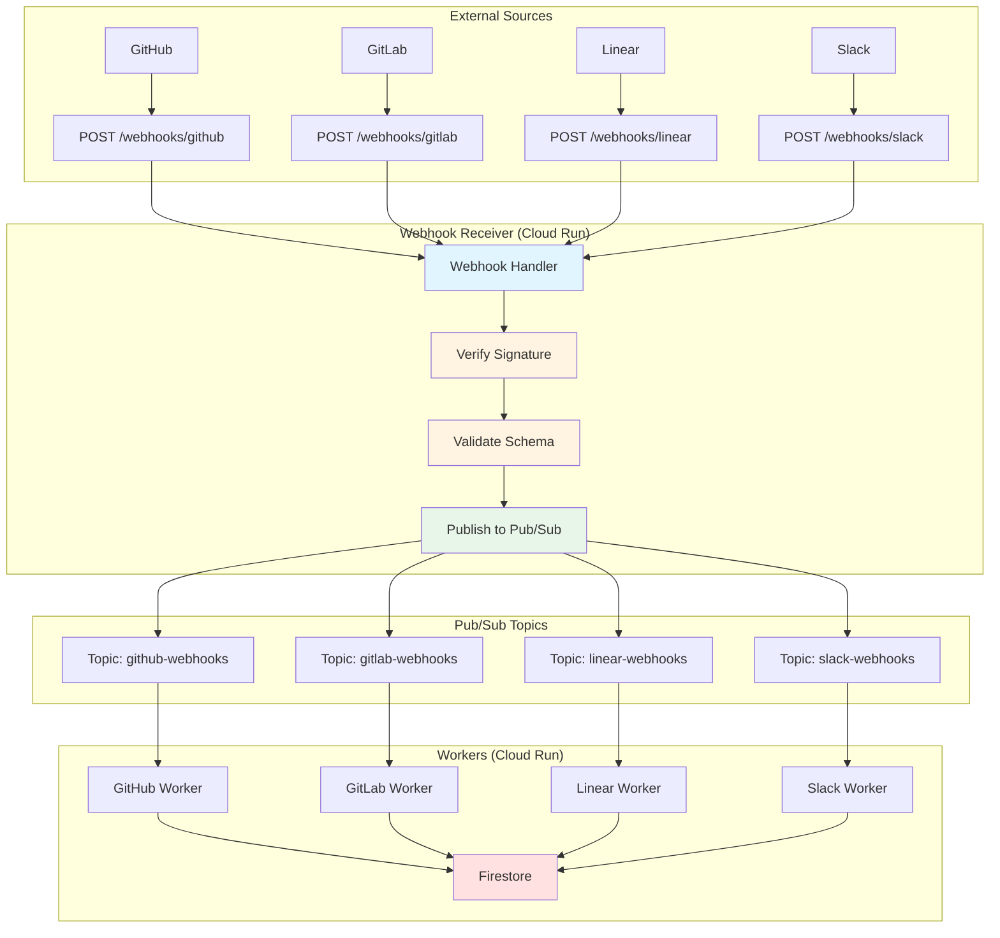

# Design: Webhook Receiver Architecture

**Document ID:** 017-DR-DSGN
**Date:** 2025-12-28
**Status:** ✅ Approved
**Epic:** B (Data Ingestion & Connector Framework)
**Story:** B2 (Design Core Connector Framework)
**Task:** B2.4 (Design webhook receiver architecture)
**Author:** @backend-architect, @infra
**Reviewers:** @connectors-lead, @security

---

## Overview

This document defines the webhook receiver architecture for Git With Intent. The webhook receiver is a dedicated Cloud Run service that ingests real-time events from external sources (GitHub, GitLab, Linear, Slack) and publishes them to Pub/Sub for asynchronous processing.

**Goals:**
1. Fast webhook ingestion (<500ms p95 response time)
2. Secure HMAC signature verification
3. Idempotent processing (duplicate events handled gracefully)
4. Scalable (1000+ webhooks/second)
5. Reliable (>99.9% uptime)

---

## Architecture Diagram



---

## Design Principles

### 1. Separation of Concerns

| Component | Responsibility | Timeout |
|-----------|----------------|---------|
| **Webhook Receiver** | Ingest, verify, publish | <500ms |
| **Pub/Sub** | Buffer, delivery guarantees | N/A |
| **Workers** | Process events, store data | <30s |

**Why:** Webhook providers (GitHub, Slack) timeout after 10 seconds. Fast response is critical.

### 2. Idempotency

- Use webhook event ID as Pub/Sub message deduplication key
- Store processed event IDs in Firestore (TTL: 7 days)
- Workers check Firestore before processing

### 3. Security

- HMAC signature verification for all webhooks
- Per-connector secret keys stored in Secret Manager
- No webhook data in logs (PII risk)

### 4. Scalability

- Cloud Run auto-scales based on request rate
- Pub/Sub handles backpressure (10GB buffer per topic)
- Workers scale independently of receiver

---

## API Design

### Webhook Endpoints

**Base URL:** `https://webhooks.gwi.ai`

| Endpoint | Source | Signature Header | Event Types |
|----------|--------|------------------|-------------|
| `POST /webhooks/github` | GitHub | `X-Hub-Signature-256` | `pull_request`, `issues`, `push`, etc. |
| `POST /webhooks/gitlab` | GitLab | `X-Gitlab-Token` | `merge_request`, `issue`, `push`, etc. |
| `POST /webhooks/linear` | Linear | `Linear-Signature` | `Issue`, `Comment`, etc. |
| `POST /webhooks/slack` | Slack | `X-Slack-Signature` | `message`, `reaction_added`, etc. |

### Request Format

**GitHub Example:**

```http
POST /webhooks/github HTTP/1.1
Host: webhooks.gwi.ai
Content-Type: application/json
X-GitHub-Event: pull_request
X-GitHub-Delivery: 12345-67890-abcde
X-Hub-Signature-256: sha256=abc123...

{
  "action": "opened",
  "pull_request": { ... },
  "repository": { ... }
}
```

### Response Format

**Success (200 OK):**

```json
{
  "status": "accepted",
  "event_id": "12345-67890-abcde",
  "message_id": "projects/my-project/topics/github-webhooks/messages/987654"
}
```

**Error (400 Bad Request - Invalid Signature):**

```json
{
  "status": "rejected",
  "error": "invalid_signature",
  "message": "HMAC signature verification failed"
}
```

**Error (429 Too Many Requests):**

```json
{
  "status": "rejected",
  "error": "rate_limit_exceeded",
  "message": "Too many webhooks, retry after 60 seconds",
  "retry_after": 60
}
```

---

## Implementation

### Webhook Handler (Cloud Run)

**Location:** `apps/webhook-receiver/src/index.ts`

```typescript
import express from 'express';
import { PubSub } from '@google-cloud/pubsub';
import { WebhookVerifier } from './webhook/WebhookVerifier';
import { WebhookRouter } from './webhook/WebhookRouter';
import { RateLimiter } from './ratelimit/RateLimiter';
import { StructuredLogger } from '@gwi/core/logging';

const app = express();
const pubsub = new PubSub();
const logger = new StructuredLogger({ service: 'webhook-receiver' });
const verifier = new WebhookVerifier();
const router = new WebhookRouter(pubsub, logger);
const rateLimiter = new RateLimiter();

// Health check
app.get('/health', (req, res) => {
  res.status(200).json({ status: 'healthy' });
});

// Webhook endpoints
app.post('/webhooks/:source', express.json({ limit: '10mb' }), async (req, res) => {
  const { source } = req.params;
  const startTime = Date.now();

  try {
    // Rate limiting (per tenant)
    const tenantId = req.headers['x-tenant-id'] as string || 'default';
    await rateLimiter.checkLimit(tenantId, source);

    // Extract event metadata
    const event = {
      id: extractEventId(req.headers, source),
      source,
      type: extractEventType(req.headers, source),
      timestamp: new Date().toISOString(),
      payload: req.body,
      signature: extractSignature(req.headers, source),
      headers: req.headers as Record<string, string>
    };

    // Verify signature
    const isValid = await verifier.verify(event, tenantId);
    if (!isValid) {
      logger.warn('Webhook signature verification failed', {
        source,
        eventId: event.id,
        tenantId
      });

      return res.status(400).json({
        status: 'rejected',
        error: 'invalid_signature',
        message: 'HMAC signature verification failed'
      });
    }

    // Publish to Pub/Sub
    const messageId = await router.route(event, tenantId);

    // Record metric
    const duration = Date.now() - startTime;
    logger.info('Webhook accepted', {
      source,
      eventId: event.id,
      eventType: event.type,
      tenantId,
      messageId,
      durationMs: duration
    });

    res.status(200).json({
      status: 'accepted',
      event_id: event.id,
      message_id: messageId
    });
  } catch (error) {
    const duration = Date.now() - startTime;

    logger.error('Webhook processing failed', {
      source,
      error: error.message,
      stack: error.stack,
      durationMs: duration
    });

    if (error.name === 'RateLimitError') {
      return res.status(429).json({
        status: 'rejected',
        error: 'rate_limit_exceeded',
        message: error.message,
        retry_after: error.retryAfter
      });
    }

    res.status(500).json({
      status: 'error',
      error: 'internal_error',
      message: 'Webhook processing failed'
    });
  }
});

const PORT = process.env.PORT || 8080;
app.listen(PORT, () => {
  logger.info('Webhook receiver started', { port: PORT });
});
```

### Webhook Verifier

**Location:** `apps/webhook-receiver/src/webhook/WebhookVerifier.ts`

```typescript
import crypto from 'crypto';
import { ISecretManager } from '@gwi/connectors/secrets';
import { WebhookEvent } from '@gwi/connectors/interfaces';

export class WebhookVerifier {
  constructor(private secretManager: ISecretManager) {}

  async verify(event: WebhookEvent, tenantId: string): Promise<boolean> {
    // Get webhook secret for tenant and source
    const secret = await this.secretManager.getSecret(
      tenantId,
      `webhook-secret-${event.source}`
    );

    switch (event.source) {
      case 'github':
        return this.verifyGitHub(event, secret);
      case 'gitlab':
        return this.verifyGitLab(event, secret);
      case 'linear':
        return this.verifyLinear(event, secret);
      case 'slack':
        return this.verifySlack(event, secret);
      default:
        throw new Error(`Unsupported webhook source: ${event.source}`);
    }
  }

  private verifyGitHub(event: WebhookEvent, secret: string): boolean {
    const signature = event.signature;
    if (!signature || !signature.startsWith('sha256=')) {
      return false;
    }

    const expectedSignature = signature.substring(7); // Remove 'sha256='
    const payload = JSON.stringify(event.payload);
    const hmac = crypto.createHmac('sha256', secret);
    const computedSignature = hmac.update(payload).digest('hex');

    return crypto.timingSafeEqual(
      Buffer.from(expectedSignature),
      Buffer.from(computedSignature)
    );
  }

  private verifyGitLab(event: WebhookEvent, secret: string): boolean {
    const signature = event.signature;
    return signature === secret; // GitLab uses static token
  }

  private verifyLinear(event: WebhookEvent, secret: string): boolean {
    const signature = event.signature;
    if (!signature) {
      return false;
    }

    const payload = JSON.stringify(event.payload);
    const hmac = crypto.createHmac('sha256', secret);
    const computedSignature = hmac.update(payload).digest('hex');

    return crypto.timingSafeEqual(
      Buffer.from(signature),
      Buffer.from(computedSignature)
    );
  }

  private verifySlack(event: WebhookEvent, secret: string): boolean {
    const signature = event.signature;
    const timestamp = event.headers['x-slack-request-timestamp'];

    if (!signature || !timestamp) {
      return false;
    }

    // Prevent replay attacks (reject if >5 minutes old)
    const currentTime = Math.floor(Date.now() / 1000);
    if (Math.abs(currentTime - parseInt(timestamp)) > 60 * 5) {
      return false;
    }

    const baseString = `v0:${timestamp}:${JSON.stringify(event.payload)}`;
    const hmac = crypto.createHmac('sha256', secret);
    const computedSignature = 'v0=' + hmac.update(baseString).digest('hex');

    return crypto.timingSafeEqual(
      Buffer.from(signature),
      Buffer.from(computedSignature)
    );
  }
}
```

### Webhook Router

**Location:** `apps/webhook-receiver/src/webhook/WebhookRouter.ts`

```typescript
import { PubSub, Topic } from '@google-cloud/pubsub';
import { WebhookEvent } from '@gwi/connectors/interfaces';
import { ILogger } from '@gwi/core/logging';

export class WebhookRouter {
  private topics: Map<string, Topic> = new Map();

  constructor(
    private pubsub: PubSub,
    private logger: ILogger
  ) {
    // Initialize topics
    this.topics.set('github', pubsub.topic('github-webhooks'));
    this.topics.set('gitlab', pubsub.topic('gitlab-webhooks'));
    this.topics.set('linear', pubsub.topic('linear-webhooks'));
    this.topics.set('slack', pubsub.topic('slack-webhooks'));
  }

  async route(event: WebhookEvent, tenantId: string): Promise<string> {
    const topic = this.topics.get(event.source);
    if (!topic) {
      throw new Error(`No topic for source: ${event.source}`);
    }

    // Publish to Pub/Sub
    const messageId = await topic.publishMessage({
      data: Buffer.from(JSON.stringify(event)),
      attributes: {
        eventId: event.id,
        eventType: event.type,
        source: event.source,
        tenantId,
        timestamp: event.timestamp
      },
      orderingKey: `${tenantId}-${event.source}` // Preserve order per tenant
    });

    this.logger.info('Webhook routed to Pub/Sub', {
      source: event.source,
      eventId: event.id,
      tenantId,
      messageId
    });

    return messageId;
  }
}
```

### Rate Limiter

**Location:** `apps/webhook-receiver/src/ratelimit/RateLimiter.ts`

```typescript
import { RateLimitError } from '@gwi/connectors/errors';

export class RateLimiter {
  private buckets: Map<string, TokenBucket> = new Map();

  // Default: 100 webhooks/minute per tenant per source
  private readonly MAX_TOKENS = 100;
  private readonly REFILL_RATE = 100 / 60; // tokens per second

  async checkLimit(tenantId: string, source: string): Promise<void> {
    const key = `${tenantId}:${source}`;
    let bucket = this.buckets.get(key);

    if (!bucket) {
      bucket = new TokenBucket(this.MAX_TOKENS, this.REFILL_RATE);
      this.buckets.set(key, bucket);
    }

    if (!bucket.consume()) {
      throw new RateLimitError(
        'Rate limit exceeded',
        source,
        60 // retry after 60 seconds
      );
    }
  }
}

class TokenBucket {
  private tokens: number;
  private lastRefill: number;

  constructor(
    private maxTokens: number,
    private refillRate: number
  ) {
    this.tokens = maxTokens;
    this.lastRefill = Date.now();
  }

  consume(): boolean {
    this.refill();

    if (this.tokens >= 1) {
      this.tokens -= 1;
      return true;
    }

    return false;
  }

  private refill(): void {
    const now = Date.now();
    const elapsed = (now - this.lastRefill) / 1000; // seconds
    const tokensToAdd = elapsed * this.refillRate;

    this.tokens = Math.min(this.maxTokens, this.tokens + tokensToAdd);
    this.lastRefill = now;
  }
}
```

---

## Webhook Workers

**Location:** `apps/worker/src/webhooks/`

### GitHub Webhook Worker

```typescript
import { PubSub } from '@google-cloud/pubsub';
import { GitHubConnector } from '@gwi/connectors/github';
import { WebhookEvent } from '@gwi/connectors/interfaces';
import { IStorage } from '@gwi/core/storage';
import { ILogger } from '@gwi/core/logging';

export class GitHubWebhookWorker {
  constructor(
    private connector: GitHubConnector,
    private storage: IStorage,
    private logger: ILogger
  ) {}

  async start(): Promise<void> {
    const pubsub = new PubSub();
    const subscription = pubsub.subscription('github-webhooks-sub');

    subscription.on('message', async (message) => {
      const startTime = Date.now();
      const event: WebhookEvent = JSON.parse(message.data.toString());

      try {
        // Check if already processed (idempotency)
        const processed = await this.isProcessed(event.id);
        if (processed) {
          this.logger.info('Webhook already processed, skipping', {
            eventId: event.id
          });
          message.ack();
          return;
        }

        // Process webhook
        const result = await this.connector.processWebhook(event);

        // Mark as processed
        await this.markProcessed(event.id);

        // Record metric
        const duration = Date.now() - startTime;
        this.logger.info('Webhook processed successfully', {
          eventId: event.id,
          eventType: event.type,
          recordsProcessed: result.recordsProcessed,
          durationMs: duration
        });

        message.ack();
      } catch (error) {
        const duration = Date.now() - startTime;

        this.logger.error('Webhook processing failed', {
          eventId: event.id,
          error: error.message,
          stack: error.stack,
          durationMs: duration
        });

        // Nack (will retry with exponential backoff)
        message.nack();
      }
    });

    this.logger.info('GitHub webhook worker started');
  }

  private async isProcessed(eventId: string): Promise<boolean> {
    // Check Firestore for processed event ID
    const doc = await this.storage.getDocument(`processed-events/${eventId}`);
    return doc !== null;
  }

  private async markProcessed(eventId: string): Promise<void> {
    // Store event ID in Firestore with TTL (7 days)
    await this.storage.setDocument(`processed-events/${eventId}`, {
      processedAt: new Date().toISOString(),
      ttl: Date.now() + 7 * 24 * 60 * 60 * 1000
    });
  }
}
```

---

## Pub/Sub Configuration

### Topics

```yaml
# github-webhooks
name: projects/my-project/topics/github-webhooks
messageRetentionDuration: 604800s  # 7 days
messageStoragePolicy:
  allowedPersistenceRegions:
    - us-central1

# gitlab-webhooks
name: projects/my-project/topics/gitlab-webhooks
messageRetentionDuration: 604800s

# linear-webhooks
name: projects/my-project/topics/linear-webhooks
messageRetentionDuration: 604800s

# slack-webhooks
name: projects/my-project/topics/slack-webhooks
messageRetentionDuration: 604800s
```

### Subscriptions

```yaml
# github-webhooks-sub
name: projects/my-project/subscriptions/github-webhooks-sub
topic: projects/my-project/topics/github-webhooks
ackDeadlineSeconds: 30
retryPolicy:
  minimumBackoff: 10s
  maximumBackoff: 600s
deadLetterPolicy:
  deadLetterTopic: projects/my-project/topics/github-webhooks-dlq
  maxDeliveryAttempts: 5
enableMessageOrdering: true  # Preserve order per tenant
```

---

## Cloud Run Configuration

### Webhook Receiver Service

```yaml
# apps/webhook-receiver/service.yaml
apiVersion: serving.knative.dev/v1
kind: Service
metadata:
  name: webhook-receiver
  namespace: default
spec:
  template:
    metadata:
      annotations:
        autoscaling.knative.dev/minScale: "1"  # Always-on
        autoscaling.knative.dev/maxScale: "100"
        autoscaling.knative.dev/target: "100"  # Concurrent requests per instance
    spec:
      containerConcurrency: 100
      timeoutSeconds: 10  # Fast timeout
      containers:
      - image: gcr.io/my-project/webhook-receiver:latest
        ports:
        - containerPort: 8080
        env:
        - name: GCP_PROJECT_ID
          value: my-project
        - name: NODE_ENV
          value: production
        resources:
          limits:
            cpu: "2"
            memory: 512Mi
          requests:
            cpu: "1"
            memory: 256Mi
```

---

## Security

### HMAC Verification

All webhooks **MUST** verify HMAC signatures:

| Source | Signature Header | Algorithm | Format |
|--------|------------------|-----------|--------|
| GitHub | `X-Hub-Signature-256` | HMAC-SHA256 | `sha256=<hex>` |
| GitLab | `X-Gitlab-Token` | Static token | `<token>` |
| Linear | `Linear-Signature` | HMAC-SHA256 | `<hex>` |
| Slack | `X-Slack-Signature` | HMAC-SHA256 | `v0=<hex>` |

### Secret Rotation

1. Generate new webhook secret
2. Update Secret Manager
3. Update webhook configuration in external service
4. Verify new webhooks succeed
5. Delete old secret

### Replay Attack Prevention

- Slack: Check timestamp header (reject if >5 minutes old)
- GitHub: No built-in replay protection (rely on idempotency)
- GitLab: No built-in replay protection (rely on idempotency)
- Linear: No built-in replay protection (rely on idempotency)

---

## Monitoring

### Metrics

```typescript
// Prometheus metrics
webhook.requests_total{source, tenant_id, status}
webhook.duration_seconds{source, tenant_id}
webhook.signature_failures_total{source, tenant_id}
webhook.rate_limit_exceeded_total{source, tenant_id}
pubsub.publish_success_total{topic}
pubsub.publish_failure_total{topic}
worker.processing_duration_seconds{source}
worker.processing_errors_total{source}
```

### Alerts

```yaml
# webhook-receiver-high-error-rate
alert: WebhookReceiverHighErrorRate
expr: |
  rate(webhook.requests_total{status="error"}[5m]) > 0.1
labels:
  severity: warning
annotations:
  summary: "Webhook receiver error rate >10%"

# webhook-receiver-down
alert: WebhookReceiverDown
expr: |
  up{job="webhook-receiver"} == 0
labels:
  severity: critical
annotations:
  summary: "Webhook receiver is down"

# webhook-worker-backlog
alert: WebhookWorkerBacklog
expr: |
  pubsub_subscription_num_undelivered_messages > 1000
labels:
  severity: warning
annotations:
  summary: "Webhook worker has backlog >1000 messages"
```

---

## Error Handling

### Retry Strategy

| Error Type | Action | Retry |
|------------|--------|-------|
| Invalid signature | Reject (400) | No |
| Rate limit | Reject (429) | Yes (after retry_after) |
| Pub/Sub publish failure | Retry (500) | Yes (exponential backoff) |
| Worker processing failure | Nack | Yes (Pub/Sub retry policy) |

### Dead Letter Queue

After 5 failed delivery attempts, messages are moved to DLQ:
- Manual investigation required
- Alert sent to on-call engineer
- Messages retained for 14 days

---

## Performance Targets

| Metric | Target | Measurement |
|--------|--------|-------------|
| Webhook response time | <500ms p95 | Cloud Trace |
| Webhook throughput | 1000/second | Cloud Monitoring |
| Worker processing time | <30s p95 | Cloud Trace |
| Uptime | >99.9% | Cloud Monitoring |
| Signature verification success | >99% | Prometheus |

---

## Testing

### Unit Tests

```typescript
describe('WebhookVerifier', () => {
  it('should verify GitHub signature', () => {
    const verifier = new WebhookVerifier(mockSecretManager);
    const event = {
      source: 'github',
      signature: 'sha256=abc123...',
      payload: { ... }
    };

    const isValid = verifier.verifyGitHub(event, 'my-secret');
    expect(isValid).toBe(true);
  });
});
```

### Integration Tests

```typescript
describe('Webhook Receiver Integration', () => {
  it('should accept valid GitHub webhook', async () => {
    const payload = { action: 'opened', pull_request: { ... } };
    const signature = generateGitHubSignature(payload, 'my-secret');

    const response = await request(app)
      .post('/webhooks/github')
      .set('X-Hub-Signature-256', signature)
      .set('X-GitHub-Event', 'pull_request')
      .set('X-GitHub-Delivery', 'test-123')
      .send(payload);

    expect(response.status).toBe(200);
    expect(response.body.status).toBe('accepted');
  });
});
```

---

## References

- 014-DR-DSGN-connector-abstraction.md (Abstraction layer)
- 015-DR-DSGN-iconnector-interface.md (IConnector interface)
- 016-DR-DSGN-authentication-strategy.md (Authentication)
- 012-DR-ADRC-connector-framework-architecture-decision.md (Parent ADR)
- GitHub Webhooks: https://docs.github.com/en/webhooks
- Slack Events API: https://api.slack.com/events-api

---

**Next Steps:**
1. Create connector registry → 018-DR-DSGN-connector-registry.md
2. Implement webhook receiver service
3. Deploy Pub/Sub topics and subscriptions
4. Build webhook workers

**Status:** ✅ Approved for implementation
**Approved By:** @backend-architect, @infra, @connectors-lead, @security
