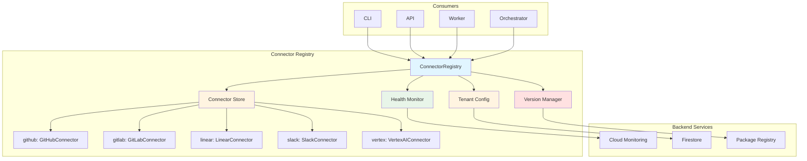

# Design: Connector Registry System

**Document ID:** 018-DR-DSGN
**Date:** 2025-12-28
**Status:** ✅ Approved
**Epic:** B (Data Ingestion & Connector Framework)
**Story:** B2 (Design Core Connector Framework)
**Task:** B2.5 (Create connector registry system)
**Author:** @backend-architect, @connectors-lead
**Reviewers:** @infra, @security

---

## Overview

This document defines the Connector Registry system for Git With Intent. The registry is a centralized service discovery mechanism that manages connector lifecycle, health monitoring, and dynamic loading.

**Goals:**
1. Centralized connector discovery and management
2. Health monitoring for all connectors
3. Dynamic connector loading (no hard-coded dependencies)
4. Version management and compatibility checking
5. Tenant-specific connector configuration

---

## Architecture Diagram



---

## Design Principles

### 1. Single Source of Truth

The registry is the **only** way to access connectors:

```typescript
// ✅ GOOD: Use registry
const connector = registry.get('github');

// ❌ BAD: Direct instantiation
const connector = new GitHubConnector();
```

### 2. Lazy Loading

Connectors are loaded on-demand, not at startup:

```typescript
// ✅ GOOD: Load when needed
const connector = await registry.load('github');

// ❌ BAD: Load all at startup
registry.loadAll(); // Slow, wastes memory
```

### 3. Health-Aware

Registry tracks connector health and can route around unhealthy connectors:

```typescript
const healthyConnectors = await registry.getHealthy();
```

### 4. Tenant Isolation

Each tenant has independent connector configurations:

```typescript
const connector = await registry.get('github', { tenantId: 'tenant-123' });
```

---

## Core Interfaces

### ConnectorRegistry

**Location:** `packages/connectors/src/registry/ConnectorRegistry.ts`

```typescript
import { IConnector, ConnectorConfig, HealthStatus } from '../interfaces/IConnector';
import { ConnectorMetadata } from '../interfaces/ConnectorMetadata';

export interface IConnectorRegistry {
  /**
   * Register a connector factory.
   *
   * @param name - Connector name (e.g., 'github')
   * @param factory - Factory function to create connector instance
   */
  register(
    name: string,
    factory: ConnectorFactory
  ): void;

  /**
   * Unregister a connector.
   *
   * @param name - Connector name
   */
  unregister(name: string): void;

  /**
   * Get a connector instance.
   *
   * @param name - Connector name
   * @param options - Tenant-specific configuration
   * @returns Connector instance
   * @throws {Error} If connector not found
   */
  get(name: string, options?: GetConnectorOptions): Promise<IConnector>;

  /**
   * Check if a connector is registered.
   *
   * @param name - Connector name
   * @returns True if registered
   */
  has(name: string): boolean;

  /**
   * List all registered connectors.
   *
   * @returns Array of connector names
   */
  list(): string[];

  /**
   * Get metadata for a connector.
   *
   * @param name - Connector name
   * @returns Connector metadata
   */
  getMetadata(name: string): Promise<ConnectorMetadata>;

  /**
   * Health check a specific connector.
   *
   * @param name - Connector name
   * @param options - Tenant-specific configuration
   * @returns Health status
   */
  healthCheck(name: string, options?: GetConnectorOptions): Promise<HealthStatus>;

  /**
   * Health check all connectors.
   *
   * @returns Map of connector name to health status
   */
  healthCheckAll(): Promise<Map<string, HealthStatus>>;

  /**
   * Get all healthy connectors.
   *
   * @returns Array of healthy connector names
   */
  getHealthy(): Promise<string[]>;

  /**
   * Get connector version.
   *
   * @param name - Connector name
   * @returns Connector version
   */
  getVersion(name: string): string;

  /**
   * Check if connector version is compatible with framework version.
   *
   * @param name - Connector name
   * @returns True if compatible
   */
  isCompatible(name: string): Promise<boolean>;
}

export type ConnectorFactory = (config: ConnectorConfig) => IConnector | Promise<IConnector>;

export interface GetConnectorOptions {
  tenantId?: string;
  config?: Partial<ConnectorConfig>;
  skipHealthCheck?: boolean;
}
```

---

## Implementation

### ConnectorRegistry Class

```typescript
import { IConnector, ConnectorConfig, HealthStatus } from '../interfaces/IConnector';
import { ConnectorMetadata } from '../interfaces/ConnectorMetadata';
import { IConnectorRegistry, ConnectorFactory, GetConnectorOptions } from './IConnectorRegistry';
import { ITenantConfigStore } from './ITenantConfigStore';
import { ILogger } from '@gwi/core/logging';
import { IMetrics } from '@gwi/core/metrics';

export class ConnectorRegistry implements IConnectorRegistry {
  private factories = new Map<string, ConnectorFactory>();
  private instances = new Map<string, IConnector>();
  private metadata = new Map<string, ConnectorMetadata>();
  private healthCache = new Map<string, { status: HealthStatus; expiresAt: number }>();

  // Health cache TTL (1 minute)
  private readonly HEALTH_CACHE_TTL_MS = 60 * 1000;

  constructor(
    private tenantConfigStore: ITenantConfigStore,
    private logger: ILogger,
    private metrics: IMetrics
  ) {}

  register(name: string, factory: ConnectorFactory): void {
    if (this.factories.has(name)) {
      throw new Error(`Connector ${name} already registered`);
    }

    this.factories.set(name, factory);
    this.logger.info('Connector registered', { connector: name });

    // Record metric
    this.metrics.increment('registry.connectors_registered_total', 1, {
      connector: name
    });
  }

  unregister(name: string): void {
    this.factories.delete(name);
    this.instances.delete(name);
    this.metadata.delete(name);
    this.healthCache.delete(name);

    this.logger.info('Connector unregistered', { connector: name });
  }

  async get(name: string, options: GetConnectorOptions = {}): Promise<IConnector> {
    const factory = this.factories.get(name);
    if (!factory) {
      throw new Error(`Connector ${name} not registered`);
    }

    // Generate cache key
    const cacheKey = this.getCacheKey(name, options.tenantId);

    // Check instance cache
    if (this.instances.has(cacheKey)) {
      return this.instances.get(cacheKey)!;
    }

    // Load tenant configuration
    const config = await this.loadConfig(name, options);

    // Create connector instance
    const connector = await factory(config);

    // Health check (optional)
    if (!options.skipHealthCheck) {
      const health = await connector.healthCheck();
      if (!health.healthy) {
        this.logger.warn('Connector unhealthy', {
          connector: name,
          tenantId: options.tenantId,
          error: health.error
        });
      }
    }

    // Cache instance
    this.instances.set(cacheKey, connector);

    // Cache metadata
    if (!this.metadata.has(name)) {
      this.metadata.set(name, connector.getMetadata());
    }

    this.logger.info('Connector loaded', {
      connector: name,
      tenantId: options.tenantId
    });

    // Record metric
    this.metrics.increment('registry.connectors_loaded_total', 1, {
      connector: name
    });

    return connector;
  }

  has(name: string): boolean {
    return this.factories.has(name);
  }

  list(): string[] {
    return Array.from(this.factories.keys());
  }

  async getMetadata(name: string): Promise<ConnectorMetadata> {
    // Check metadata cache
    if (this.metadata.has(name)) {
      return this.metadata.get(name)!;
    }

    // Load connector to get metadata
    const connector = await this.get(name, { skipHealthCheck: true });
    const metadata = connector.getMetadata();

    this.metadata.set(name, metadata);
    return metadata;
  }

  async healthCheck(name: string, options: GetConnectorOptions = {}): Promise<HealthStatus> {
    const cacheKey = this.getCacheKey(name, options.tenantId);

    // Check health cache
    const cached = this.healthCache.get(cacheKey);
    if (cached && Date.now() < cached.expiresAt) {
      return cached.status;
    }

    // Perform health check
    const connector = await this.get(name, { ...options, skipHealthCheck: true });
    const status = await connector.healthCheck();

    // Update cache
    this.healthCache.set(cacheKey, {
      status,
      expiresAt: Date.now() + this.HEALTH_CACHE_TTL_MS
    });

    // Record metric
    this.metrics.gauge('registry.connector_health', status.healthy ? 1 : 0, {
      connector: name,
      tenantId: options.tenantId || 'default'
    });

    return status;
  }

  async healthCheckAll(): Promise<Map<string, HealthStatus>> {
    const results = new Map<string, HealthStatus>();

    for (const name of this.list()) {
      try {
        const status = await this.healthCheck(name);
        results.set(name, status);
      } catch (error) {
        this.logger.error('Health check failed', {
          connector: name,
          error: error.message
        });

        results.set(name, {
          healthy: false,
          timestamp: new Date().toISOString(),
          connector: name,
          checks: [],
          error: error.message
        });
      }
    }

    return results;
  }

  async getHealthy(): Promise<string[]> {
    const health = await this.healthCheckAll();
    const healthy: string[] = [];

    for (const [name, status] of health.entries()) {
      if (status.healthy) {
        healthy.push(name);
      }
    }

    return healthy;
  }

  getVersion(name: string): string {
    const metadata = this.metadata.get(name);
    if (!metadata) {
      throw new Error(`Connector ${name} not loaded`);
    }
    return metadata.version;
  }

  async isCompatible(name: string): Promise<boolean> {
    const metadata = await this.getMetadata(name);
    const connectorVersion = metadata.version;
    const frameworkVersion = this.getFrameworkVersion();

    // Simple semver major version check
    const connectorMajor = parseInt(connectorVersion.split('.')[0]);
    const frameworkMajor = parseInt(frameworkVersion.split('.')[0]);

    return connectorMajor === frameworkMajor;
  }

  private getCacheKey(name: string, tenantId?: string): string {
    return tenantId ? `${name}:${tenantId}` : name;
  }

  private async loadConfig(
    name: string,
    options: GetConnectorOptions
  ): Promise<ConnectorConfig> {
    // Load tenant-specific configuration
    if (options.tenantId) {
      const tenantConfig = await this.tenantConfigStore.getConfig(
        options.tenantId,
        name
      );

      // Merge with override config
      return {
        ...tenantConfig,
        ...options.config
      };
    }

    // Use override config or empty config
    return options.config as ConnectorConfig || {} as ConnectorConfig;
  }

  private getFrameworkVersion(): string {
    // Read from package.json or environment
    return process.env.GWI_FRAMEWORK_VERSION || '1.0.0';
  }
}
```

---

## Tenant Configuration Store

**Location:** `packages/connectors/src/registry/ITenantConfigStore.ts`

```typescript
import { ConnectorConfig } from '../interfaces/IConnector';

export interface ITenantConfigStore {
  /**
   * Get connector configuration for a tenant.
   *
   * @param tenantId - Tenant ID
   * @param connector - Connector name
   * @returns Connector configuration
   */
  getConfig(tenantId: string, connector: string): Promise<ConnectorConfig>;

  /**
   * Set connector configuration for a tenant.
   *
   * @param tenantId - Tenant ID
   * @param connector - Connector name
   * @param config - Connector configuration
   */
  setConfig(tenantId: string, connector: string, config: ConnectorConfig): Promise<void>;

  /**
   * Delete connector configuration for a tenant.
   *
   * @param tenantId - Tenant ID
   * @param connector - Connector name
   */
  deleteConfig(tenantId: string, connector: string): Promise<void>;

  /**
   * List connectors configured for a tenant.
   *
   * @param tenantId - Tenant ID
   * @returns Array of connector names
   */
  listConnectors(tenantId: string): Promise<string[]>;
}

/**
 * Firestore implementation
 */
export class FirestoreTenantConfigStore implements ITenantConfigStore {
  private readonly COLLECTION = 'tenant-connectors';

  constructor(private firestore: Firestore) {}

  async getConfig(tenantId: string, connector: string): Promise<ConnectorConfig> {
    const docRef = this.firestore
      .collection(this.COLLECTION)
      .doc(tenantId)
      .collection('connectors')
      .doc(connector);

    const doc = await docRef.get();
    if (!doc.exists) {
      throw new Error(`No configuration for ${connector} in tenant ${tenantId}`);
    }

    return doc.data() as ConnectorConfig;
  }

  async setConfig(
    tenantId: string,
    connector: string,
    config: ConnectorConfig
  ): Promise<void> {
    const docRef = this.firestore
      .collection(this.COLLECTION)
      .doc(tenantId)
      .collection('connectors')
      .doc(connector);

    await docRef.set(config);
  }

  async deleteConfig(tenantId: string, connector: string): Promise<void> {
    const docRef = this.firestore
      .collection(this.COLLECTION)
      .doc(tenantId)
      .collection('connectors')
      .doc(connector);

    await docRef.delete();
  }

  async listConnectors(tenantId: string): Promise<string[]> {
    const collectionRef = this.firestore
      .collection(this.COLLECTION)
      .doc(tenantId)
      .collection('connectors');

    const snapshot = await collectionRef.get();
    return snapshot.docs.map(doc => doc.id);
  }
}
```

---

## Bootstrap and Registration

**Location:** `packages/connectors/src/bootstrap.ts`

```typescript
import { ConnectorRegistry } from './registry/ConnectorRegistry';
import { FirestoreTenantConfigStore } from './registry/FirestoreTenantConfigStore';
import { StructuredLogger } from '@gwi/core/logging';
import { PrometheusMetrics } from '@gwi/core/metrics';
import { Firestore } from '@google-cloud/firestore';

// Connector implementations
import { GitHubConnector } from './github/GitHubConnector';
import { GitLabConnector } from './gitlab/GitLabConnector';
import { LinearConnector } from './linear/LinearConnector';
import { SlackConnector } from './slack/SlackConnector';
import { VertexAIConnector } from './vertex/VertexAIConnector';

/**
 * Create and bootstrap the global connector registry.
 */
export function createConnectorRegistry(): ConnectorRegistry {
  const firestore = new Firestore();
  const tenantConfigStore = new FirestoreTenantConfigStore(firestore);
  const logger = new StructuredLogger({ service: 'connector-registry' });
  const metrics = new PrometheusMetrics();

  const registry = new ConnectorRegistry(tenantConfigStore, logger, metrics);

  // Register connectors
  registry.register('github', (config) => new GitHubConnector(config));
  registry.register('gitlab', (config) => new GitLabConnector(config));
  registry.register('linear', (config) => new LinearConnector(config));
  registry.register('slack', (config) => new SlackConnector(config));
  registry.register('vertex', (config) => new VertexAIConnector(config));

  logger.info('Connector registry initialized', {
    connectors: registry.list()
  });

  return registry;
}

// Global singleton
export const registry = createConnectorRegistry();
```

---

## Usage Examples

### Example 1: Get Connector

```typescript
import { registry } from '@gwi/connectors/bootstrap';

// Get GitHub connector for a tenant
const github = await registry.get('github', {
  tenantId: 'tenant-123'
});

// Use connector
for await (const record of github.sync({ repository: 'owner/repo' })) {
  console.log(record);
}
```

### Example 2: Health Check Dashboard

```typescript
import { registry } from '@gwi/connectors/bootstrap';

// Health check all connectors
const health = await registry.healthCheckAll();

for (const [name, status] of health.entries()) {
  console.log(`${name}: ${status.healthy ? '✅' : '❌'}`);
  if (!status.healthy) {
    console.log(`  Error: ${status.error}`);
  }
}
```

### Example 3: List Available Connectors

```typescript
import { registry } from '@gwi/connectors/bootstrap';

// List all registered connectors
const connectors = registry.list();
console.log('Available connectors:', connectors);

// Get metadata for each
for (const name of connectors) {
  const metadata = await registry.getMetadata(name);
  console.log(`${name} v${metadata.version}`);
  console.log(`  - Record types: ${metadata.recordTypes.join(', ')}`);
  console.log(`  - Auth methods: ${metadata.authMethods.join(', ')}`);
}
```

### Example 4: Configure Connector for Tenant

```typescript
import { registry } from '@gwi/connectors/bootstrap';

// Configure GitHub connector for tenant
await registry.tenantConfigStore.setConfig('tenant-123', 'github', {
  tenantId: 'tenant-123',
  auth: {
    type: 'bearer',
    token: 'ghp_abc123...'
  }
});

// Get configured connector
const github = await registry.get('github', { tenantId: 'tenant-123' });
```

---

## Health Monitoring

### Health Check Endpoint (API)

**Location:** `apps/api/src/routes/connectors.ts`

```typescript
import express from 'express';
import { registry } from '@gwi/connectors/bootstrap';

const router = express.Router();

// Health check all connectors
router.get('/connectors/health', async (req, res) => {
  const health = await registry.healthCheckAll();

  const results = Array.from(health.entries()).map(([name, status]) => ({
    connector: name,
    healthy: status.healthy,
    timestamp: status.timestamp,
    checks: status.checks,
    error: status.error
  }));

  const allHealthy = results.every(r => r.healthy);

  res.status(allHealthy ? 200 : 503).json({
    healthy: allHealthy,
    connectors: results
  });
});

// Health check specific connector
router.get('/connectors/:name/health', async (req, res) => {
  const { name } = req.params;
  const tenantId = req.query.tenant_id as string;

  if (!registry.has(name)) {
    return res.status(404).json({
      error: 'not_found',
      message: `Connector ${name} not registered`
    });
  }

  const status = await registry.healthCheck(name, { tenantId });

  res.status(status.healthy ? 200 : 503).json(status);
});

export default router;
```

### Metrics Dashboard

```typescript
// Prometheus metrics exposed by registry
registry.connectors_registered_total{connector}
registry.connectors_loaded_total{connector}
registry.connector_health{connector, tenant_id}
registry.health_check_duration_seconds{connector}
```

---

## Version Management

### Compatibility Matrix

| Framework Version | Compatible Connector Versions |
|-------------------|-------------------------------|
| 1.x.x | 1.x.x |
| 2.x.x | 2.x.x |

### Version Check

```typescript
// Check if connector is compatible
const compatible = await registry.isCompatible('github');
if (!compatible) {
  console.warn('GitHub connector version incompatible with framework');
}
```

---

## Testing

### Unit Tests

```typescript
describe('ConnectorRegistry', () => {
  let registry: ConnectorRegistry;
  let mockTenantStore: jest.Mocked<ITenantConfigStore>;

  beforeEach(() => {
    mockTenantStore = {
      getConfig: jest.fn(),
      setConfig: jest.fn(),
      deleteConfig: jest.fn(),
      listConnectors: jest.fn()
    };

    registry = new ConnectorRegistry(
      mockTenantStore,
      new MockLogger(),
      new MockMetrics()
    );
  });

  it('should register connector', () => {
    const factory = jest.fn();
    registry.register('test', factory);

    expect(registry.has('test')).toBe(true);
  });

  it('should get connector', async () => {
    const connector = new MockConnector();
    const factory = jest.fn().mockReturnValue(connector);

    registry.register('test', factory);

    const result = await registry.get('test', { skipHealthCheck: true });

    expect(result).toBe(connector);
    expect(factory).toHaveBeenCalled();
  });

  it('should cache connector instances', async () => {
    const connector = new MockConnector();
    const factory = jest.fn().mockReturnValue(connector);

    registry.register('test', factory);

    await registry.get('test', { skipHealthCheck: true });
    await registry.get('test', { skipHealthCheck: true });

    expect(factory).toHaveBeenCalledTimes(1); // Called once, then cached
  });
});
```

### Integration Tests

```typescript
describe('ConnectorRegistry Integration', () => {
  it('should load real GitHub connector', async () => {
    const github = await registry.get('github', {
      tenantId: 'test',
      skipHealthCheck: true
    });

    expect(github.name).toBe('github');
    expect(github.version).toMatch(/\d+\.\d+\.\d+/);
  });

  it('should perform health checks', async () => {
    const health = await registry.healthCheckAll();

    expect(health.size).toBeGreaterThan(0);
    for (const [name, status] of health.entries()) {
      expect(status).toHaveProperty('healthy');
      expect(status).toHaveProperty('connector', name);
    }
  });
});
```

---

## Performance Considerations

### 1. Lazy Loading

- Connectors loaded on-demand (not all at startup)
- Reduces memory footprint
- Faster application startup

### 2. Instance Caching

- Connector instances cached per tenant
- Avoids re-instantiation overhead
- Reduces authentication API calls

### 3. Health Check Caching

- Health status cached for 1 minute
- Reduces load on external APIs
- Faster dashboard rendering

---

## Security Considerations

### 1. Tenant Isolation

- Each tenant has separate connector configurations
- Credentials stored in Secret Manager (per tenant)
- No cross-tenant data leakage

### 2. Configuration Validation

- All connector configs validated with Zod schemas
- Invalid configs rejected at registration time
- Type-safe configuration access

### 3. Audit Logging

- All connector loads logged
- Health check failures logged
- Configuration changes audited

---

## Migration Path

### Phase 1: Core Registry (Week 2-3)
- [ ] Implement `ConnectorRegistry` class
- [ ] Build `FirestoreTenantConfigStore`
- [ ] Create bootstrap script
- [ ] Add unit tests

### Phase 2: Health Monitoring (Week 3-4)
- [ ] Implement health check caching
- [ ] Create health check API endpoints
- [ ] Add Prometheus metrics
- [ ] Build health dashboard

### Phase 3: Version Management (Week 4-5)
- [ ] Implement version compatibility checking
- [ ] Add version metadata to connectors
- [ ] Create migration guides

---

## References

- 014-DR-DSGN-connector-abstraction.md (Abstraction layer)
- 015-DR-DSGN-iconnector-interface.md (IConnector interface)
- 016-DR-DSGN-authentication-strategy.md (Authentication)
- 017-DR-DSGN-webhook-receiver.md (Webhook receiver)
- 012-DR-ADRC-connector-framework-architecture-decision.md (Parent ADR)

---

**Next Steps:**
1. Implement ConnectorRegistry class
2. Build FirestoreTenantConfigStore
3. Create bootstrap script
4. Add health monitoring endpoints
5. Begin GitHub connector implementation (Story B4)

**Status:** ✅ Approved for implementation
**Approved By:** @backend-architect, @connectors-lead, @infra, @security
