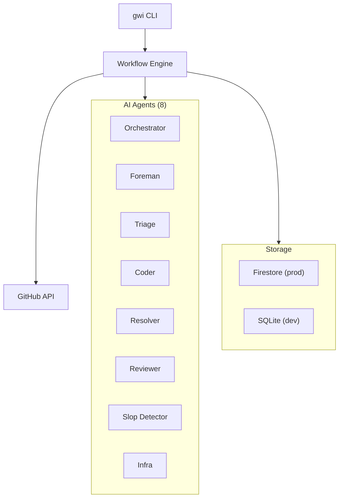
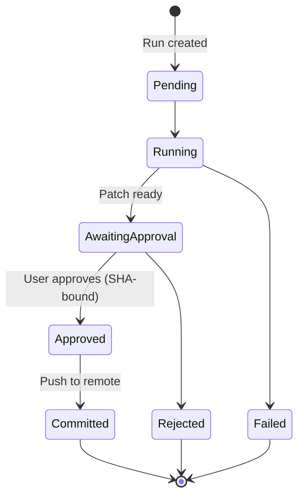
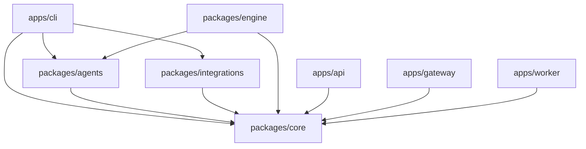

# Git With Intent

[](https://github.com/intent-solutions-io/iam-git-with-intent/actions/workflows/ci.yml)
[](https://github.com/intent-solutions-io/iam-git-with-intent/actions/workflows/test.yml)
[](https://github.com/intent-solutions-io/iam-git-with-intent/actions/workflows/arv.yml)

AI-powered CLI for PR automation. Semantic merge conflict resolution, issue-to-code generation, complexity scoring, and full autopilot — all with approval gating.

**v0.10.0** · **BSL 1.1** · [Interactive Overview](https://intent-solutions-io.github.io/iam-git-with-intent/overview.html) · [Docs](000-docs/)

---

## What It Does

| Command | What happens |
|---------|-------------|
| `gwi triage <pr>` | Score PR complexity (1–10) |
| `gwi resolve <pr>` | Resolve merge conflicts semantically |
| `gwi review <pr>` | Generate review summary |
| `gwi review --local` | Review staged changes before PR |
| `gwi issue-to-code <issue>` | Create a PR from a GitHub issue |
| `gwi autopilot <pr>` | Full pipeline: triage → resolve → review → commit |
| `gwi gate` | Pre-commit approval gate |
| `gwi explain <run-id>` | Explain why AI made a decision |

---

## Quick Start

```bash
npm install && npm run build
```

```bash
# At least one AI provider
export ANTHROPIC_API_KEY="..."    # or GOOGLE_AI_API_KEY / OPENAI_API_KEY
export GITHUB_TOKEN="..."
```

```bash
gwi triage https://github.com/owner/repo/pull/123
gwi resolve https://github.com/owner/repo/pull/123
gwi issue-to-code https://github.com/owner/repo/issues/456
gwi autopilot https://github.com/owner/repo/pull/123
gwi run approve <run-id>
```

---

## How It's Different

| Tool | What it does | GWI difference |
|------|-------------|----------------|
| **GitHub Copilot** | Suggests code in editor | Generates PRs from issues, resolves conflicts, runs pipelines |
| **Cursor / Windsurf** | AI coding assistants | Repo-level automation, not editor plugins |
| **Linear / Jira** | Project management | Actually writes the code, not just tracks it |
| **SonarQube** | Static analysis | Fixes issues, not just reports them |

**Key differentiators:** Semantic conflict resolution · Hash-bound approval gating · Multi-agent model routing · Full audit trail · CLI-first

---

## Architecture



### Agent Routing

Tasks route to models by complexity:

| Complexity | Model | Use case |
|-----------|-------|----------|
| 1–3 | Gemini Flash | Fast scoring, simple triage |
| 4–6 | Claude Sonnet | Code generation, reviews |
| 7–10 | Claude Opus | Complex conflicts, multi-file changes |

### Approval Flow



Destructive operations (commit, push, merge) require explicit approval with SHA256 hash binding. If the patch changes after approval, the approval is invalidated.

---

## Security

| Operation | Approval needed? |
|-----------|-----------------|
| Read / analyze | No |
| Generate patch | No |
| Commit / push | Yes (hash-bound) |
| Merge PR | Yes (hash-bound) |

All agents have [SPIFFE](https://spiffe.io/) identities. Every decision is logged to an immutable audit trail. See [SECURITY.md](SECURITY.md) and [Threat Model](000-docs/110-DR-TMOD-security-threat-model.md).

---

## Monorepo

```
git-with-intent/
├── apps/
│   ├── cli/              # gwi command
│   ├── api/              # REST API (Cloud Run)
│   ├── gateway/          # A2A agent coordination
│   ├── github-webhook/   # Webhook handler
│   ├── mcp-server/       # MCP tool server (Cloud Run)
│   ├── worker/           # Background jobs
│   ├── webhook-receiver/ # Generic webhooks
│   ├── registry/         # Workflow templates
│   └── web/              # Dashboard (React)
├── packages/
│   ├── core/             # Storage, billing, security
│   ├── agents/           # AI agent implementations
│   ├── engine/           # Workflow orchestration
│   ├── integrations/     # GitHub/GitLab connectors
│   ├── connectors/       # Airbyte-style connectors
│   ├── forecasting/      # TimeGPT integration
│   ├── sandbox/          # Secure execution
│   └── sdk/              # TypeScript SDK
└── infra/                # OpenTofu (GCP)
```



---

## Deployment

5 Cloud Run services deployed via GitHub Actions + OpenTofu. No direct `gcloud deploy`.

| Service | Purpose |
|---------|---------|
| `gwi-api` | REST API |
| `gwi-gateway` | A2A agent coordination |
| `gwi-webhook` | GitHub webhooks |
| `gwi-worker` | Background jobs |
| `gwi-mcp-server` | MCP tool server |

Plus Firestore (database) and Firebase Hosting (dashboard).

---

## Development

```bash
npm run build        # Build all packages
npm run typecheck    # Type check
npm run test         # Run tests
npm run arv          # Agent Readiness Verification (required before commit)
```

### ARV Gates

20 verification gates run before every commit — forbidden patterns, Zod schema contracts, deterministic golden outputs, security, identity, reliability, observability, and more:

```bash
npm run arv:lint      # No forbidden patterns
npm run arv:contracts # Zod schema validation
npm run arv:goldens   # Deterministic outputs
npm run arv:smoke     # Boot check
```

### Run Artifacts

Every run produces artifacts at `.gwi/runs/<runId>/`:

```
run.json · triage.json · plan.json · patch.diff · review.json · approval.json · audit.log
```

---

## Contributing

See [CONTRIBUTING.md](CONTRIBUTING.md) · [Code of Conduct](CODE_OF_CONDUCT.md) · [Security Policy](SECURITY.md) · [Support](SUPPORT.md)

jeremy@intentsolutions.io

---

## License

Business Source License 1.1 — Copyright (c) 2025-2026 Intent Solutions LLC

Source-available. Personal and non-commercial use permitted. Production use in a competing SaaS requires a commercial license. Converts to Apache 2.0 on 2030-02-17. See [LICENSE](LICENSE).
