# Git With Intent

CLI tool that automates PR workflows. Resolves merge conflicts, creates PRs from issues, reviews code, runs in full autopilot with approval gating.

**Version:** 0.5.1 | **Status:** Active development

---

## Who It's For

**Teams that:**
- Spend hours resolving merge conflicts that AI could handle
- Want to turn GitHub issues into working PRs with one command
- Need audit trails for AI-assisted code changes
- Want AI help but don't trust fully autonomous commits

**Not for teams that:**
- Need a web dashboard first (CLI-only for now)
- Want AI to push directly without approval (intentionally blocked)
- Need GitLab/Bitbucket support today (GitHub only for now)

---

## How It's Different

| Tool | What it does | GWI difference |
|------|--------------|----------------|
| **GitHub Copilot** | Suggests code in editor | We generate PRs from issues, resolve conflicts, run pipelines |
| **Cursor / Windsurf** | AI coding assistants | We're repo-level automation, not editor plugins |
| **Linear / Jira** | Project management | We actually write the code, not just track it |
| **SonarQube** | Static analysis | We fix issues, not just report them |
| **Dependabot** | Dependency updates | We handle any issue type, not just deps |

**Key differentiators:**

1. **Semantic conflict resolution** - Understands code intent, not just text diffs
2. **Approval gating** - AI can't push without explicit user consent (hash-bound)
3. **Multi-agent routing** - Simple tasks → cheap models, complex → powerful models
4. **Full audit trail** - Every decision is logged and explainable
5. **CLI-first** - Works in your terminal, not another web app

---

## What It Does

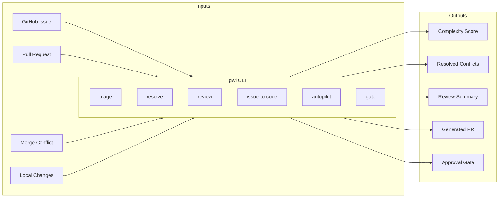

**Core capabilities:**
- Resolve merge conflicts (semantic understanding, not just textual)
- Create PRs from GitHub issues
- Score PR complexity (deterministic 1-10 scale)
- Review and summarize PRs
- Full autopilot: triage → resolve → review → commit
- **Local review before PR** (v0.5.0): Review staged/unstaged changes locally

---

## User Journeys

### Journey 1: Resolve a Merge Conflict

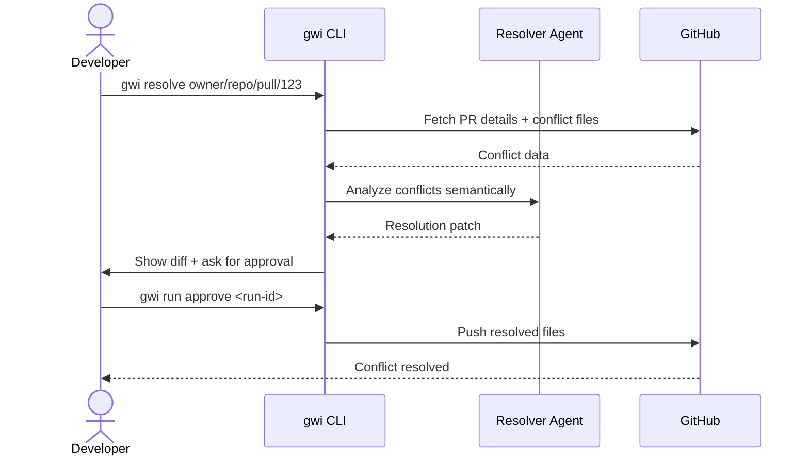

**Commands:**
```bash
gwi resolve https://github.com/owner/repo/pull/123
# Review the proposed resolution
gwi run status <run-id>
# Approve and commit
gwi run approve <run-id>
```

### Journey 2: Create PR from Issue

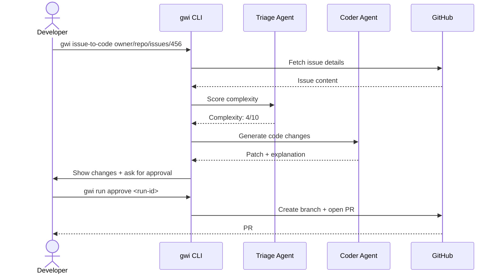

**Commands:**
```bash
gwi issue-to-code https://github.com/owner/repo/issues/456
gwi run approve <run-id>
```

### Journey 3: Full Autopilot

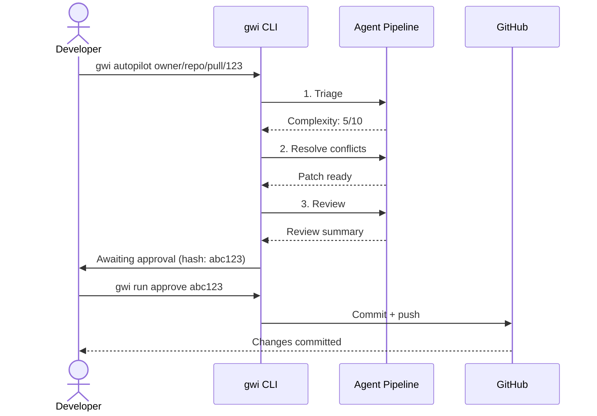

### Journey 4: Local Review Before PR (v0.5.0)

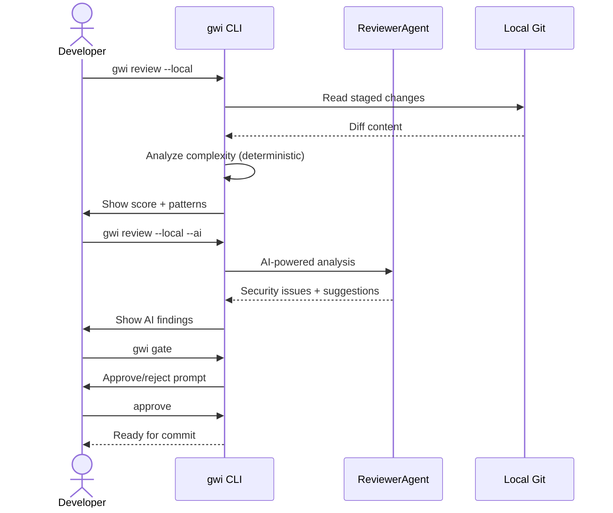

**Commands:**
```bash
# Review staged changes (fast, deterministic)
gwi review --local

# Review all uncommitted changes
gwi review --local --all

# AI-powered review (uses ReviewerAgent)
gwi review --local --ai

# Pre-commit approval gate
gwi gate

# Non-interactive gate for CI/hooks
gwi gate --no-interactive

# Score complexity of recent commits
gwi triage --diff HEAD~1

# Explain local changes
gwi explain .
```

---

## Architecture

### System Overview

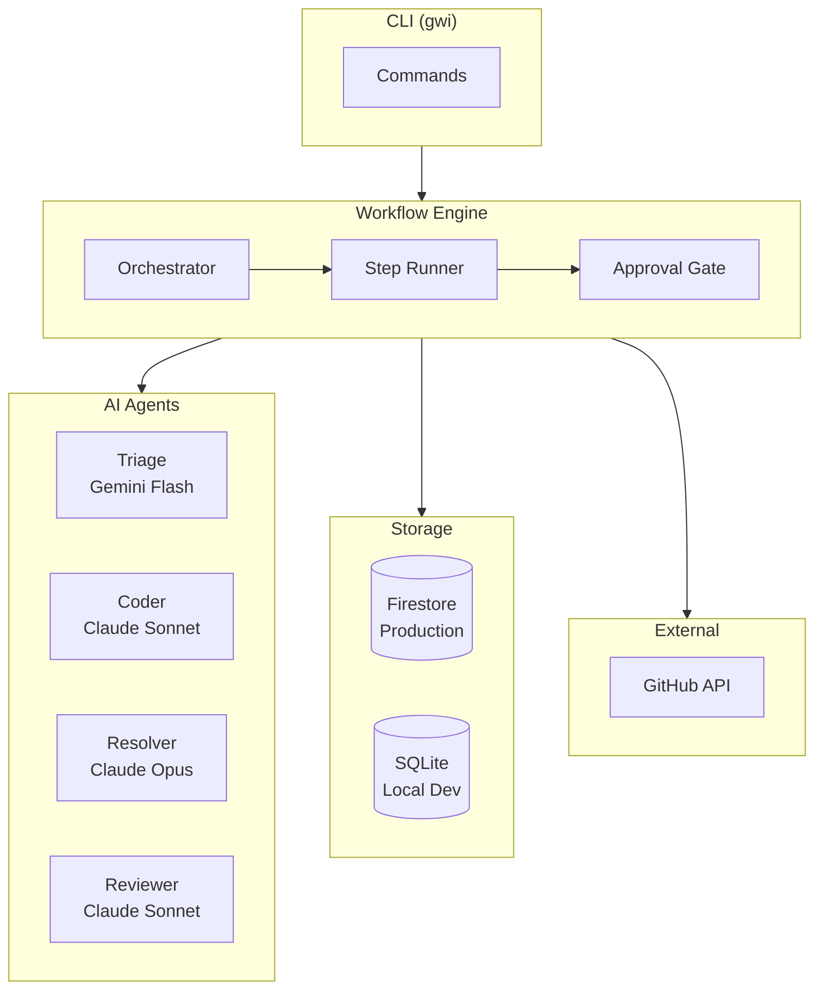

### Agent Routing

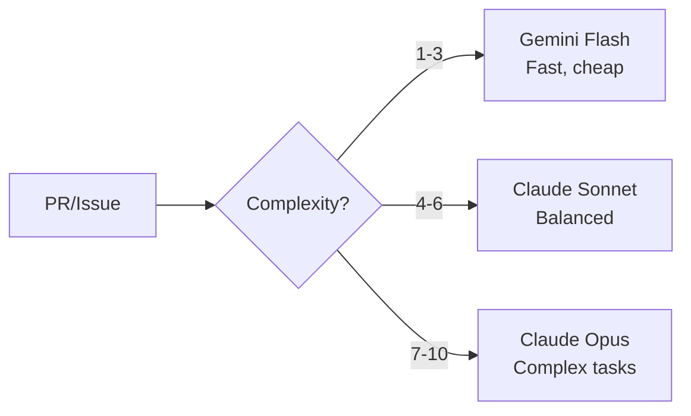

Simple tasks use fast/cheap models. Complex tasks use powerful models.

### Approval Flow

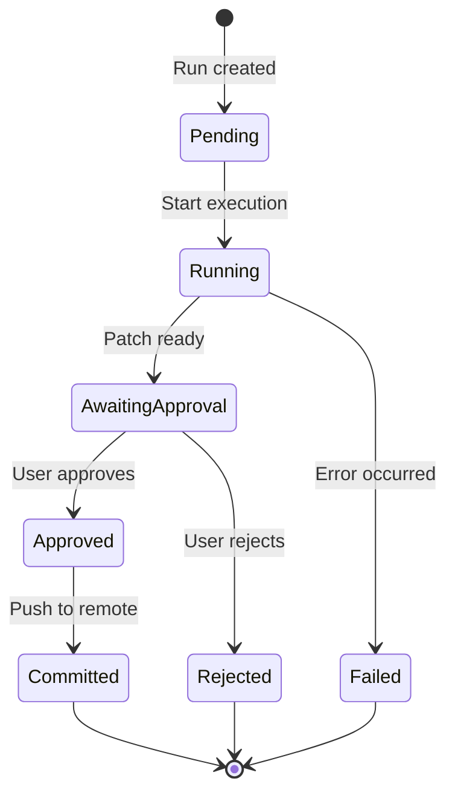

Destructive operations (commit, push, merge) require explicit approval with SHA256 hash binding.

---

## Monorepo Structure

```
git-with-intent/
├── apps/
│   ├── cli/              # CLI tool (gwi command)
│   ├── api/              # REST API (Cloud Run)
│   ├── gateway/          # A2A agent coordination
│   ├── github-webhook/   # Webhook handler
│   ├── worker/           # Background jobs
│   └── web/              # Dashboard (React)
├── packages/
│   ├── core/             # Storage, billing, security (68 modules)
│   ├── agents/           # AI agent implementations
│   ├── engine/           # Workflow orchestration
│   ├── integrations/     # GitHub/GitLab connectors
│   └── sdk/              # TypeScript SDK
└── infra/                # OpenTofu (GCP infrastructure)
```

### Package Dependencies

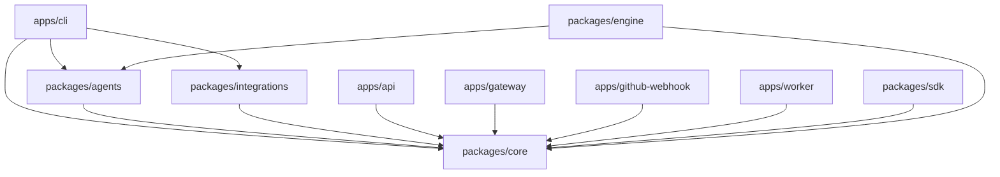

---

## Quick Start

### Install

```bash
npm install
npm run build
```

### Configure

```bash
# Required: At least one AI provider
export ANTHROPIC_API_KEY="your-key"
export GOOGLE_AI_API_KEY="your-key"

# Required: GitHub access
export GITHUB_TOKEN="your-token"
```

### Use

```bash
# Score PR complexity
gwi triage https://github.com/owner/repo/pull/123

# Resolve merge conflicts
gwi resolve https://github.com/owner/repo/pull/123

# Create PR from issue
gwi issue-to-code https://github.com/owner/repo/issues/456

# Full pipeline with approval
gwi autopilot https://github.com/owner/repo/pull/123

# Check run status
gwi run list
gwi run status <run-id>

# Approve pending changes
gwi run approve <run-id>
```

### Local Development Review (v0.5.0)

Review code locally **before** creating a PR:

```bash
# Review staged changes (fast, no AI)
gwi review --local

# Review all uncommitted changes
gwi review --local --all

# AI-powered local review
gwi review --local --ai

# Pre-commit approval gate
gwi gate

# Non-interactive for CI/git hooks
gwi gate --no-interactive

# Score complexity of local commits
gwi triage --diff HEAD~1

# Explain what changed locally
gwi explain .

# Manage git hooks
gwi hooks install    # Install pre-commit hook
gwi hooks status     # Check hook status
```

---

## Context Graph & Explainability

Captures decision traces to answer "why did AI do that?"

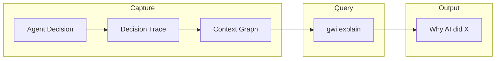

### Decision Trace Flow

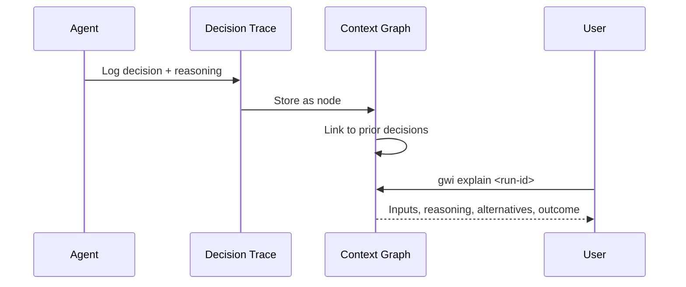

**Commands:**
```bash
# Explain a run or decision
gwi explain <run-id>
gwi explain <run-id> --step=coder

# Explain local changes (v0.5.0)
gwi explain .
gwi explain HEAD~3
```

> **Roadmap:** `gwi simulate` (world model simulation) is planned for Phase 35.

---

## Development

### Build & Test

```bash
npm run build        # Build all packages
npm run typecheck    # Type check
npm run test         # ~1700 tests
npm run arv          # Pre-commit checks
```

### Test Single Package

```bash
npx turbo run test --filter=@gwi/core
npx turbo run test --filter=@gwi/agents
```

### ARV (Agent Readiness Verification)

```bash
npm run arv           # All checks
npm run arv:lint      # No deprecated patterns
npm run arv:contracts # Schema validation
npm run arv:goldens   # Deterministic outputs
npm run arv:smoke     # Boot test
```

---

## Task Tracking

Uses [beads](https://github.com/steveyegge/beads) for issue tracking.

```bash
bd list --status open       # View open tasks
bd ready                    # Available tasks
bd update <id> --status in_progress
bd close <id> -r "reason"
bd sync                     # Push to git
```

### Epic Status

| Epic | Status | Focus |
|------|--------|-------|
| A | Active | Core infrastructure |
| B | Active | Data connectors |
| C | Active | Workflow engine |
| D | Active | Policy & audit |
| E | Complete | RBAC & governance |
| F | Active | Web dashboard |
| G | Planned | Slack integration |
| H | Active | Infrastructure |
| I | Active | Forecasting & ML |
| J | **Complete** | **Local dev review (v0.5.0)** |

---

## Security Model

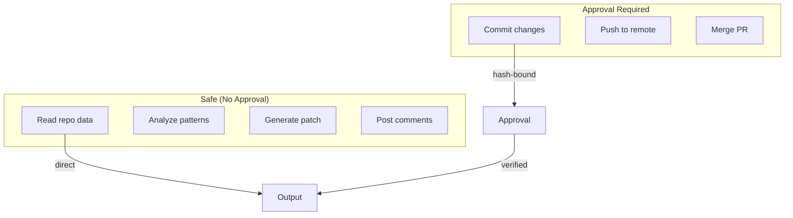

| Operation | Approval |
|-----------|----------|
| Read/analyze | No |
| Generate patch | No |
| Commit/push | Yes (hash-bound) |
| Merge | Yes (hash-bound) |

Hash binding: if the patch changes after approval, approval is invalidated.

---

## Deployment

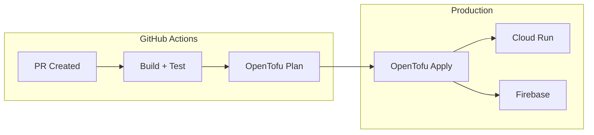

**Services:**
- `gwi-api` - REST API (Cloud Run)
- `gwi-gateway` - A2A coordination (Cloud Run)
- `gwi-webhook` - GitHub webhooks (Cloud Run)
- `gwi-worker` - Background jobs (Cloud Run)
- Firestore - Operational database
- Firebase Hosting - Web dashboard

**No direct `gcloud` deploys.** All infrastructure via GitHub Actions + OpenTofu.

---

## Run Artifacts

Every run creates a bundle at `.gwi/runs/<runId>/`:

```
.gwi/runs/550e8400.../
├── run.json          # Metadata
├── triage.json       # Complexity score
├── plan.json         # Resolution plan
├── patch.diff        # Proposed changes
├── review.json       # Findings
├── approval.json     # Approval record
└── audit.log         # JSONL audit trail
```

Replay, audit, or debug any run from these artifacts.

---

## Roadmap

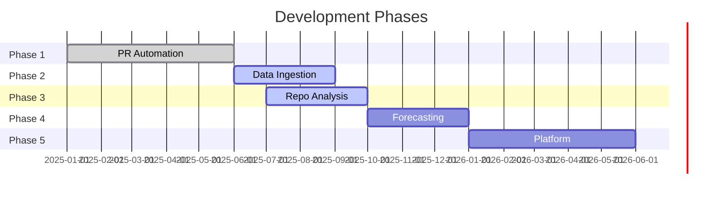

| Phase | Status | Features |
|-------|--------|----------|
| 1. PR Automation | Shipped | Triage, resolve, review, autopilot |
| 2. Data Ingestion | In Progress | GitHub connector, storage layer |
| 3. Repo Analysis | In Progress | Single/multi-repo patterns |
| 4. Forecasting | Planned | TimeGPT integration |
| 5. Platform | Planned | GitHub App, Slack, dashboard |

---

## Contributing

See [CONTRIBUTING.md](CONTRIBUTING.md) for development guidelines.

- Code of Conduct: [CODE_OF_CONDUCT.md](CODE_OF_CONDUCT.md)
- Security Policy: [SECURITY.md](SECURITY.md)
- Support: [SUPPORT.md](SUPPORT.md)

📧 jeremy@intentsolutions.io

---

## Security

[Security Policy](SECURITY.md)

- Security audit completed Dec 2025
- Pre-alpha software - not production-ready
- Security issues: security@intentsolutions.io

---

## License

MIT License - Copyright (c) 2025-2026 Intent Solutions LLC

Open source CLI. Hosted service (when available) is commercial.
