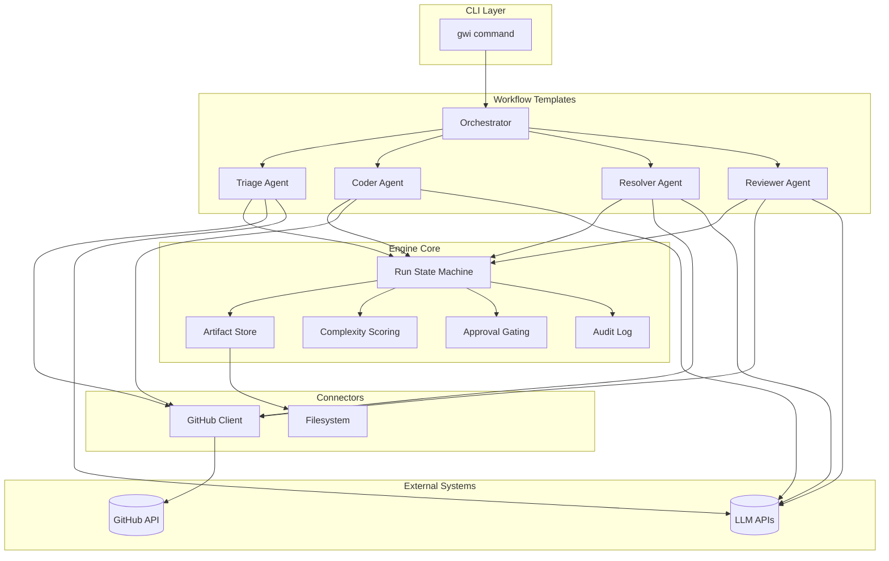
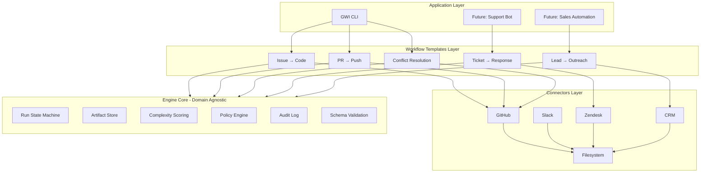
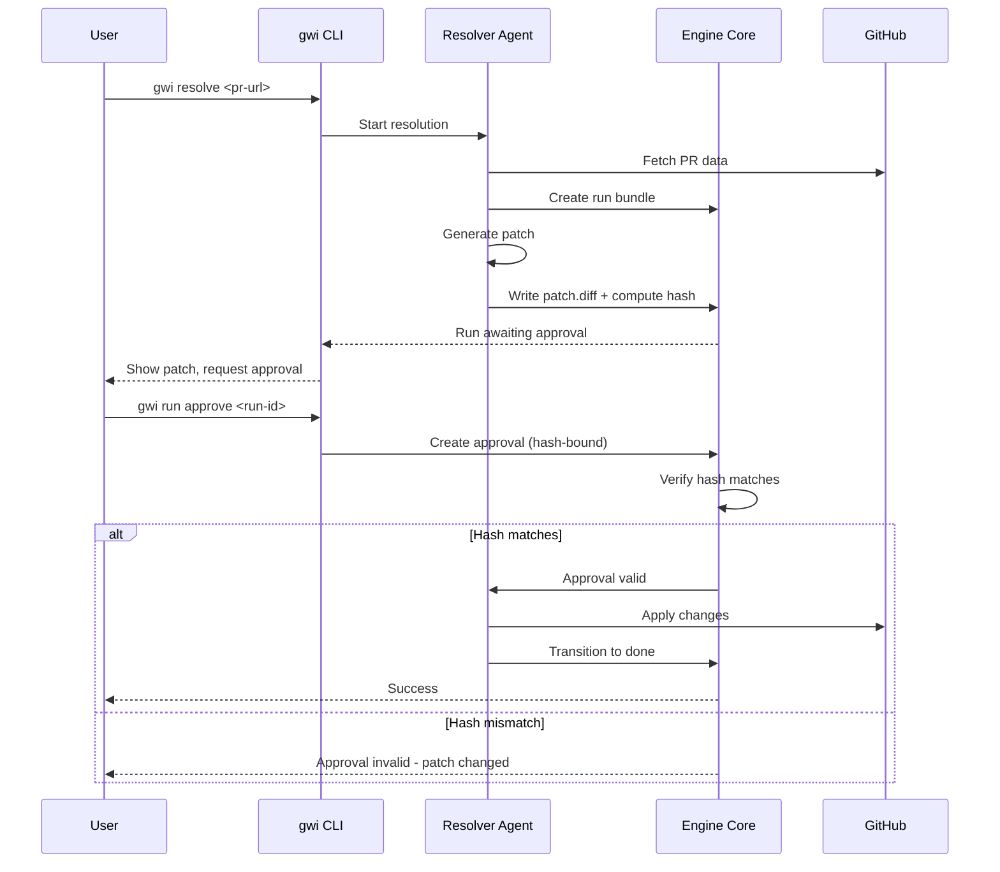

# Git With Intent: Context and Architecture

> **TL;DR**: Git With Intent (GWI) is a GitHub-native CLI for AI-powered PR workflows. Under the hood, it's the first connector + workflow templates of a general-purpose **Agent Automation Engine** designed to be reusable across domains.

---

## What This Document Covers

1. [The Wedge Product (GWI)](#the-wedge-product-gwi)
2. [The Underlying Substrate](#the-underlying-substrate)
3. [Why This Architecture](#why-this-architecture)
4. [Module Boundaries](#module-boundaries)
5. [Safety Model](#safety-model)
6. [Capabilities Modes](#capabilities-modes)
7. [Run Artifacts and Auditability](#run-artifacts-and-auditability)
8. [What's In Scope Now vs Later](#whats-in-scope-now-vs-later)
9. [Architecture Diagrams](#architecture-diagrams)

---

## The Wedge Product (GWI)

**Git With Intent** is a CLI tool that automates GitHub workflows:

| Workflow | Command | What It Does |
|----------|---------|--------------|
| Triage | `gwi triage <pr-url>` | Analyze PR complexity, score conflicts |
| Plan | `gwi plan <pr-url>` | Generate resolution plan |
| Resolve | `gwi resolve <pr-url>` | Full conflict resolution with approval |
| Review | `gwi review <pr-url>` | Review AI-generated changes |
| Autopilot | `gwi autopilot <pr-url>` | End-to-end: triage → plan → resolve → review |
| Issue-to-Code | `gwi issue-to-code <issue-url>` | Generate code from GitHub issue |

**Target users**: Indie hackers, small teams, and developers who want AI assistance with PR workflows without switching tools.

**Distribution strategy**: CLI-first (npm install), GitHub Actions runner, optional SaaS for teams.

---

## The Underlying Substrate

GWI is built on an **Agent Automation Engine** (the "substrate") that is domain-agnostic. The substrate provides:

```
┌─────────────────────────────────────────────────────────────────┐
│                     AGENT AUTOMATION ENGINE                      │
├─────────────────────────────────────────────────────────────────┤
│  ┌─────────────┐  ┌─────────────┐  ┌─────────────────────────┐  │
│  │ Run State   │  │ Artifact    │  │ Policy Engine           │  │
│  │ Machine     │  │ Store       │  │ (approval gating)       │  │
│  └─────────────┘  └─────────────┘  └─────────────────────────┘  │
│  ┌─────────────┐  ┌─────────────┐  ┌─────────────────────────┐  │
│  │ Complexity  │  │ Schema      │  │ Append-Only             │  │
│  │ Scoring     │  │ Validation  │  │ Audit Log               │  │
│  └─────────────┘  └─────────────┘  └─────────────────────────┘  │
├─────────────────────────────────────────────────────────────────┤
│                        CONNECTORS                                │
│  ┌──────────┐  ┌──────────┐  ┌──────────┐  ┌──────────┐        │
│  │ GitHub   │  │ Filesystem│  │ Slack    │  │ (future) │        │
│  └──────────┘  └──────────┘  └──────────┘  └──────────┘        │
├─────────────────────────────────────────────────────────────────┤
│                     WORKFLOW TEMPLATES                           │
│  ┌──────────────┐  ┌──────────────┐  ┌──────────────┐          │
│  │ Issue→PR     │  │ PR→Push      │  │ Conflicts    │          │
│  │ (issue-code) │  │ (resolve)    │  │ (triage)     │          │
│  └──────────────┘  └──────────────┘  └──────────────┘          │
└─────────────────────────────────────────────────────────────────┘
```

### Substrate Components

| Component | Location | Purpose |
|-----------|----------|---------|
| Run State Machine | `packages/core/src/run-bundle/state-machine.ts` | Validated state transitions |
| Artifact Store | `packages/core/src/run-bundle/artifact-writer.ts` | File-based run bundles |
| Complexity Scoring | `packages/core/src/scoring/` | Deterministic + bounded LLM adjustment |
| Schema Validation | `packages/core/src/run-bundle/schemas/` | Zod schemas for all outputs |
| Policy/Approvals | `packages/core/src/capabilities/` | Gated operations, patch hash binding |
| Audit Log | `packages/core/src/run-bundle/audit-log.ts` | Append-only JSONL |

---

## Why This Architecture

### Problem
Building AI automation tools that are:
- **Trustworthy**: Operators need to know what the AI did and why
- **Safe**: Destructive actions must be gated
- **Auditable**: Every decision must be traceable
- **Generalizable**: Same patterns work across domains (DevOps, support, finance, etc.)

### Solution
Separate the **core engine** (runs, artifacts, approvals, scoring) from **domain-specific connectors** (GitHub, Slack, etc.) and **workflow templates** (PR resolve, issue-to-code, etc.).

This means:
1. GWI users get a polished, focused product
2. The engine can power future products without rewriting core logic
3. Contributors know exactly where to add code

---

## Module Boundaries

Contributors must follow these boundaries:

### `engine-core` (packages/core/)
**What it contains:**
- Run state machine and transitions
- Artifact bundle I/O (`.gwi/runs/<runId>/`)
- Append-only audit log
- Complexity scoring (deterministic baseline + LLM adjustment)
- Policy/approval gating
- Zod schemas for step outputs

**Rules:**
- No domain-specific logic (no GitHub, no Slack)
- All I/O through defined interfaces
- Schema validation for all outputs

### `connectors/*` (packages/integrations/)
**What it contains:**
- Pure integrations with external systems
- GitHub client (PRs, issues, comments)
- Filesystem operations
- Future: Slack, Jira, email

**Rules:**
- Stateless where possible
- No workflow logic (just API calls)
- Returns typed data for engine to process

### `workflows/*` (packages/agents/, packages/engine/)
**What it contains:**
- Workflow templates (issue→PR, PR→push, conflicts→resolution)
- Agent implementations (Orchestrator, Triage, Coder, Resolver, Reviewer)
- Workflow state orchestration

**Rules:**
- Uses engine-core for all runs, artifacts, approvals
- Uses connectors for external I/O
- Each workflow produces a run bundle

---

## Safety Model

### Operations by Risk Level

| Operation | Examples | Approval Required? |
|-----------|----------|-------------------|
| **Read** | Fetch PR, read file, list issues | No |
| **Comment** | Post PR comment, add label | No |
| **Check** | Create check run, update status | No |
| **Write (gated)** | Commit, push, create/update PR | **Yes** |
| **Merge (gated)** | Merge PR, delete branch | **Yes** |

### Approval Record Structure

Every approval is bound to the specific changes being approved:

```typescript
interface ApprovalRecord {
  runId: string;           // UUID of the run
  approvedAt: string;      // ISO timestamp
  approvedBy: string;      // User/system that approved
  scope: ApprovalScope[];  // ['commit', 'push', 'open_pr', 'merge']
  patchHash: string;       // SHA256 of patch.diff
  comment?: string;        // Optional approval comment
}
```

**Key property**: The `patchHash` binds the approval to the exact changes. If the patch changes after approval, the approval is invalid.

### Approval Flow

```
┌─────────────┐     ┌─────────────┐     ┌─────────────┐
│   Generate  │────▶│   Review    │────▶│   Approve   │
│   Patch     │     │   Changes   │     │   (hash)    │
└─────────────┘     └─────────────┘     └─────────────┘
                                               │
                                               ▼
                    ┌─────────────┐     ┌─────────────┐
                    │   Verify    │────▶│   Execute   │
                    │   Hash      │     │   Action    │
                    └─────────────┘     └─────────────┘
```

---

## Capabilities Modes

GWI operates in one of three modes:

### 1. `comment-only`
- **Allowed**: Read, comment, label, check runs
- **Not allowed**: Any code changes
- **Use case**: Analysis and reporting only

### 2. `patch-only`
- **Allowed**: Generate patch.diff
- **Not allowed**: Commit, push, PR operations
- **Use case**: Propose changes for human review

### 3. `commit-after-approval` (default)
- **Allowed**: All operations, but gated ones require approval
- **Approval required for**: commit, push, create PR, update PR, merge
- **Use case**: Full automation with safety gates

---

## Run Artifacts and Auditability

Every run produces a bundle at `.gwi/runs/<runId>/`:

```
.gwi/runs/
└── 550e8400-e29b-41d4-a716-446655440000/
    ├── run.json          # Run context, state, config
    ├── triage.json       # Complexity score, route decision
    ├── plan.json         # Execution plan
    ├── plan.md           # Human-readable plan
    ├── patch.diff        # Proposed changes
    ├── resolve.json      # Resolution results
    ├── review.json       # Review findings
    ├── approval.json     # Approval record (if approved)
    └── audit.log         # Append-only JSONL audit trail
```

### Audit Log Format (JSONL)

Each line is a JSON object:

```json
{"timestamp":"2025-12-16T12:00:00Z","runId":"550e8400...","actor":"system","action":"run_created","details":{"initiator":"cli"}}
{"timestamp":"2025-12-16T12:00:01Z","runId":"550e8400...","actor":"agent","actorId":"triage","action":"state_transition","details":{"from":"queued","to":"triaged"}}
{"timestamp":"2025-12-16T12:00:05Z","runId":"550e8400...","actor":"user","actorId":"dev@example.com","action":"approval_granted","details":{"scope":["commit","push"],"patchHash":"abc123..."}}
```

### What Every Run Must Produce

Following the "5 Ws" principle:

| Question | Field | Example |
|----------|-------|---------|
| **Why** | `explanation`, `reasons` | "Complex merge due to auth changes" |
| **What** | `actions`, `changes` | "Modified 3 files, resolved 2 conflicts" |
| **Who** | `actor`, `approvedBy` | "triage-agent", "dev@example.com" |
| **When** | `timestamp`, `createdAt` | ISO 8601 timestamps |
| **Where** | `files`, `targetRepo` | "src/auth/login.ts", "owner/repo" |

---

## What's In Scope Now vs Later

### In Scope Now (v0.2.x)

| Feature | Status | Location |
|---------|--------|----------|
| PR triage and complexity scoring | Complete | `gwi triage` |
| Issue-to-code generation | Complete | `gwi issue-to-code` |
| Conflict resolution | Complete | `gwi resolve` |
| Run artifact bundles | Complete | `.gwi/runs/` |
| Approval gating | Complete | `gwi run approve` |
| CLI workflow | Complete | All `gwi` commands |
| Deterministic scoring | Complete | `packages/core/src/scoring/` |

### Planned (v0.3.x)

| Feature | Purpose |
|---------|---------|
| GitHub Actions runner | Run GWI in CI/CD |
| Rate limiting (distributed) | API protection |
| Webhook-triggered runs | Event-driven automation |
| Multi-tenant dashboard | Team management |

### Future Domains (Post-GWI)

| Domain | Connector | Example Workflow |
|--------|-----------|------------------|
| Support | Zendesk, Intercom | Ticket triage → response draft → approval |
| Sales | CRM, email | Lead enrichment → outreach → follow-up |
| Finance | Accounting APIs | Invoice review → categorization → approval |
| GCP Ops | Cloud APIs | Resource audit → remediation → approval |

These will use the same engine-core but different connectors and workflow templates.

---

## Architecture Diagrams

### GWI GitHub Workflow (Current Wedge)



### Generalized Engine Architecture



### Approval Flow Sequence



---

## Quick Reference

### CLI Commands (Current)

```bash
# PR Workflows
gwi triage <pr-url>           # Analyze complexity
gwi plan <pr-url>             # Generate plan
gwi resolve <pr-url>          # Full resolution
gwi autopilot <pr-url>        # End-to-end

# Issue Workflows
gwi issue-to-code <issue-url> # Generate code from issue

# Run Management
gwi run list                  # List recent runs
gwi run status <run-id>       # Show run details
gwi run approve <run-id>      # Approve for commit/push

# Configuration
gwi init                      # Initialize in repo
gwi config show               # Show config
gwi status                    # Show agent status
```

### Environment Variables

| Variable | Purpose | Required |
|----------|---------|----------|
| `GITHUB_TOKEN` | GitHub API access | Yes |
| `ANTHROPIC_API_KEY` | Claude API | One AI key required |
| `GOOGLE_AI_API_KEY` | Gemini API | One AI key required |
| `GWI_STORE_BACKEND` | Storage (memory, firestore) | No (default: memory) |

### Key Files

| File | Purpose |
|------|---------|
| `CLAUDE.md` | Working contract for Claude Code |
| `docs/context.md` | This file - architecture context |
| `docs/contributing-orientation.md` | Contributor guide |
| `000-docs/043-AA-REPT-*.md` | Latest implementation AAR |

---

*This document is the canonical architecture reference. For implementation details, see the source code and AARs in `000-docs/`.*
