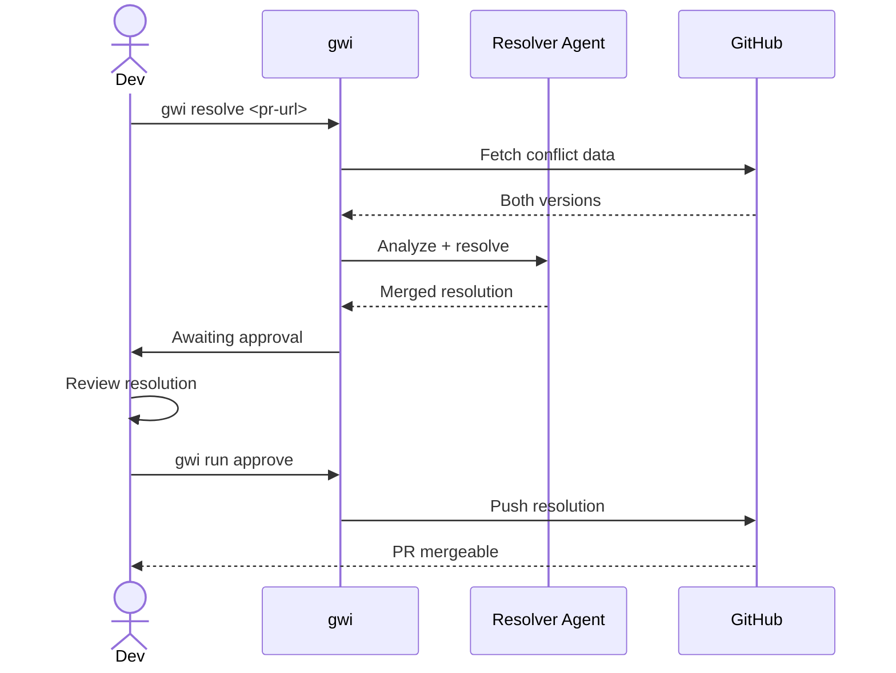

# Conflict Resolution

Resolve merge conflicts with AI-powered semantic understanding.

## When to Use

- A PR has merge conflicts with the base branch
- Git shows `CONFLICTING` when trying to merge
- You want AI to understand code intent, not just text diffs

## Prerequisites

- [ ] PR exists with merge conflicts
- [ ] `ANTHROPIC_API_KEY` configured (uses Claude for complex resolution)
- [ ] `GITHUB_TOKEN` with write access
- [ ] `gwi doctor` passes

## Steps

### Step 1: Identify Conflicts

Check PR status:

```bash
gh pr view 456 --json mergeable
# Output: {"mergeable":"CONFLICTING"}
```

Or use GWI:

```bash
gwi triage https://github.com/owner/repo/pull/456
```

**Output:**
```
PR #456: Feature branch

Status: Has conflicts
Conflict files:
  - src/api/users.ts (both modified)
  - src/utils/helpers.ts (both modified)

Complexity: 5/10 (medium)
```

### Step 2: Run Resolution

```bash
gwi resolve https://github.com/owner/repo/pull/456
```

**What happens:**
1. Fetches both versions of conflicting files
2. Analyzes semantic intent of each change
3. Generates merged resolution
4. Pauses for your approval

**Output:**
```
Run ID: def456
Status: awaiting_approval

Conflicts Resolved:
  ✓ src/api/users.ts - Combined new endpoint + error handling
  ✓ src/utils/helpers.ts - Merged utility functions

Resolution Strategy:
  - Preserved feature branch's new getUserById()
  - Preserved main's improved error handling
  - Combined import statements

View resolution: gwi run status def456
Approve: gwi run approve def456
```

### Step 3: Review Resolution

Before approving, check what was generated:

```bash
gwi run status def456
```

View the merged files:
```bash
cat .gwi/runs/def456/patch.diff
```

**Key things to verify:**
- Both changes are preserved (no lost work)
- Code compiles/runs correctly
- Logic makes sense combined

### Step 4: Approve and Push

If the resolution looks correct:

```bash
gwi run approve def456
```

**What happens:**
1. Applies the resolution to the PR branch
2. Commits with a clear message
3. Pushes to GitHub
4. PR becomes mergeable

**Output:**
```
✓ Resolution applied
✓ Committed: "fix: resolve merge conflicts"
✓ Pushed to origin/feature-branch

PR #456 is now mergeable.
```

### Step 5: Verify and Merge

```bash
# Check PR status
gh pr view 456 --json mergeable
# Output: {"mergeable":"MERGEABLE"}

# Merge the PR
gh pr merge 456 --squash
```

## Success Criteria

- [ ] All conflict markers removed
- [ ] Both sets of changes preserved
- [ ] Code compiles without errors
- [ ] Tests pass
- [ ] PR is mergeable

## Common Issues

### "No conflicts detected"

```
Info: PR has no merge conflicts
```

**This is good!** The PR is already mergeable.

### "Cannot resolve automatically"

```
Warning: Complex conflict requires manual review
```

**Fix:** The conflict is too complex for automatic resolution. Review the suggested resolution carefully or resolve manually.

### "Resolution changes semantics"

The AI might combine code in unexpected ways.

**Fix:** Always review the resolution. Edit manually if the combined logic is wrong.

### "Tests fail after resolution"

```
CI: Tests failing
```

**Fix:** The resolution might have logical issues. Review and fix manually.

## Workflow Diagram



## Resolution Strategies

GWI uses semantic resolution, not just text merging:

| Conflict Type | Strategy |
|---------------|----------|
| **Both add code** | Combine additions in logical order |
| **Both modify same function** | Analyze intent, merge carefully |
| **One deletes, one modifies** | Prefer modification (preserve work) |
| **Import conflicts** | Deduplicate and combine |
| **Rename conflicts** | Use the more descriptive name |

## Manual Override

If you prefer manual resolution:

```bash
# Checkout the PR branch
gh pr checkout 456

# Rebase on main
git rebase main

# Resolve conflicts manually
# ... edit files ...

# Complete rebase
git add -A
git rebase --continue

# Push
git push --force-with-lease
```

## Next Steps

After resolution:

1. **Run CI** - Ensure tests pass
2. **Get reviews** - Request re-review if needed
3. **Merge** - Complete the PR

## Tips

- **Resolve early** - Conflicts grow over time
- **Small PRs** - Less likely to conflict
- **Frequent rebases** - Keep branches up to date
- **Review carefully** - AI resolution needs verification
