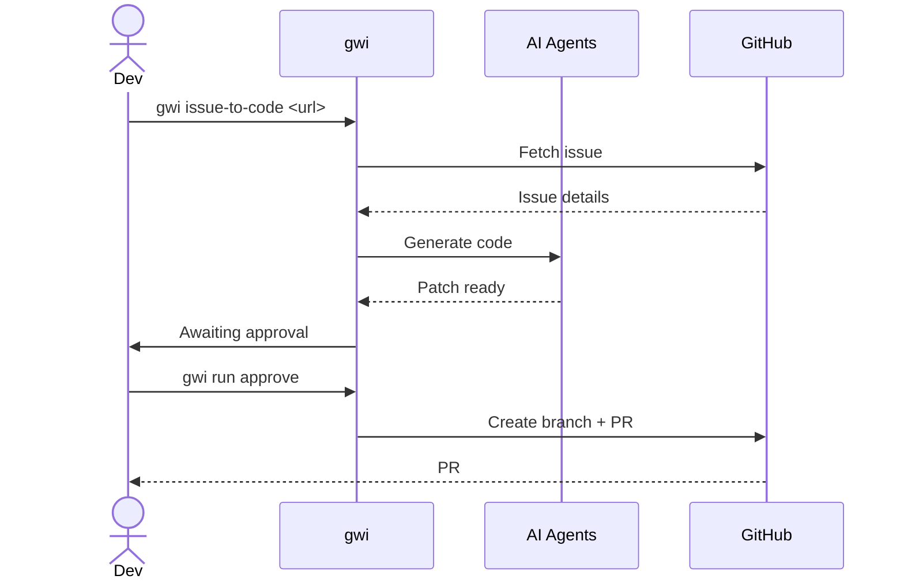

# Planning to PR

Turn a GitHub issue into a working pull request with AI assistance.

## When to Use

- You have a well-defined GitHub issue
- The issue describes a feature, bug fix, or improvement
- You want AI to generate the initial implementation

## Prerequisites

- [ ] Issue exists on GitHub with clear description
- [ ] You have write access to the repository
- [ ] API keys configured (`ANTHROPIC_API_KEY`, `GITHUB_TOKEN`)
- [ ] `gwi doctor` passes

## Steps

### Step 1: Triage the Issue (Optional)

Check complexity before generating code:

```bash
gwi triage https://github.com/owner/repo/issues/123
```

**Output:**
```
Complexity: 4/10
Estimated: 1-2 files, ~50 lines
Recommended model: Claude Sonnet
```

This helps you understand scope before committing.

### Step 2: Generate Code

```bash
gwi issue-to-code https://github.com/owner/repo/issues/123
```

**What happens:**
1. Fetches issue details from GitHub
2. Analyzes repository structure
3. Generates implementation plan
4. Creates code changes
5. Pauses for your approval

**Output:**
```
Run ID: abc123
Status: awaiting_approval

Files changed:
  M src/components/Button.tsx (+45, -12)
  A src/components/Button.test.tsx (+89)

Patch hash: sha256:e3b0c44298fc...

View changes: gwi run status abc123
Approve: gwi run approve abc123
```

### Step 3: Review Changes

Before approving, review what was generated:

```bash
gwi run status abc123
```

Check the generated patch:
```bash
cat .gwi/runs/abc123/patch.diff
```

### Step 4: Approve and Create PR

If the changes look good:

```bash
gwi run approve abc123
```

**What happens:**
1. Creates a new branch
2. Commits the changes
3. Pushes to GitHub
4. Opens a pull request
5. Links PR to original issue

**Output:**
```
✓ Branch created: ai/issue-123-add-button
✓ Changes committed
✓ Pushed to origin
✓ PR created: #456

PR URL: https://github.com/owner/repo/pull/456
```

### Step 5: Review the PR

The PR is now ready for human review:
- CI will run automatically
- Review the code diff
- Request changes if needed
- Merge when satisfied

## Success Criteria

- [ ] PR is created and linked to issue
- [ ] CI passes
- [ ] Code addresses the issue requirements
- [ ] No obvious bugs or security issues

## Common Issues

### "Issue not found"

```
Error: Could not fetch issue #123
```

**Fix:** Check the issue URL and your `GITHUB_TOKEN` permissions.

### "Complexity too high"

```
Warning: Complexity 8/10 - consider breaking into smaller issues
```

**Fix:** The issue might be too broad. Consider splitting it.

### "Patch conflicts with main"

```
Error: Cannot apply patch - conflicts detected
```

**Fix:** The main branch changed since analysis. Re-run `gwi issue-to-code`.

### "API rate limit"

```
Error: Rate limited by GitHub API
```

**Fix:** Wait a few minutes or check your token's rate limit status.

## Workflow Diagram



## Next Steps

After the PR is created:

1. **Review the PR** - Use `gwi review <pr-url>` for AI-assisted review
2. **Address feedback** - Make manual changes or regenerate
3. **Merge** - When CI passes and reviews approve
4. **Close issue** - GitHub auto-closes if PR description has "Closes #123"

## Tips

- **Be specific in issues** - Better descriptions = better code
- **Start small** - Low complexity issues work best initially
- **Review carefully** - AI-generated code needs human verification
- **Iterate** - It's fine to make manual edits after generation
