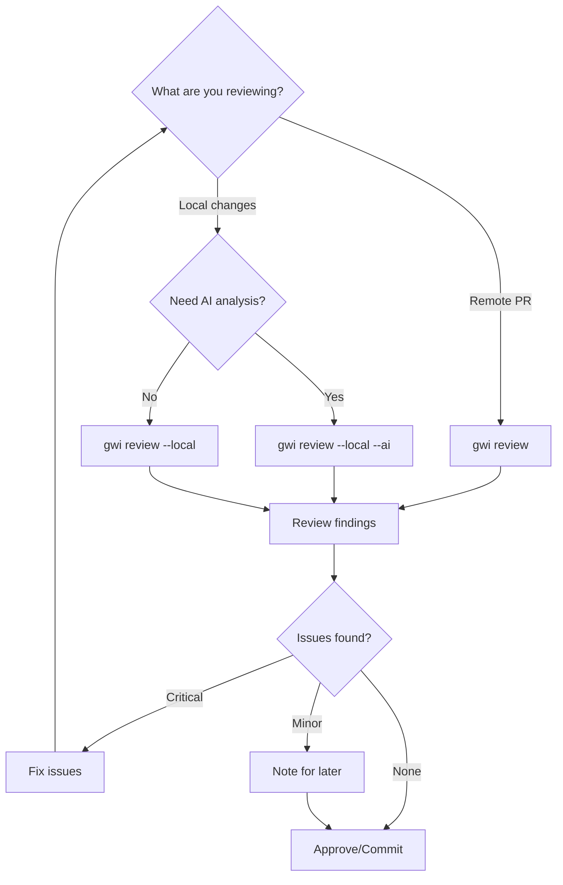

# PR Review

Review pull requests with AI assistance or review local changes before creating a PR.

## When to Use

- You're reviewing someone else's PR
- You want to self-review before requesting reviews
- You want to review local changes before committing

## Prerequisites

- [ ] PR exists (for remote review) or changes staged (for local review)
- [ ] `ANTHROPIC_API_KEY` or `GOOGLE_AI_API_KEY` configured
- [ ] `GITHUB_TOKEN` configured (for remote PRs)

## Path A: Review a Remote PR

### Step 1: Run Review

```bash
gwi review https://github.com/owner/repo/pull/456
```

**What happens:**
1. Fetches PR diff from GitHub
2. Analyzes code changes
3. Scores complexity
4. Identifies issues and suggestions

**Output:**
```
PR #456: Add user authentication

Complexity: 5/10
Files: 4 changed (+234, -45)

Issues Found:
  🔴 CRITICAL: SQL injection vulnerability in login.ts:45
  🟡 WARNING: Missing input validation in signup.ts:23
  🟢 SUGGESTION: Consider using prepared statements

Security: 1 critical issue
Tests: 2 new tests added
Documentation: README updated
```

### Step 2: Review Findings

Check detailed analysis:

```bash
gwi run status <run-id>
cat .gwi/runs/<run-id>/review.json
```

### Step 3: Take Action

Based on findings:
- **Request changes** if critical issues found
- **Approve** if code looks good
- **Comment** with specific suggestions

## Path B: Review Local Changes

### Step 1: Stage Your Changes

```bash
git add -A
# or stage specific files
git add src/feature.ts
```

### Step 2: Run Local Review

```bash
# Fast deterministic review (no AI)
gwi review --local

# AI-powered review
gwi review --local --ai

# Review all changes (staged + unstaged)
gwi review --local --all
```

**Output (deterministic):**
```
Local Review

Complexity: 3/10
Files: 2 staged

Patterns Detected:
  ✓ No secrets found
  ✓ No large files
  ⚠ Console.log statements (3)
  ⚠ TODO comments (1)

Ready for commit.
```

**Output (AI-powered):**
```
Local Review (AI)

Complexity: 3/10
Files: 2 staged

AI Analysis:
  🟢 Good separation of concerns
  🟡 Consider adding error handling in fetchUser()
  🟡 Missing JSDoc for public function

Security: No issues
Recommendation: Ready for commit with minor improvements
```

### Step 3: Pre-commit Gate

Use the approval gate before committing:

```bash
gwi gate
```

**Interactive prompt:**
```
Changes Summary:
  2 files, +45 lines

Approve these changes? [y/n/d(iff)]: y
✓ Approved. Ready for commit.
```

### Step 4: Commit

```bash
git commit -m "feat: add user profile page"
```

## Path C: Review with Git Hooks

Install the pre-commit hook:

```bash
gwi hooks install
```

Now `gwi gate` runs automatically on every commit.

```bash
git commit -m "feat: add feature"
# Hook runs gwi gate automatically
# Prompts for approval if changes detected
```

## Success Criteria

- [ ] All critical issues addressed
- [ ] Security scan passes
- [ ] Complexity is reasonable
- [ ] Tests cover new functionality

## Common Issues

### "No staged changes"

```
Error: No staged changes to review
```

**Fix:** Stage changes with `git add` first.

### "Review failed - rate limited"

```
Error: AI provider rate limited
```

**Fix:** Use `gwi review --local` (deterministic, no AI) or wait.

### "Cannot fetch PR"

```
Error: PR not found or access denied
```

**Fix:** Check URL and `GITHUB_TOKEN` permissions.

## Workflow Diagram



## Next Steps

After review:

1. **For remote PRs** - Leave review comments on GitHub
2. **For local changes** - Commit and push
3. **For rejected changes** - Fix issues and re-review

## Tips

- **Review early, review often** - Smaller reviews are easier
- **Use `--local` for speed** - Deterministic review is instant
- **Trust but verify** - AI suggestions need human judgment
- **Install hooks** - Automate pre-commit review
