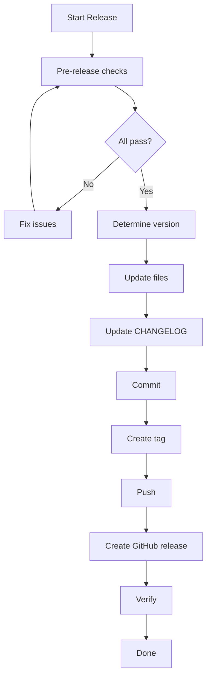

# Release

Ship a new version of GWI with proper versioning, changelog, and audit trail.

## When to Use

- You're ready to ship accumulated changes
- A milestone is complete
- Security fixes need immediate release
- Regular release cadence (weekly/monthly)

## Prerequisites

- [ ] All PRs for this release are merged
- [ ] CI passes on main branch
- [ ] `npm run arv` passes (Agent Readiness Verification)
- [ ] CHANGELOG.md is updated (or will be)
- [ ] You have push access to main

## Steps

### Step 1: Pre-Release Checklist

```bash
# Ensure you're on main and up to date
git checkout main
git pull origin main

# Run all checks
npm run build
npm run typecheck
npm run test
npm run arv
```

**All must pass before proceeding.**

### Step 2: Review Changes

See what's changed since last release:

```bash
# Last release tag
git describe --tags --abbrev=0
# e.g., v0.5.0

# Commits since then
git log v0.5.0..HEAD --oneline

# Files changed
git diff v0.5.0..HEAD --stat
```

### Step 3: Determine Version Bump

Follow [Semantic Versioning](https://semver.org/):

| Change Type | Version Bump | Example |
|-------------|--------------|---------|
| Breaking changes | MAJOR | 0.5.0 → 1.0.0 |
| New features | MINOR | 0.5.0 → 0.6.0 |
| Bug fixes only | PATCH | 0.5.0 → 0.5.1 |

### Step 4: Update Version Files

Update version in these files:
- `package.json` (root)
- `apps/cli/package.json`
- `README.md` (version badge)

```bash
# Example: Update to 0.6.0
NEW_VERSION="0.6.0"

# Update root package.json
npm version $NEW_VERSION --no-git-tag-version

# Update CLI package.json
cd apps/cli && npm version $NEW_VERSION --no-git-tag-version && cd ../..
```

### Step 5: Update CHANGELOG

Add release entry to `CHANGELOG.md`:

```markdown
## [0.6.0] - 2026-02-03

### Added
- Portfolio audit command for multi-repo scanning
- Drift detection ARV gate

### Changed
- Improved conflict resolution for complex merges

### Fixed
- Memory leak in long-running workers

### Security
- Updated dependencies for CVE-2026-1234
```

### Step 6: Create Release Commit

```bash
git add -A
git commit -m "chore(release): prepare v$NEW_VERSION

- Update version in package.json files
- Update CHANGELOG.md

Co-Authored-By: Claude <noreply@anthropic.com>"
```

### Step 7: Create Tag

```bash
git tag -a "v$NEW_VERSION" -m "Release v$NEW_VERSION

Changes in this release:
- [Brief summary of major changes]
"
```

### Step 8: Push Release

```bash
# Push commit
git push origin main

# Push tag
git push origin "v$NEW_VERSION"
```

### Step 9: Create GitHub Release

```bash
gh release create "v$NEW_VERSION" \
  --title "v$NEW_VERSION" \
  --notes-file CHANGELOG.md \
  --verify-tag
```

Or create via GitHub UI with release notes.

### Step 10: Verify Release

```bash
# Check tag exists
git tag -l "v$NEW_VERSION"

# Check GitHub release
gh release view "v$NEW_VERSION"

# Verify version
node apps/cli/dist/index.js --version
```

## Success Criteria

- [ ] Version updated in all package.json files
- [ ] CHANGELOG.md has release entry
- [ ] Git tag created and pushed
- [ ] GitHub release published
- [ ] CI passes on tagged commit

## Common Issues

### "Tag already exists"

```
Error: tag 'v0.6.0' already exists
```

**Fix:** Choose a different version or delete the existing tag:
```bash
git tag -d v0.6.0
git push origin :refs/tags/v0.6.0
```

### "Push rejected - branch protected"

```
Error: refusing to push to protected branch
```

**Fix:** Create a PR for the release commit, get approval, then merge.

### "Version mismatch"

Different versions in different package.json files.

**Fix:** Ensure all package.json files have the same version.

## Workflow Diagram



## Rollback Procedure

If a release has critical issues:

```bash
# Delete the release
gh release delete "v$NEW_VERSION" --yes

# Delete the tag
git push origin --delete "v$NEW_VERSION"
git tag -d "v$NEW_VERSION"

# Revert the release commit
git revert HEAD
git push origin main
```

## Hotfix Process

For urgent fixes after release:

```bash
# Create hotfix branch from tag
git checkout -b hotfix/critical-fix v0.6.0

# Make fix
# ... edit files ...

# Commit
git commit -m "fix: critical security issue"

# Merge to main
git checkout main
git merge hotfix/critical-fix

# Release patch version
# Follow steps 4-10 with v0.6.1
```

## Next Steps

After release:

1. **Monitor** - Watch for issues in production
2. **Announce** - Post release notes to relevant channels
3. **Close milestone** - Mark GitHub milestone as complete
4. **Plan next** - Start accumulating changes for next release

## Tips

- **Release often** - Smaller releases are safer
- **Automate** - Consider CI/CD for releases
- **Test before tagging** - Tags are permanent references
- **Communicate** - Let users know what changed
