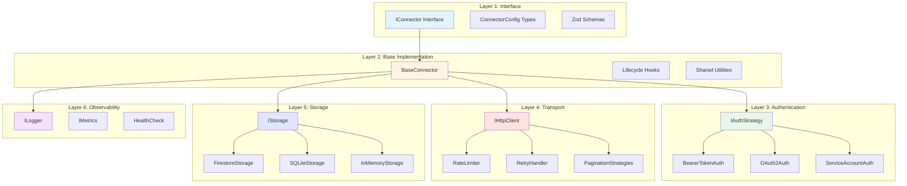
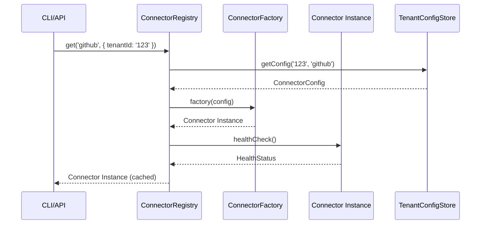
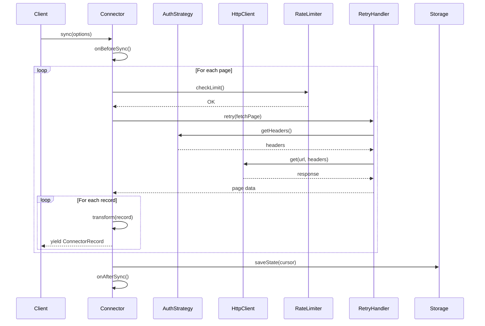
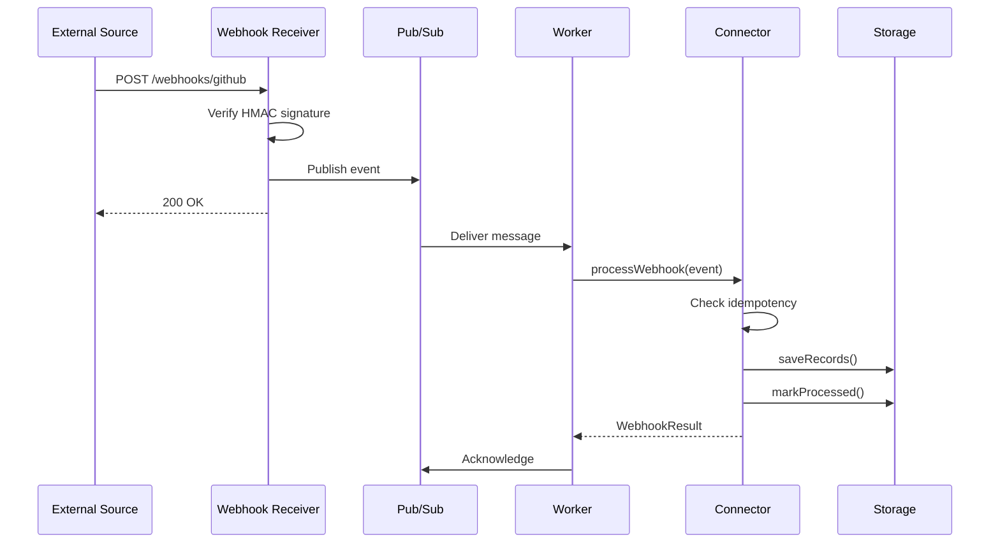
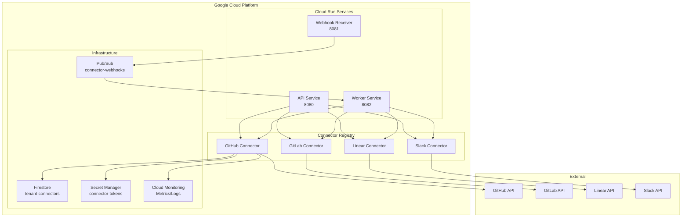
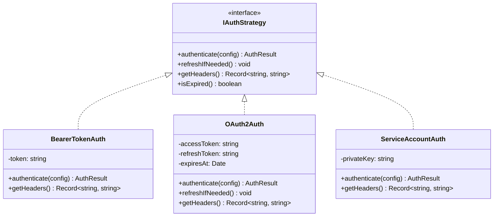
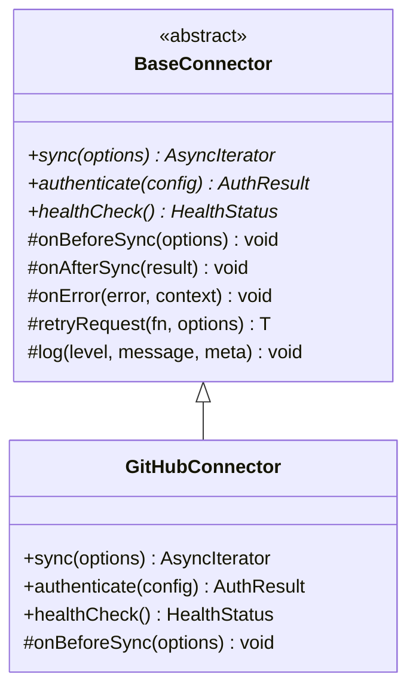
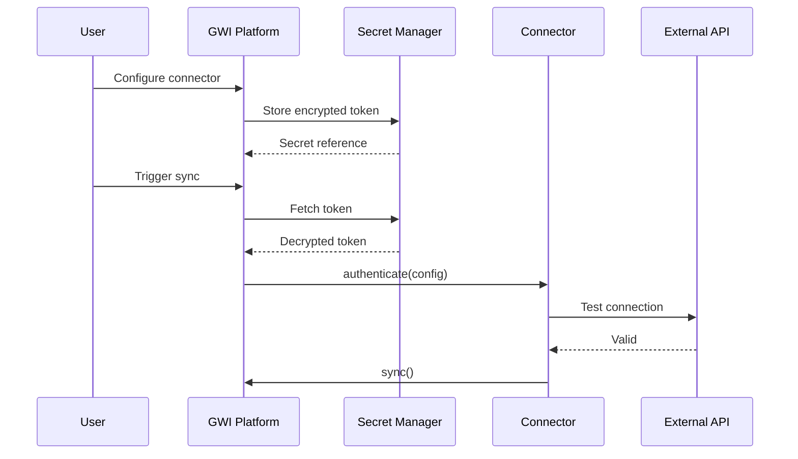
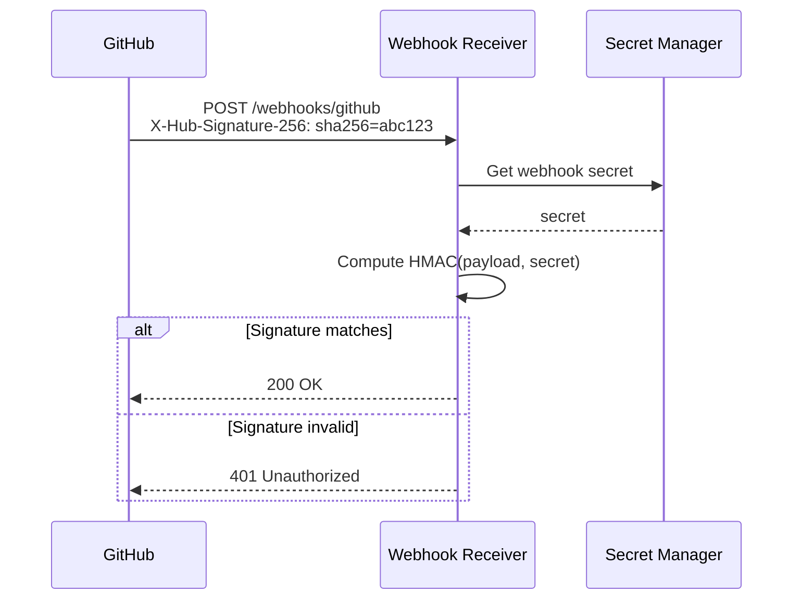

# Connector Framework Architecture

This document provides a deep dive into the connector framework architecture, including component interactions, data flow, deployment patterns, and design rationale.

## Table of Contents

1. [Architecture Overview](#architecture-overview)
2. [6-Layer Architecture](#6-layer-architecture)
3. [Component Interactions](#component-interactions)
4. [Data Flow](#data-flow)
5. [Deployment Architecture](#deployment-architecture)
6. [Design Patterns](#design-patterns)
7. [Security Architecture](#security-architecture)
8. [Performance Considerations](#performance-considerations)
9. [Design Decisions](#design-decisions)

---

## Architecture Overview

The connector framework follows a **layered architecture** inspired by Airbyte CDK patterns, adapted for TypeScript and the Git With Intent ecosystem.

### High-Level Architecture

```
                                    +-------------------------+
                                    |      GWI Platform       |
                                    |  (CLI, API, Workers)    |
                                    +------------+------------+
                                                 |
                                                 v
+------------------------------------------------------------------------------------+
|                              CONNECTOR FRAMEWORK                                    |
|                                                                                    |
|  +-------------------+     +-------------------+     +-------------------+          |
|  |  ConnectorRegistry|     |   BaseConnector   |     |  IConnector       |          |
|  |  (Service Discovery)    |   (Shared Utils)  |     |  (Interface)      |          |
|  +-------------------+     +-------------------+     +-------------------+          |
|                                                                                    |
|  +-------------------+     +-------------------+     +-------------------+          |
|  |   Auth Strategies |     |   Pagination      |     |   Rate Limiting   |          |
|  |  Bearer/OAuth/SA  |     |  Cursor/Offset    |     |  Token Bucket     |          |
|  +-------------------+     +-------------------+     +-------------------+          |
|                                                                                    |
|  +-------------------+     +-------------------+     +-------------------+          |
|  |   HTTP Transport  |     |   Retry Handler   |     |   Storage Layer   |          |
|  |   (Axios/Fetch)   |     |  Exp. Backoff     |     | Firestore/SQLite  |          |
|  +-------------------+     +-------------------+     +-------------------+          |
|                                                                                    |
|  +-------------------+     +-------------------+     +-------------------+          |
|  |   Observability   |     |   Error Types     |     |   Testing Utils   |          |
|  |  Logger/Metrics   |     |  Typed Exceptions |     |  Mocks/Harness    |          |
|  +-------------------+     +-------------------+     +-------------------+          |
+------------------------------------------------------------------------------------+
                                                 |
                                                 v
+------------------------------------------------------------------------------------+
|                              CONNECTOR IMPLEMENTATIONS                              |
|                                                                                    |
|  +----------+  +----------+  +----------+  +----------+  +----------+  +----------+|
|  |  GitHub  |  |  GitLab  |  |  Linear  |  |   Jira   |  |  Slack   |  |VertexAI  ||
|  +----------+  +----------+  +----------+  +----------+  +----------+  +----------+|
+------------------------------------------------------------------------------------+
                                                 |
                                                 v
+------------------------------------------------------------------------------------+
|                              EXTERNAL SERVICES                                      |
|                                                                                    |
|  +----------+  +----------+  +----------+  +----------+  +----------+  +----------+|
|  |GitHub API|  |GitLab API|  |Linear API|  | Jira API |  |Slack API |  |VertexAI  ||
|  +----------+  +----------+  +----------+  +----------+  +----------+  +----------+|
+------------------------------------------------------------------------------------+
```

---

## 6-Layer Architecture

The framework is organized into 6 distinct layers, each with specific responsibilities.

### Layer Diagram



### Layer Details

| Layer | Purpose | Key Components |
|-------|---------|----------------|
| **1. Interface** | Contract definition, type safety | `IConnector`, `ConnectorConfig`, Zod schemas |
| **2. Base** | Shared utilities, lifecycle management | `BaseConnector`, hooks, error handling |
| **3. Authentication** | Credential management, token refresh | `BearerTokenAuth`, `OAuth2Auth`, `ServiceAccountAuth` |
| **4. Transport** | HTTP communication, resilience | `HttpClient`, `RateLimiter`, `RetryHandler` |
| **5. Storage** | State persistence, data storage | `FirestoreStorage`, `SQLiteStorage` |
| **6. Observability** | Logging, metrics, health monitoring | `Logger`, `Metrics`, `HealthCheck` |

---

## Component Interactions

### Connector Registry Flow



### Sync Flow



### Webhook Processing Flow



---

## Data Flow

### Pull (API Polling) Data Flow

```
+-------------+     +-------------+     +-------------+     +-------------+
|   External  |     |  Connector  |     |  Transform  |     |   Storage   |
|     API     | --> |    Fetch    | --> |   Records   | --> |  Firestore  |
+-------------+     +-------------+     +-------------+     +-------------+
      |                   ^
      |                   |
      +-------------------+
          (Pagination)
```

**Steps:**
1. Connector authenticates with external API
2. Fetches data page by page (cursor/offset pagination)
3. Transforms API responses to `ConnectorRecord` format
4. Yields records to caller via async iterator
5. Saves sync state (cursor position) to storage

### Push (Webhook) Data Flow

```
+-------------+     +-------------+     +-------------+     +-------------+
|   External  |     |  Webhook    |     |   Pub/Sub   |     |   Worker    |
|   Source    | --> |  Receiver   | --> |    Topic    | --> |  Connector  |
+-------------+     +-------------+     +-------------+     +-------------+
                          |                                       |
                          v                                       v
                    +-------------+                         +-------------+
                    |   Verify    |                         |   Storage   |
                    |  Signature  |                         |  Firestore  |
                    +-------------+                         +-------------+
```

**Steps:**
1. External source sends webhook to receiver (Cloud Run)
2. Receiver verifies HMAC signature
3. Publishes event to Pub/Sub topic
4. Returns 200 OK immediately (fast response)
5. Worker pulls from Pub/Sub subscription
6. Connector processes event, saves records

### State Management

```
+-------------+     +-------------+     +-------------+
|  Connector  |     |   Storage   |     |  Firestore  |
|    State    | --> |   Adapter   | --> |   Document  |
+-------------+     +-------------+     +-------------+

State includes:
- lastSyncCursor: "2025-01-01T00:00:00Z"
- lastSyncTime: "2025-01-15T10:30:00Z"
- totalRecordsSynced: 15000
- errors: [...]
```

---

## Deployment Architecture

### Cloud Run Deployment



### Service Responsibilities

| Service | Purpose | Scaling |
|---------|---------|---------|
| **API Service** | Sync requests, health checks | CPU/memory based |
| **Webhook Receiver** | Receive webhooks, verify signatures | Request-based, fast scale |
| **Worker Service** | Process webhook events from Pub/Sub | Message backlog based |

### Environment Configuration

```yaml
# Cloud Run Service (example)
apiVersion: serving.knative.dev/v1
kind: Service
metadata:
  name: gwi-connectors-api
spec:
  template:
    spec:
      containers:
        - image: gcr.io/project/gwi-connectors:latest
          env:
            - name: GWI_STORE_BACKEND
              value: firestore
            - name: GCP_PROJECT_ID
              value: gwi-production
          resources:
            limits:
              cpu: 2
              memory: 2Gi
          ports:
            - containerPort: 8080
```

---

## Design Patterns

### 1. Strategy Pattern (Authentication)



**Rationale:** Different APIs require different authentication methods. The Strategy pattern allows connectors to swap auth strategies without changing connector logic.

### 2. Factory Pattern (Connector Registration)

```mermaid
classDiagram
    class ConnectorRegistry {
        -factories: Map~string, ConnectorFactory~
        -instances: Map~string, IConnector~
        +register(name, factory) void
        +get(name, options) IConnector
        +list() string[]
    }

    class ConnectorFactory {
        <<type>>
        (config) => IConnector
    }

    class GitHubConnector {
        +authenticate() AuthResult
        +sync() AsyncIterator
    }

    class GitLabConnector {
        +authenticate() AuthResult
        +sync() AsyncIterator
    }

    ConnectorRegistry --> ConnectorFactory
    ConnectorFactory ..> GitHubConnector : creates
    ConnectorFactory ..> GitLabConnector : creates
```

**Rationale:** Factory pattern enables lazy loading of connectors and tenant-specific configuration without hardcoding dependencies.

### 3. Template Method Pattern (BaseConnector)



**Rationale:** Template Method defines the sync skeleton while allowing connectors to override specific hooks for customization.

### 4. Iterator Pattern (Async Generators)

```typescript
// Connector produces records one at a time
async *sync(options: SyncOptions): AsyncIterator<ConnectorRecord> {
  for await (const page of this.fetchPages()) {
    for (const item of page.items) {
      yield this.transform(item);
    }
  }
}

// Consumer processes records as they arrive
for await (const record of connector.sync(options)) {
  await processRecord(record);  // Memory-efficient
}
```

**Rationale:** Async iterators enable memory-efficient streaming of large datasets without loading everything into memory.

### 5. Decorator Pattern (Rate Limiting)

```typescript
// RateLimiter decorates HTTP client
class RateLimitedHttpClient implements IHttpClient {
  constructor(
    private client: IHttpClient,
    private rateLimiter: IRateLimiter
  ) {}

  async get(url: string, options?: RequestOptions): Promise<Response> {
    await this.rateLimiter.checkLimit('http');
    const response = await this.client.get(url, options);
    this.rateLimiter.recordRequest('http');
    return response;
  }
}
```

**Rationale:** Rate limiting is added transparently without modifying the underlying HTTP client.

---

## Security Architecture

### Authentication Flow



### Webhook Security



### Tenant Isolation

```
+------------------+     +------------------+     +------------------+
|   Tenant A       |     |   Tenant B       |     |   Tenant C       |
|   Credentials    |     |   Credentials    |     |   Credentials    |
+--------+---------+     +--------+---------+     +--------+---------+
         |                        |                        |
         v                        v                        v
+------------------+     +------------------+     +------------------+
|  Secret Manager  |     |  Secret Manager  |     |  Secret Manager  |
|  tenant-a/...    |     |  tenant-b/...    |     |  tenant-c/...    |
+------------------+     +------------------+     +------------------+
         |                        |                        |
         v                        v                        v
+------------------------------------------------------------------------+
|                    Connector Instance (tenant-scoped)                   |
+------------------------------------------------------------------------+
```

**Key Security Measures:**
1. **Credentials never in code** - All tokens stored in Secret Manager
2. **HMAC verification** - All webhooks verified with SHA-256 signatures
3. **Tenant isolation** - Each tenant has separate credential storage
4. **Minimal scopes** - Request only necessary API permissions
5. **Token rotation** - OAuth tokens auto-refreshed before expiry
6. **Audit logging** - All connector operations logged

---

## Performance Considerations

### Memory Efficiency

**Problem:** Syncing large datasets can exhaust memory.

**Solution:** Use async iterators (streaming).

```typescript
// GOOD: Stream records, low memory
async *sync(options: SyncOptions): AsyncIterator<ConnectorRecord> {
  for await (const page of this.fetchPages()) {
    for (const item of page.items) {
      yield this.transform(item);  // One at a time
    }
  }
}

// BAD: Load everything into memory
async sync(options: SyncOptions): Promise<ConnectorRecord[]> {
  const all = [];
  for await (const page of this.fetchPages()) {
    all.push(...page.items.map(this.transform));  // OOM risk
  }
  return all;
}
```

### Connection Pooling

```typescript
const httpClient = axios.create({
  timeout: 30000,
  httpAgent: new http.Agent({
    keepAlive: true,
    maxSockets: 10
  }),
  httpsAgent: new https.Agent({
    keepAlive: true,
    maxSockets: 10
  })
});
```

### Batch Processing

```typescript
async *sync(options: SyncOptions): AsyncIterator<ConnectorRecord> {
  const batch: ConnectorRecord[] = [];
  const BATCH_SIZE = 100;

  for await (const page of this.fetchPages()) {
    for (const item of page.items) {
      batch.push(this.transform(item));
      yield this.transform(item);

      if (batch.length >= BATCH_SIZE) {
        await this.storage.saveRecords(batch);
        batch.length = 0;  // Clear batch
      }
    }
  }

  // Flush remaining
  if (batch.length > 0) {
    await this.storage.saveRecords(batch);
  }
}
```

### Caching

```typescript
class ConnectorRegistry {
  private healthCache = new Map<string, {
    status: HealthStatus;
    expiresAt: number;
  }>();

  private readonly HEALTH_CACHE_TTL_MS = 60 * 1000;  // 1 minute

  async healthCheck(name: string): Promise<HealthStatus> {
    const cached = this.healthCache.get(name);
    if (cached && Date.now() < cached.expiresAt) {
      return cached.status;  // Return cached
    }

    const status = await this.performHealthCheck(name);
    this.healthCache.set(name, {
      status,
      expiresAt: Date.now() + this.HEALTH_CACHE_TTL_MS
    });

    return status;
  }
}
```

### Performance Targets

| Metric | Target | Measurement |
|--------|--------|-------------|
| Memory per sync | <512MB | Process RSS |
| Records/second | >1000 | Throughput |
| API latency p95 | <200ms | Response time |
| Health check | <100ms | Duration |
| Webhook response | <100ms | Time to 200 OK |

---

## Design Decisions

### Why TypeScript (Not Python)?

**Decision:** Build in TypeScript despite Airbyte using Python.

**Rationale:**
- **Type safety:** Catch errors at compile time
- **Ecosystem:** Aligns with GWI platform (all TypeScript)
- **Performance:** Better async/await, no GIL
- **Developer experience:** Shared tooling, build system

**Trade-offs:**
- Cannot reuse Airbyte's Python connectors directly
- Fewer existing TypeScript connector examples

### Why Not Adopt Airbyte Directly?

**Decision:** Build custom framework inspired by Airbyte patterns.

**Rationale:**
- **Operational complexity:** Airbyte requires Kubernetes cluster
- **Language mismatch:** Python runtime for 6 connectors is overkill
- **Domain fit:** Airbyte is data warehouse focused, not PR automation
- **Control:** Custom framework enables tighter integration

**We adopted:**
- 3-tier architecture pattern
- Connector registry concept
- Incremental sync with cursors
- Health check pattern

### Why Async Iterators?

**Decision:** Use `async *sync()` generators instead of `Promise<T[]>`.

**Rationale:**
- **Memory efficiency:** Process records one at a time
- **Early termination:** Stop when limit reached
- **Backpressure:** Consumer controls pace
- **Streaming:** Natural fit for paginated APIs

### Why Multiple Storage Backends?

**Decision:** Support Firestore, SQLite, and in-memory storage.

**Rationale:**
- **Firestore:** Production (real-time, scalable, managed)
- **SQLite:** Local development (full analytics, backup)
- **In-memory:** Unit tests (fast, no persistence)

**Interface abstraction** allows swapping backends without code changes.

### Why Separate Webhook Receiver?

**Decision:** Deploy webhook receiver as separate Cloud Run service.

**Rationale:**
- **Fast response:** Webhooks require <1s response
- **Decoupling:** Heavy processing happens asynchronously
- **Scalability:** Auto-scales independently on burst traffic
- **Reliability:** Pub/Sub handles backpressure, retries

**Trade-offs:**
- Additional service to deploy
- Pub/Sub costs
- Eventual consistency

---

## References

### Internal Documents
- [012-DR-ADRC-connector-framework-architecture-decision.md](../../000-docs/012-DR-ADRC-connector-framework-architecture-decision.md)
- [014-DR-DSGN-connector-abstraction.md](../../000-docs/014-DR-DSGN-connector-abstraction.md)
- [015-DR-DSGN-iconnector-interface.md](../../000-docs/015-DR-DSGN-iconnector-interface.md)
- [018-DR-DSGN-connector-registry.md](../../000-docs/018-DR-DSGN-connector-registry.md)
- [011-DR-PATT-production-connector-patterns.md](../../000-docs/011-DR-PATT-production-connector-patterns.md)

### External Resources
- [Airbyte CDK Documentation](https://docs.airbyte.com/connector-development/cdk-python/)
- [SurfSense Connectors](https://github.com/MODSetter/SurfSense)
- [TypeScript Handbook](https://www.typescriptlang.org/docs/handbook/)
- [Cloud Run Documentation](https://cloud.google.com/run/docs)

---

**Next:** [API Reference](./api-reference.md) | [Examples](./examples/)
